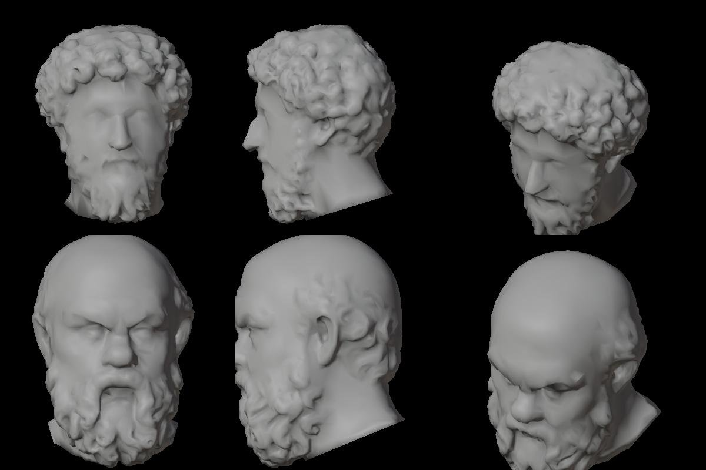

# Ajattelijat kartalla: 3D-päät (Linnanrakentaja 2.10.2026)

Omistaja 2.10. klo 12.27 (Päätoimittajan kautta): ajattelijat kartalle 3D-päinä. Tehty Sokrateelle ja Marcus
Aureliukselle samalla putkella: `tools/linssit/blender/sokrates_bysti.py --kohde sokrates|marcus --kartta <ulos>`.

Tiedostot: `/Users/Shared/Claude/proto-3d/_valmiit/ajattelijat-kartta/v1/` (SHA256SUMS).

| GLB | Kolmiot | Koko | Mitat glTF x/y/z (m) |
|---|---|---|---|
| sokrates-kartta.glb | 5 020 | 0,87 Mt | 0,219 × 0,319 × 0,244 |
| marcus-kartta.glb | 5 008 | 1,04 Mt | 0,212 × 0,270 × 0,208 |

- Pää ja kaula ilman sokkelia ja rintaa. Leikkaus on kolme täytettyä tasoa: vino taso parran alta niskaan ja kaksi
  jyrkkää sivutasoa olkapäiden poistoon (`KARTTA_LEIKKAUS`). Parta ja kiharat jäävät kokonaan.
- Koordinaatit: glTF Y ylös, **kasvot +Z**. Pivot on kaulan juuressa eli vinon leikkauksen keskellä. Nenän kääntö
  kohti näkymän keskustaa on pelkkä kierto Y-akselin ympäri. Parran etureuna ulottuu hieman pivotin alle (y −0,02…−0,04).
- Mittakaava: oikea bysti 0,51 m sokkeli mukaan, joten pää on noin 0,27–0,32 m korkea. Kartalla skaalataan vapaasti.
- Materiaali: kipsi, perusväri 512 px leivottu (0,86/0,85/0,82 × (0,45 + 0,55 · AO), AO 400 k:n leikatusta
  skannauksesta). Normaalikartta 512 px leivottu samasta. Karheus 0,62, ei metallia. Kuvat ovat GLB:n sisällä.
- Lähteet: SMK KAS635 ja KAS979, Public Domain Mark 1.0 (api.smk.dk), skannaus Scan the World / SMK.
