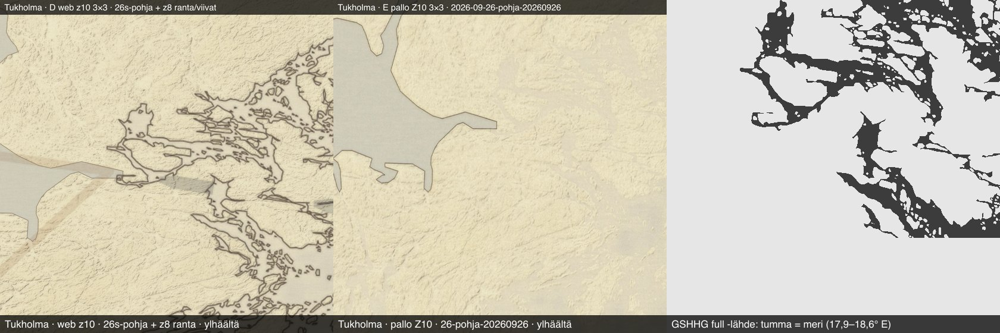
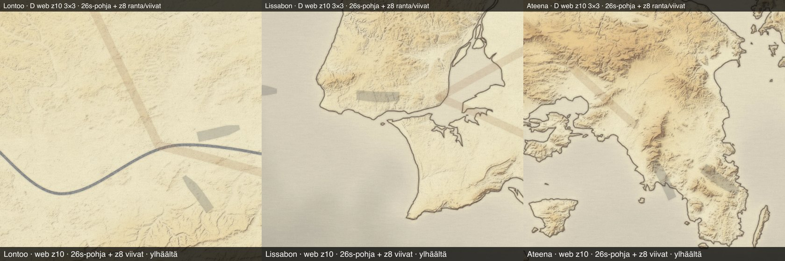
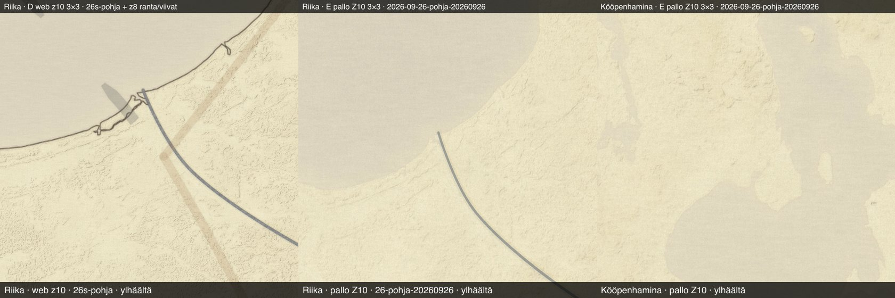
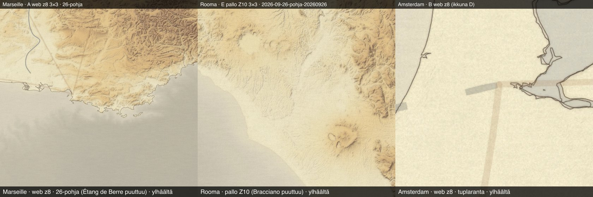

# Euroopan kartan laatukierros 27.9.2026 (Karttaseppä)

Fablen tilaus 27.9. klo 17.2x: VAIN EUROOPPA, App Store -laatu. Kierros kävi läpi
pelin kaikki 49 eurooppalaista kaupunkia (`kaupungit.json`, `manner: europe`).
Kultakin kaupungilta tutkittiin tuotannon laatat webin peruskartalta (z8–z10) ja
natiivin pallon Z10:stä.

## Menetelmä

- **Kuvat:** jokaisesta kaupungista koottiin kuvarivi suoraan tuotannon CDN:stä
  (`media.matkakirja.app`), eli kuvissa on juuri se, mitä pelaaja saa. Rivissä on
  viisi paneelia:
  - **A:** web z8 3×3 (noin 3,2°)
  - **B, C, D:** sama maantieteellinen ikkuna tasoilta z8, z9 ja z10. Ikkuna on z10:n
    3×3 (noin 0,8°). C:n ja D:n päälle on venytetty z8:n ranta- ja viivakerros,
    kuten peli tekee.
  - **E:** pallon Z10 3×3 (Mercator, sarja `2026-09-26-pohja-20260926`)
- **Keskipiste:** kaupungin lat/lon Miller-projektiolla, koska laudan x/y on
  tyylitelty.
- **Sarjat:** pyramidi `2026-09-26s-pohja` (z0–z8 kopioina sarjasta `2026-09-26-pohja`),
  ranta `2026-09-25-ranta` ja viivat `2026-09-25-viivat`.
- **Läpikäynti:** neljä Opus-agenttia kävi kuvat rinnakkain läpi silmällä ja numeerisesti.
  Numeerisesti tarkistettiin magentapikselit (puuttuva laatta), saumapiikit
  256/512 px:n kohdissa ja tasojen keskisävyt. Karttaseppä tarkisti vakavat ja
  toistuvat löydökset itse.
- **Aineisto:**
  - löydökset (77 riviä): `docs/raportit/data/eurooppa-laatu-loydokset-20260927.json`
  - mosaiikit ja työkalut: Macilla kansiossa
    `/Users/Shared/Claude/pyramidi-poltto/eurooppa-laatu-20260927/`
- **Rajaus:** kierros tutki laattoja, ei pelin CSS-kerroksia. Kermaa, väritasoja ja
  nostoja se ei kattanut.

## Kokonaiskuva

- **Puuttuvia laattoja ei ole yhtään.** Tämä koskee kaikkia 49 kaupunkia kaikilla
  neljällä tasolla. Magentaa tai reikiä ei ole, eikä laattasaumoja löytynyt
  webistä eikä pallosta.
- **Tasojen välillä ei ole sävyhyppyä.** B:n, C:n ja D:n keskisävyt ovat 1–7/255:n
  sisällä joka kaupungissa. Ylösnousu z8 → z9 → z10 on siis sävyltään saumaton.
  Tämä oli kierroksen tärkein tarkistus, ja se meni läpi.
- **Viat ovat vesiaineistossa ja viivatasossa, eivät polton tekniikassa.** Luvut:
  vakava 1 (Tukholma, neljä paneelia), näkyvä 28 ja pieni 27. Ilman löydöksiä oli
  17 kaupunkia.

## VAKAVA

### V1. Tukholman saaristo on maata kaikilla tasoilla ja pallossa

- **Oire:** Saltsjön ja sisäsaariston vedet ovat maan värisiä, ja reliefi jatkuu veden
  yli. Z8-rantaviivat piirtävät saaret maan päälle. Vettä on vain avomerellä ja
  Mälarenissa (järvi).
- **Todennettu:**
  - Lähde on oikein: GSHHG full -aineiston merirenkaissa (`gshhs-data/ne_10m_ocean.geojson`,
    kuvan oikea paneeli) saariston vesi on merta.
  - Rannikon harvennus (0,004°) ei kadota vettä, rasteroitu kummallakin arvolla.
  - Vika syntyy siis pohjan maa- ja meriluokittelussa polton aikana.
- **Juurisyy on selvittämättä.** Korjauserä 1 aloittaa yhden laatan koepoltolla
  (`--alue` Tukholman ympäriltä). Epäiltyjä ovat renkaiden laatikkorajaus ja
  parillisuussäännön kääntyminen suurimmassa mannerrenkaassa. Sama ilmiö voi selittää
  pallon pohjoiset rannat (N2).

## NÄKYVÄ

### N1. Meriväylien katkoviivat maan päällä (11 kaupunkia)

- **Kaupungit:** Lontoo, Rooma, Islanti, Dublin, Lissabon, Sisilia, Dubrovnik,
  Helsinki, Odessa, Ateena ja Tallinna.
- **Oire:** viivatason (`2026-09-25-viivat`) laivareitti alkaa sisämaan kaupungin
  pisteestä ja kulkee maata pitkin rannikolle. Z9–z10:llä venytys tekee katkoista
  leveitä harmaita palkkeja maan päälle.
- **Korjaus:** laivareitin katkoviiva piirretään vain vesimaskin sisään. Rannasta
  kaupunkiin kulkeva maaosuus jätetään pois tai piirretään maareitin tyylillä.
  Vain viivataso poltetaan uudelleen (z0–z8), pohja ei muutu.

### N2. Pallon Z10:n vesi on pohjoisessa pilvimäinen ja pehmeä

- **Kaupungit:** Riika, Pietari, Bergen, Islanti, Helsinki ja Kööpenhamina.
- **Oire:** etelässä (Marseille, Kreeta, Rooma) pallon ranta on terävä.
- **Todennäköinen syy:** pallon Z10 lasketaan pyramidin z9:stä. Mercator venyttää
  60 °N:ssa noin kaksinkertaisesti, joten z9:n pehmeä maskireuna (`maskiAA 4`)
  suurenee näkyväksi.
- **Korjaus:** pallon Z10:n lähteeksi pyramidin z10 siellä, missä se on poltettu
  (kaupungit ±1°). Poltetaan uudelleen vain Euroopan osuus 13 856 laatasta.

### N3. Järviä ja jokia puuttuu, ja järvet ovat karkeita

- **Puuttuvat järvet:** Étang de Berre (Marseille, noin 155 km²), Bracciano ja
  Martignano, Albano ja Nemi (Rooma), Berliinin järvet (Müggelsee, Havel) sekä Riian
  lähijärvet.
- **Karkeat järvet:** Tampereen järvet ovat pitkäsivuisia monikulmioita.
- **Puuttuvat jokiviivat:** Vltava (Praha), Kemijoki ja Ounasjoki (Rovaniemi) sekä
  todennäköisesti Moskva.
- **Syy:** meri tulee GSHHG full -aineistosta, mutta järvet yhä Natural Earthin
  1:10m-aineistosta, josta nämä puuttuvat tai jotka on siinä yleistetty.
  - Étang de Berre on GSHHG:ssä tason 2 vesi (järvi), joten se ei ole merirenkaissa.
  - GSHHG full sisältää 6 659 tason 2 järveä (`gshhs-data/lahde.json`).
- **Korjaus:** Euroopan järvet GSHHG full -tasolta 2 (saarineen, taso 3).
  Jokiviivojen täydennys erikseen Fablen päätöksellä.

### N4. Amsterdamin tuplarantaviiva

Markermeerin ja IJ:n rannoilla on kaksi viivaa: pohjaan leivottu ohut viiva
(järven reuna) ja z8-rantaviiva eri kohdassa. Korjaantuu todennäköisesti N3:n
järvilähteen vaihdolla, koska järven reuna ja rantaviiva tulisivat silloin
samasta aineistosta.

### N5. Pintamallin kohina z10:llä

Bukarestissa (näkyvä) sekä Kiovassa, Vilnassa, Riiassa ja Pietarissa (pieni)
tasangolle ilmestyy z10:llä kohokuvioläikkiä. Ne ovat Copernicus DSM:n
rakennuksia ja metsänreunoja, eikä z9:ssä näy vastaavaa. Korjausta ei ehdoteta
ilman omistajaa: tasoittaminen muuttaisi reliefiä, ja kuvan pitää pysyä
maitomaisena. Tätä ei terävöitetä.

### N6. Nevan jokiviiva Laatokan päällä (Pietari, z8)

Joen viiva jatkuu noin 150 px järven vesialueelle. Korjaantuu jokien leikkauksella
järvimaskiin samassa erässä kuin N3.

## PIENI (27 kpl, luettelo JSONissa)

- Jokiviivat ovat 1,5–2 km sivussa uomasta (Wienin Tonava, Rein Alpeilla).
- Rajan katkoviiva kulkee Reinin rinnalla.
- Oslon pikkusaaret ovat pohjassa vettä.
- Beiget maareittiviivat kulkevat veden yli (Tejo, Juutinrauma). Nämä voivat olla
  tarkoituksellisia.
- Joissakin kaupungeissa yksittäisiä epävarmoja läikkiä.

## Korjauserät (delta-poltto, polttovahti v5, vienti kortilla)

Järjestys on vaikutuksen mukaan. Jokainen erä poltetaan vain Eurooppaan, vain
muuttuvat laatat.

1. **VESI (V1 ja N3, joka korjaa myös N4:n ja N6:n).**
   - Tukholman juurisyy yhden laatan koepoltolla.
   - Euroopan järvet GSHHG-tasolta 2.
   - Delta-poltto: pohjan z0–z10 muuttuvat laatat ja rantataso z0–z8. Pallon osuus
     tehdään erässä 3.
2. **MERIVÄYLÄT (N1).** Viivataso z0–z8 uudelleen Euroopalle, laivareitit vain veteen.
3. **PALLO Z10 PYRAMIDIN Z10:STÄ (N2).** Euroopan kaupunkien osuus, poltetaan erän 1
   jälkeen, jotta vesi on jo korjattu.
4. **Pintamallin kohina (N5)** vain omistajan päätöksellä.

Kontrastia tai terävyyttä ei lisätä missään erässä (omistajan linjaus 27.9.).
