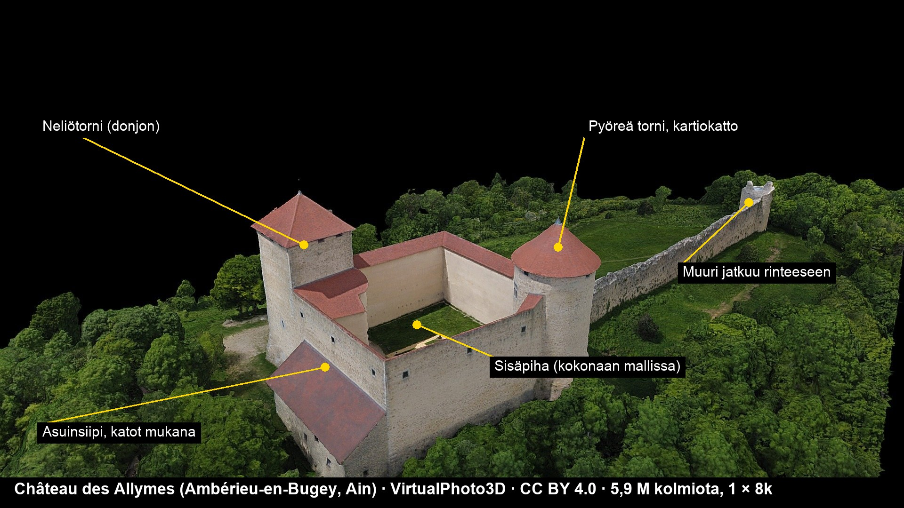

# Poikkileikkaus-linssin (E11) toinen linna: Ranskan kartoitus (Linnanrakentaja 1.10.2026)

Päätoimittajan tilaus 1.10. (omistaja hyväksyi erän): 3–5 ehdokasta lähdemallin mukaan, vain CC BY / CC0 (kaupallinen
käyttö ja muokkaus sallittu; ei NC, ei Scan the World, ei Quixel), laatu Olavinlinnaan verrattuna ja tarinallinen arvo.
Toteutus vasta omistajan valinnan jälkeen; malleja ei ole ladattu.

**Menetelmä.** Sketchfabin julkinen API (`/v3/search`, suodattimet `license=by|cc0`, `downloadable=true`, 40+ hakua:
Carcassonne, Chambord, Pierrefonds, Chinon, Vincennes, Bonaguil, Beynac, Foix, Fougères, Montségur, Najac, Murol,
Castelnaud, Falaise … sekä tekijöiden VirtualPhoto3D, pierre391 ja Archéomatique portfoliot). Tekstuurit ja kolmiot
mallikohtaisesta katselurajapinnasta (`/i/models/<uid>/textures`). Kaikkien alla olevien lisenssi on tarkistettu
API:sta: **CC BY 4.0** (http://creativecommons.org/licenses/by/4.0/), lataus `free`.

**Vertailukohta Olavinlinna:** 1,35 M kolmiota, yksi 4096²-tekstuuri, ~35 700 m² pintaa → 5,5–6,5 cm/tekseli.

## Ehdokkaat (paremmuusjärjestyksessä)

| # | Linna | Tekijä (CC BY 4.0) | Kolmiot | Tekstuurit | Tekselitiheys (arvio) | Kattavuus | Arkisto |
|---|---|---|---|---|---|---|---|
| 1 | **Château des Allymes**, Ambérieu-en-Bugey (Ain) | VirtualPhoto3D — [malli](https://sketchfab.com/3d-models/chateau-des-allymes-7645b78c4d674a1c98eb5128414ca758) | 5,94 M | 1 × 8192² | **~2–3 cm** | koko ulkokuori, kaikki katot, sisäpiha, muuri rinteeseen, ympäröivä metsä | 144 Mt |
| 2 | Château du Haut-Kœnigsbourg, Orschwiller (Alsace) | pierre391 — [malli](https://sketchfab.com/3d-models/chateau-du-haut-kœnigsbourg-b66ebc97c2494a7f903c9b9804bdf19e) | 0,86 M | 1 × 4096² | ~8–10 cm | koko linna ja katot, pihat; maasto karkea | 24 Mt |
| 3 | Château de Bonaguil (Lot-et-Garonne) | pierre391 — [malli](https://sketchfab.com/3d-models/chateau-de-bonaguil-6e2688960a914822858b998214aa5c09) | 1,18 M | 1 × 4096² | ~8–10 cm | raunio + kylä ja rinne; ei kattoja | 33 Mt |
| 3b | Château de Bonaguil (sama kohde) | Nikitos & 3130 — [malli](https://sketchfab.com/3d-models/chateau-de-bonaguil-f9a328a2f6e746a698b2f757a07f7b0a) | 1,31 M | 10 × 4096² | ~4–5 cm | laajempi maisema (kylä, pellot); linnan osuus pieni | 51 Mt |
| 4 | Forteresse de Couzan (Loire) | Christophe Mathevot — [malli](https://sketchfab.com/3d-models/forteresse-medievale-de-couzan-5daecf03c770428d939137e61299a723) | 2,47 M | 1 × 8192² | ~1,5–2 cm | raunio kalliolla, ei kattoja | 73 Mt |
| 5 | Château de Beynac (Dordogne) | pierre391 — [malli](https://sketchfab.com/3d-models/chateau-de-beynac-4f26ef1c2c1c49e98000d6e90d04ffcb) | 1,12 M | 1 × 4096² | ~10 cm | linna jyrkänteellä + koko kylä; linnan osuus pieni | 31 Mt |

Tekselitiheys on arvio (8k/4k-atlas × UV-käyttö ~0,6 ÷ arvioitu pinta-ala mallin rajauksen mukaan, ±50 %); tarkka
arvo `tekselitiheys.py`:llä latauksen jälkeen. Alkuperäinen tiedosto: kaikissa Sketchfabin lähdearkisto (OBJ/glTF +
tekstuurit) ladattavissa kirjautuneena (Olavinlinna ladattiin omistajan tililtä samoin).

**Hylätyt:** Carcassonne (GeoLan3D, CC BY) on IGN-lidarin pintamalli 2,7k-ortokuvalla, ei fotogrammetriaa — muurit
sulavat; Chambord (bbandic1) on käsin tehty "akin to" -AR-malli, ja "Castle Chambord" (Eric Haines) peliassetti; Nantesin
herttuoiden linna (Archéomatique) on vain yksi ovi; Saint-Denis-en-Bugey vain yksi torni; Murol (SARLW3ds) pieni ja
karkea; Montfaucon ja Weidelsburg ovat CC BY-NC (kielletty). Pierrefonds, Vincennes, Chinon, Foix ja Fougères: vain
yksityiskohtia tai ei CC-mallia.

## Tarinallinen arvo

1. **Allymes** — Viennoisin dauphinin 1200–1300-luvun vaihteessa rakentama rajalinna Dauphinén ja Savoijin kiistellyllä
   rajalla Bugeyssa; rakennettu uudelleen 1500-luvulla ja restauroitu 1800-luvulla. Opittavaa: miksi rajalle rakennettiin linnoja (sama kuin
   Olavinlinna Ruotsin ja Novgorodin rajalla 1475 — hyvä pari), neliö- ja pyöreän tornin ero puolustuksessa, alueen
   siirtyminen Ranskalle 1601. Pieni ja ehjä: kaikki huoneet katon alla → sopii Poikkileikkaukseen kuten Olavinlinna.
2. **Haut-Kœnigsbourg** — 1100-luvulta, tuhoutui 30-vuotisessa sodassa 1633; Saksan keisari Vilhelm II rakennutti sen
   uudelleen 1900–1908, kun Elsass kuului Saksalle. Opittavaa: rajaseudun kansallisuus, historiallinen "jälleenrakennus"
   tulkintana. Vahvin tarina, mutta tekstuuri harvempi kuin Olavinlinnassa.
3. **Bonaguil** — "viimeinen keskiaikainen linna" (1480–1520), suunniteltu jo tykkejä vastaan, mutta sitä ei koskaan
   piiritetty. Opittavaa: tuliaseiden muutos linnoitustekniikassa. Raunio: huoneita ei ole leikattavaksi.
4. **Couzan** — Forezin vanhimpia linnoituksia (1000–1400-luku). Paras tekstuuri, mutta raunio eikä tunnettu.
5. **Beynac** — satavuotisen sodan raja Dordognessa, Rikhard Leijonamieli. Linna on pieni osa kylämallia.

## Suositus: Château des Allymes

Lähdemalli on ehdokkaista ainoa, joka on samalla **ehjä katettu linna** (Poikkileikkaus tarvitsee huoneet) ja
**Olavinlinnaa tarkempi** (8k kompaktilla alueella, arviolta 2–3 cm/tekseli vs. 6 cm). Tarina tukee oppimista
rajalinnojen parina Olavinlinnan kanssa. Tekijämaininta: *Château des Allymes by VirtualPhoto3D, CC BY 4.0*.
Varavaihtoehto tarinan perusteella: Haut-Kœnigsbourg (laatu jää Olavinlinnan tasolle tai alle).

Kaikki ehdokkaat: `kuvat/linna-ranska-20261001/ehdokkaat.jpg` (esikatselukuvat Sketchfabista).
