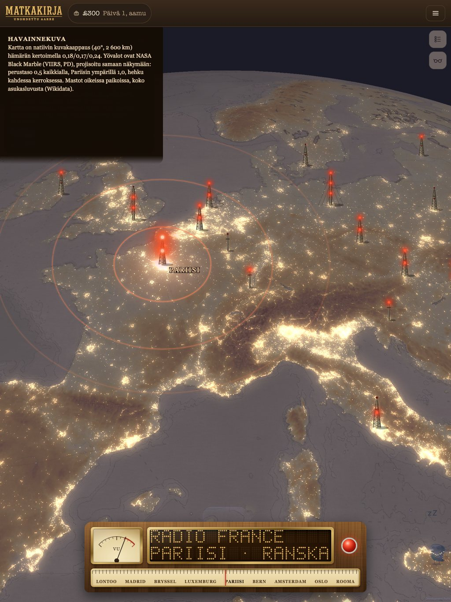
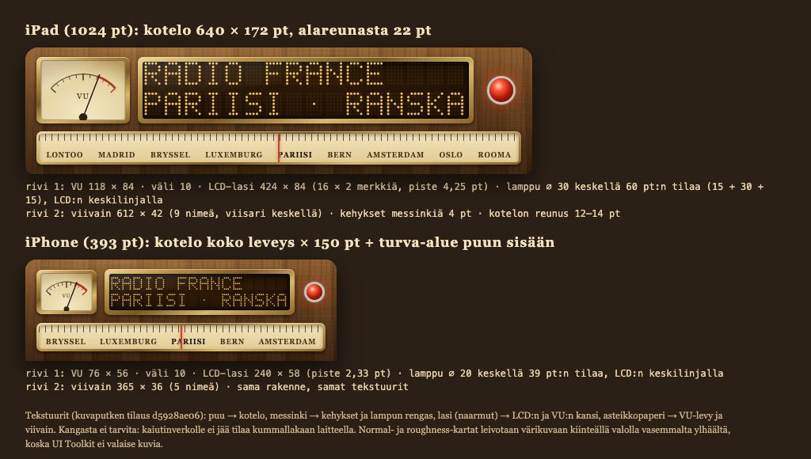
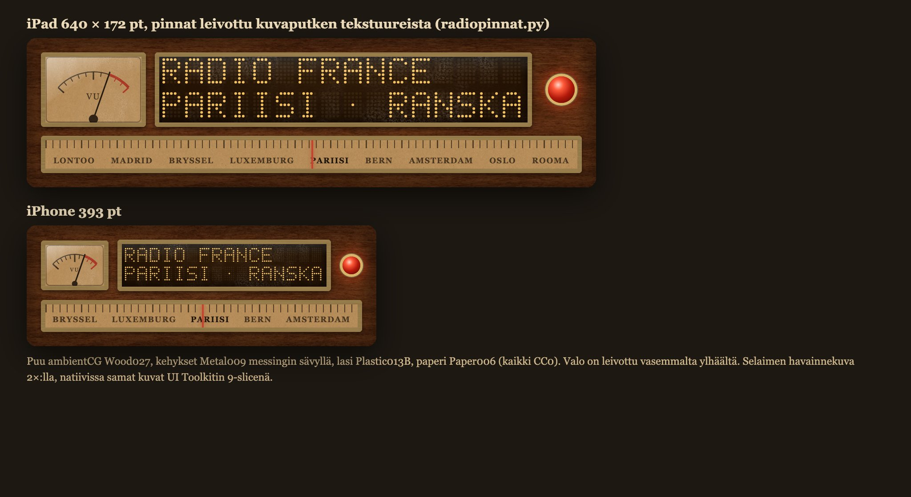
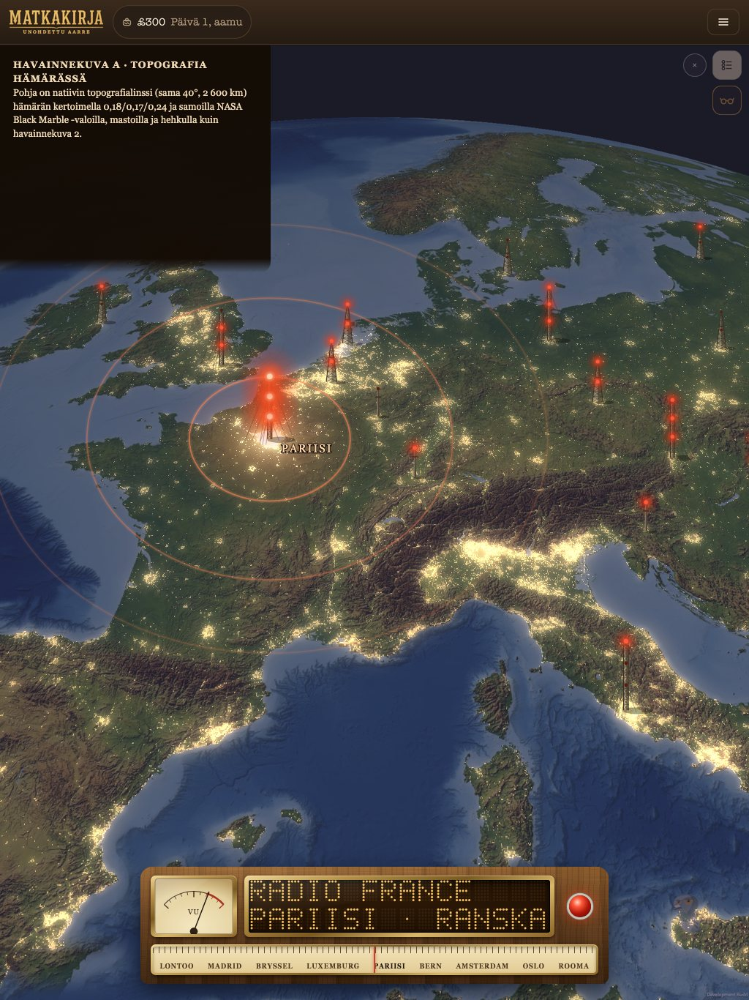
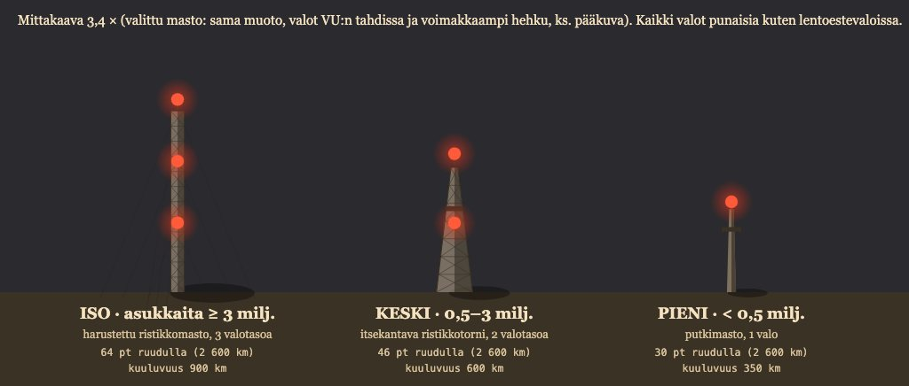
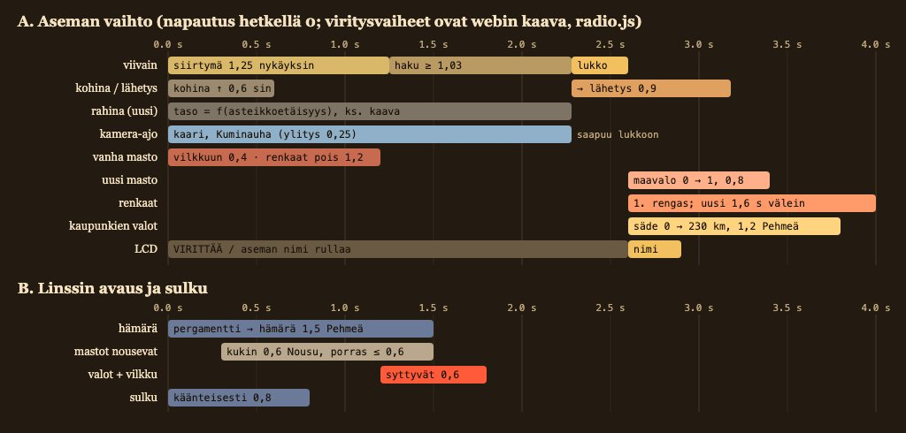
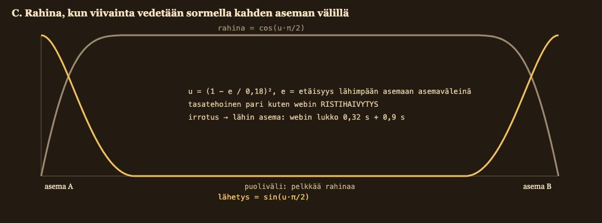
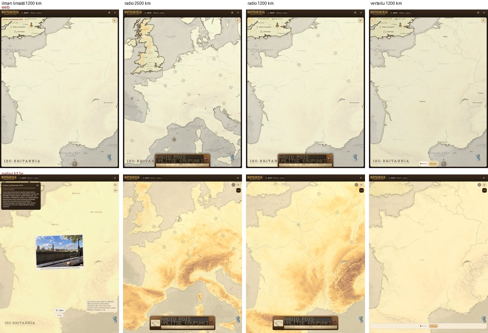

# Radiolinssin uudistus natiivissa: kuvitettu suunnitelma

*Linssiseppä (Opus), 24.9.2026 klo 19.4x. HYVÄKSYTTY sellaisenaan (Fable 24.9.2026 klo 19.5x, päätökset
luvussa 12). Toteutus on build 12:ssa, kun build 11:n pariteettityöt on mergetty. Sitä ennen tehdään vain
valmistelu (radiopinnat.py, mastoluokat). Linjaus on Raamatussa ("RADIOLINSSIN UUDISTUS NATIIVISSA", omistaja 24.9. klo 19.2x–19.3x). Tämä
suunnitelma koskee vain natiivia, web pysyy ennallaan.*

Kuvat ovat kansiossa `kaappaukset/radiouudistus-20260924/` (lähdekoodi `lahde/`). Ne ovat havainnekuvia.
Kartta on natiivin oma kuvakaappaus isosta iPadista (40° kallistus, 47° N 6° E, 2 600 km), ja sen päälle on
laskettu hämärä. Yövalot ovat oikeaa NASA Black Marble -aineistoa (GIBS VIIRS_Black_Marble), joka on projisoitu
samaan näkymään pelin kameramallilla (`lahde/proj.py`). Mastot ovat oikeissa paikoissa, ja niiden koko tulee
asukasluvusta (skeema 1.38). Pääkuva päivitettiin omistajan palautteen mukaan 24.9. klo 20.1x: kartta on
tummempi, yövalot kattavat kaikki kaupungit ja tiet, ja hehku on voimakkaampi. Paneelin puu, messinki ja lasi ovat
proseduraalisia sijaisia, kunnes kuvaputki toimittaa tekstuurit (tilaus d5928ae06).



## 1. Kokonaisuus lyhyesti

| Osa | Ratkaisu | Tekijä |
|---|---|---|
| Paneeli | Puinen kotelo, jossa VU ja LCD ovat samalla rivillä ja lamppu oikealla. Viivain on alla. Pinnat tulevat kuvaputken tekstuureista, ja valo on leivottu kuviin. | Linssiseppä (RadioNakyma, Natiivi-UI:n kanssa) |
| Hämärä | Kartta tummuu ja viilenee kertoimella lineaarisessa tilassa. Viivat säilyttävät kontrastinsa, koska kerroin on sama kaikille. | Natiiviseppä (tileset-varjostin) |
| Yön valot | Black Marble näkyy emissiivisenä, koko maailmassa himmeänä ja valitun maston ympärillä kirkkaana. | Karttaseppä (poltto), Natiiviseppä (sekoitus) |
| Mastot | Kolme kokoa, instanssit, liioiteltu korkeus ja punaiset lentoestevalot. | Natiiviseppä (piirto), Linssiseppä (luokat ja tila) |
| Vilkku | Muut mastot vilkkuvat epätahdissa GPU:lla. Valittu seuraa VU-tasoa ja valaisee maata. | Natiiviseppä (varjostin), Linssiseppä (taso) |
| Renkaat | Renkaat laajenevat pintaa pitkin kuuluvuusalueen reunaan. | Natiiviseppä (pallokalotti), Linssiseppä (ajoitus) |
| Rahina | Viivainta vedetään sormella, ja rahina riippuu asteikkoetäisyydestä. Lukitus käyttää webin kaavaa. | Linssiseppä |
| Kamera-ajo | Kaari uudelle mastolle Kamerakoreografialla. Kamera saapuu perille lukituksen hetkellä. | Linssiseppä |

## 2. Paneeli



**Lampun paikka** (omistaja 24.9. klo 20.0x, sitova): lamppu on keskellä LCD:n oikean reunan ja kotelon
sisäreunan välistä tilaa sekä vaaka- että pystysuunnassa, LCD:n rivien keskilinjalla. UI:ssa lampun
säiliö täyttää jäljelle jäävän tilan (flex-grow 1, align-self stretch), ja lamppu keskitetään sen sisään.

**iPad (1024 pt):** kotelo on 640 × 172 pt, keskellä ja 22 pt alareunasta. Sisäleveys on 612 pt (reunus 14 pt).
- Rivi 1: VU 118 × 84, väli 10 pt, LCD-lasi 424 × 84 (16 × 2 merkkiä, pisteväli 4,25 pt) ja lamppu ⌀ 30
  keskellä jäljelle jäävää 60 pt:n tilaa (15 + 30 + 15).
- Rivi 2: viivain 612 × 42, jossa 9 nimeä ja punainen viisari keskellä.
- Messinkikehys on 4 pt jokaisen osan ympärillä, ja kotelon reunus on 12–14 pt.

**iPhone (393 pt):** kotelo on koko ruudun levyinen ja 150 pt korkea, ja turva-alue jää puun sisään.
- Rivi 1: VU 76 × 56, väli 10 pt, LCD-lasi 240 × 58 (pisteväli 2,33 pt) ja lamppu ⌀ 20 keskellä jäljelle
  jäävää 39 pt:n tilaa. Aiempi LCD (260 pt) ei mahtunut sisäleveyteen 365 pt lampun kanssa.
- Rivi 2: viivain 365 × 36, jossa on 5 nimeä.
- 16 merkin näyttö mahtuu, kun VU pienenee. Nykyinen iPhone-asettelu, jossa VU on omalla rivillään, poistuu.

**Pinnat:**

| Tekstuuri | Käyttö | Tiedosto natiivissa |
|---|---|---|
| Puu (pähkinä/mahonki) | kotelo | 9-slice 1024 × 320 |
| Messinki | kehykset ja lampun rengas | 9-slice 128 × 128 |
| Lasi (naarmut) | LCD:n ja VU:n kansi | päällyskuva 512 × 128 (heijastus ja naarmut alfana) |
| Asteikkopaperi | VU-levy ja viivain | 256 × 180 ja toistuva 512 × 64 |



Kangasta ei tarvita, koska kaiutinverkolle ei jää tilaa kummallakaan laitteella. UI Toolkit ei valaise
kuvia, joten normal- ja roughness-kartat leivotaan värikuvaan kiinteällä valolla vasemmalta ylhäältä
(L = (−0,4, 0,6, 0,7), ambient 0,55). Samalla lisätään kevyt kiilto roughnessin mukaan. Leivonta tehdään
Linssisepän Python-työkalulla `tyokalut/radiopinnat.py`. Tulos on ASTC 6×6 ja yhteensä alle 2 Mt.

**Käytös:** VU-neula käyttää nykyistä VuMittariNakymaa, jossa asteikko piirretään kerran ja neula kääntyy
muunnoksella. Lamppu toimii kuten ennenkin: punainen soittaessa, meripihka virittäessä, tumma virheessä ja
napautuksesta tauko. LCD:n rivit tulevat edelleen RadioTilasta.

## 3. Hämärä kartta

**POHJA ON VÄRILLINEN TOPOGRAFIA** (omistaja 24.9. klo 22.3x, havainnekuva A, Raamattu RADIOLINSSIN
UUDISTUS, POHJA): radiolinssi ei käytä pergamenttia, vaan sama topografiarasteri kuin topografialinssi
(väriasteikko vihreästä alamaasta ruskeisiin vuoriin, meri sininen) tummuu hämäräksi ja Black Marble -valot
syttyvät sen päälle. Toteutus:
- **Linssiseppä (RadioLinssi):** avaus ottaa topografialinssin rasterin samalla polulla kuin topografialinssi
  (KarttaKerrokset.LisaaRasteri Topografia.Kerros, pohja "laatat" piiloon), ja sulku palauttaa entisen pohjan.
- **Natiiviseppä (Kartta):** pehmeä häivytys paikan alfalla (_overlayAlfa_<paikka>) avauksen 1,5 s:n aikana.
- Hämärän kertoimet (alla) eivät muutu: ne kertovat pohjan värit, oli pohja mikä tahansa.



Vertailuksi B (päivänvalo, ei valittu): `kaappaukset/radiouudistus-20260924/3-topografia-b.jpg`.
Pääkuva (1) on pergamenttipohjainen ja näyttää mastot, renkaat ja paneelin samasta näkymästä.

Hämärä ei ole yö. Kartta tummuu ja viilenee, ja rannat, rajat, nimet ja relief jäävät näkyviin.
Tileset-varjostimessa tehdään yksi kerto- ja lisäys lineaarisessa tilassa:

```
hämärä = pohja × (0,18, 0,17, 0,24) + (0,006, 0,006, 0,016)     (omistaja 24.9. klo 20.0x: tummempi)
lopputulos = lerp(pohja, hämärä, h),  h = 0 → 1 linssin avauksessa (1,5 s, Pehmeä)
```

Kerroin on sama tummille viivoille ja vaalealle paperille, joten rantaviivan ja paperin suhde säilyy.
Pääkuvassa kaikki rannat ja Alppien relief erottuvat. Taivas on jo valmiiksi tumma. Linssin ajaksi huntu
lähtee pois (löydös 43, alla), joten kaikki maat näkyvät samassa hämärässä.

**Yön valot** tulevat NASA Black Marblesta (VIIRS, PD). Karttaseppä polttaa kevyen sarjan Z0–Z6
satelliittiputkella, ja Natiiviseppä lisää sen hämärään emissiivisenä:

```
w     = saturate((R − 48/255) / (170/255)) × saturate((R − B + 10/255) / (40/255))   (vain lämmin valo,
        ei kuunvalaistua maata eikä lunta; Karttaseppä voi leipoa tämän suoraan polttoon)
valo  = w × 0,85 × (0,5 + 0,5 × paikallinen) × (1,05, 0,82, 0,52)                   (natriumin sävy)
paikallinen = smoothstep(230 km, 60 km, etäisyys valittuun mastoon) × syttyminen (0 → 1, 1,2 s Pehmeä)
hehku = valo + blur(valo, 4 pt) × 1,4 + blur(valo, 14 pt) × 1,9                       (bloom, lisätään)
```

Perustaso on 0,5 kaikkialla maailmassa (omistaja: selvästi näkyvä), ja valitun maston ympärillä valot ovat
täysiä. Bloom on Natiivisepän filmipinossa (URP Bloom: kynnys emissiiviselle, sironta noin 0,7) tai
tileset-varjostimen oma kahden säteen hehku, kumpi on iPhonella halvempi. Sama kerros palvelee myöhemmin
yön valot -datalinssiä ja lennon yöosuutta.

## 4. Radiomastot



| Koko | Kaupunki | Muoto | Valot | Korkeus ruudulla (2 600 km) | Kuuluvuus (renkaiden säde) |
|---|---|---|---|---|---|
| Iso | ≥ 3 milj. asukasta | harustettu ristikkomasto | 3 tasoa (36 %, 68 %, huippu) | 64 pt | 900 km |
| Keski | 0,5–3 milj. | itsekantava ristikkotorni | 2 tasoa (50 %, huippu) | 46 pt | 600 km |
| Pieni | < 0,5 milj. | putkimasto | huippu | 30 pt | 350 km |

- **Koko tulee kaupungin asukasluvusta:** kaupungit.json-kenttä `asukkaat` (skeema 1.38, Wikidata P1082,
  CC0). Jos luku puuttuu (luontokohteet kuten Sahara ja Alpit) tai `asukkaatAlue` on tosi (luku koskee
  saarta tai valtiota, esim. Angola ja Islanti), masto on Pieni. Koepaketissa v49 jako on 36 Iso, 43 Keski
  ja 36 Pieni. Huom: P1082 on kaupungin oma raja eikä metropolialue, joten Pariisi (2,1 milj.) ja Rooma
  (2,7 milj.) ovat Keskiä.
- **Liioittelu:** 64 pt 2 600 km:n korkeudelta vastaa noin 150 km:n mastoa (oikea on noin 300 m), eli
  liioittelu on noin 500-kertainen. Maston korkeus maailmassa on c × kameran korkeus^0,85, joten koko
  ruudulla kasvaa hieman zoomattaessa lähemmäs mutta ei räjähdä. Mastot seisovat pinnan normaalin
  suuntaisina.
- **Kallistus:** ylhäältä katsottuna pystymasto näkyy pisteenä. Siksi radiolinssi avaa kameran 40°:n
  kallistukseen (pääkuva). Pelaaja voi kallistaa itse 0–85°, ja 0°:ssa mastot näkyvät lyhyinä.
- **Napautus:** masto korvaa nykyiset ▶-napit. Osuma-alue on 44 × 44 pt maston puolivälissä, ja valitun
  maston nimi näkyy sen vieressä. Kanavaton maa näyttää maston ilman valoja 50 %:n peittävyydellä (web:
  katkoviivarengas ilman kolmiota). Linkkiasemassa (kielletty luokka) valot palavat, mutta renkaita ei ole.
- **Piirto:** kolme verkkoa (LOD0 noin 300 kolmiota, LOD1 kaukana litteä kortti) GPU-instansseina, eli 3
  piirtokutsua. Valot ovat yksi instansoitu billboard-kutsu, ja pallon takana olevat karsitaan. 115 mastoa.

## 5. Vilkku, maavalo ja renkaat

**Muut mastot (lentoestevalot):** kukin vilkkuu omassa vaiheessaan. Jakso on 1,5 s ± 20 % (arvottu
mastoittain, siemen = aseman tunnus), valo palaa 0,45 s ja nousee ja laskee 0,12 s. Kaikki lasketaan
varjostimessa, joten prosessori ei tee mitään kehyskohtaista.

**Hehku** (omistaja 24.9. klo 20.0x): lentoestevalon halo on 6,8 × valon säde (valittu 12 ×), eli
kaksinkertainen ensimmäiseen havainnekuvaan nähden, ja reunan alfa on korkeampi. Maavalon säde on 140 km.

**Valittu masto:** kirkkaus = max(0,25, VU) (aito taso, AVAudioEngine build 8). Kirkkaus nousee 30 ms:ssa
ja laskee 250 ms:ssa, jotta tahti näkyy mutta ei välky. Kaikki tasot vilkkuvat samassa tahdissa. Maavalo on
lämmin #ff8a4a, säde 110 km × (0,6 + 0,4 × kirkkaus), ja se lisätään tileset-varjostimessa samaan kohtaan
kuin yön valojen paikallinen tehostus.

**Radioaaltorenkaat:** ensimmäinen syntyy lukituksen hetkellä, ja sen jälkeen uusi rengas syntyy 1,6 s
välein. Rengas kasvaa kuuluvuussäteeseen 4,8 s:ssa käyrällä Nousu (nopea alku, pitkä hidastus), joten
näkyvissä on kolme rengasta. Alfa laskee 0,55:stä nollaan säteen mukana. Rengas on 2 pt:n viiva #ff7a4a,
jonka ympärillä on 6 pt:n hehku 18 %:n peittävyydellä. Renkaat piirretään pallokalottina 2 km pinnan
yläpuolelle, jotta 900 km:n rengas kaartuu pallon mukana.

## 6. Aikajana: aseman vaihto sekä avaus ja sulku



Aseman vaihdon rungon muodostavat webin viritysvaiheet, joita ei muuteta: siirtymä 1,25 s, haku ≥ 1,03 s,
lukittuminen 0,32 s (vähintään 2,6 s yhteensä) ja ristihäivytys 0,6 s alussa ja 0,9 s lukituksessa.
Uudet osat kiinnittyvät niihin:

| Hetki | Tapahtuma |
|---|---|
| 0 | Napautus. Vanha masto palaa vilkkuun 0,4 s:ssa, ja sen renkaat häipyvät 1,2 s:ssa (uusia ei synny). Kamera lähtee. |
| 0–2,28 s | Kamera kulkee kaarena uudelle mastolle. |
| 2,28 s | Kamera saapuu. Lukittuminen alkaa, ja kohina vaihtuu lähetykseen (0,9 s). |
| 2,6 s | Uusi masto siirtyy VU-tahtiin (0,3 s), ja maavalo nousee 0,8 s:ssa. Ensimmäinen rengas syntyy, ja kaupunkien valot syttyvät 1,2 s:ssa. |

**Kamera-ajo** (Raamattu, KAMERA-AJOT; `Linssit/Ydin/Kamera/Kamerakoreografia`):
- Kesto on 2,28 s, jolloin kamera saapuu lukituksen alkaessa. Jos matka on alle 150 km, kesto on 1,2 s.
- Reitti kulkee isoympyrää pitkin. Korkeus nousee keskellä kertoimella 1 + 0,6 × min(1, d / 2 500 km),
  joten lähimatka on pieni kaari ja mantereen ylitys tuntuu lennolta.
- Käyrä on Kuminauha, ylitys 0,25: pehmeä lähtö ja jousto perille.
- Kallistus pysyy 40°:ssa. Suuntima kääntyy enintään 15° kohti kulkusuuntaa ja palaa perillä.
- Jos pelaaja koskee palloon ajon aikana, ajo keskeytyy heti.

**Avaus (1,5 s):** hämärä laskeutuu 1,5 s:ssa (Pehmeä), ja kamera kallistuu samassa ajossa 40°:seen.
Mastot nousevat maasta 0,6 s:ssa käyrällä Nousu, porrastettuina 0–0,6 s kamerasta mitatun etäisyyden
mukaan. Lähimmät nousevat ensin. Valot syttyvät 0,6 s:ssa ja aloittavat vilkkunsa arvotusta vaiheesta.

**Sulku (0,8 s):** kaikki tapahtuu käänteisesti Pehmeällä käyrällä, ja kallistus palaa pelaajan
edelliseen kallistukseen.

## 7. Rahina viivainta vedettäessä



Nyt viivaimen nimen voi vain napauttaa. Uudistuksessa nauhaa voi myös vetää sormella (1:1, ilman
hitautta), ja vedon aikana kuuluu rahinaa sen mukaan, kuinka lähellä asemaa viisari on:

```
e = etäisyys lähimpään asemaan asemaväleinä (0 … 0,5)
u = max(0, 1 − e / 0,18)²
lähetys = sin(u·π/2),  rahina = cos(u·π/2)      (tasatehoinen pari kuten webin RISTIHAIVYTYS)
```

Kun viisari on lähellä asemaa, asema kuuluu rahinan läpi. Puolivälissä kuuluu pelkkää rahinaa.
Irrotuksen jälkeen nauha lukittuu lähimpään asemaan webin lukitusvaiheella (0,32 s) ja 0,9 s:n
ristihäivytyksellä. Jos asema ei ole vielä kuulunut, se soi tavallisena virityksenä (siirtymä jää pois, koska
sormi teki sen). Vedon aikana lähetykset avataan mykkinä kuten nyt. Kahden lähimmän aseman virta pidetään
auki, ja kolmas suljetaan. Rahina tulee nykyisestä viritinäänestä (RadioViritin), jonka taso annetaan
suoraan. Kamera ei liiku vedon aikana vaan vasta lukituksessa.

## 8. Löydös 43 (build 11, tehty)

Radiolinssissä kaikki maat näkyvät nyt ilman huntua. Vertailu- ja maatietolinssi pitävät hunnun, kuten
webissä, joka mittasi niissä kerman. Keksinnöt, ihmisen matka ja astronautti menettävät hunnun samalla
säännöllä kuin web (lauta.js: "KERMA POIS MYÖS LINSSIN AJAKSI"). Topografia, vesistöt, satelliitti ja
isoisä vaihtavat pohjan tai lisäävät rasterin, joten niissä huntua ei ollut ennestäänkään. Muutos on
haarassa linssiseppa/radio-huntu efbdb7f, ja Natiiviseppä on antanut mergeluvan.



## 9. Rajapinta (RAJAPINTA.md luku 4, ehdotus Natiivisepälle)

```csharp
public interface IRadioKartta   // laajennus: nykyiset NaytaVain/Korosta/KaupunkiNapautettu säilyvät
{
    void Hamara(float h);                                   // 0…1 joka kehys avauksen ja sulun aikana
    void Mastot(IReadOnlyList<Masto> mastot);               // kerran avauksessa: id, lat, lon, koko 0/1/2, tila
    void Valittu(string id, float kirkkaus);                // joka kehys: VU-taso käyrän jälkeen, null = ei valittua
    void Renkaat(double lat, double lon, double sadeKm, IReadOnlyList<float> osuudet); // renkaiden osuudet 0…1
    void YonValot(double lat, double lon, float paikallinen);
    event Action<string> MastoNapautettu;
}
```

Logiikka on Ydimessä (RadioLinssi, testattavissa ilman editoria): kirkkauskäyrä, renkaiden ajoitus,
kamera-ajon ketju ja avauksen porrastus. Natiiviseppä piirtää, ja muiden mastojen vilkku on kokonaan
hänen varjostimessaan.

## 10. Suorituskyky ja testaus

- **Budjetti iPhonella:** alle 1,0 ms GPU:ta. Mastot vievät 3 piirtokutsua, valot 1 ja renkaat 1.
  Hämärä, maavalo ja yön valot ovat tileset-varjostimen uniformeja ilman omaa kutsua. Prosessorilla
  kehyskohtaista työtä on vain valitun kirkkaus ja renkaiden osuudet.
- **Testit:**
  - `laitetesti.sh radio`: mastot, kuvasarja aseman vaihdosta (komento.txt `kuva …; odota 0.25`, video
    ffmpegillä).
  - `laitetesti.sh piikit`: avaus, vaihto ja sulku alle 20 ms/kehys.
  - Ydintestit: rahinan pari, kirkkauskäyrä, renkaiden ajoitus ja kameran kesto.
  - Kuvapari: webistä ei ole vastinetta, joten vertailu tehdään tähän suunnitelmaan.

## 11. Työjärjestys build 12:een

1. **Linssiseppä:** Ydimen logiikka ja testit (kohdat 5–7 ja 9) sekä paneeli proseduraalisilla sijaisilla.
2. **Natiiviseppä:** hämärä, mastot instansseina, vilkku, maavalo ja renkaat rajapinnan takana.
3. **Siirtoseppä:** `asukkaat` radiokaupungeille (Wikidata P1082).
4. **Kuvaputki → Linssiseppä:** tekstuurit leivotaan ja vaihdetaan sijaisten tilalle.
5. **Karttaseppä → Natiiviseppä:** Black Marble Z0–Z6 E28:n jälkeen. Sitä ennen yön valot ovat pois, ja
   vain maavalo näkyy.
6. **Linnut** (Raamattu, hämärässä ja lennolla) eivät kuulu tähän suunnitelmaan, ks. kysymys 5.

## 12. Fablen päätökset (24.9.2026 klo 19.5x)

1. **Mastoluokka tulee asukasluvusta** (≥ 3 milj. / 0,5–3 / < 0,5). Siirtoseppä lisää kentän `asukkaat`
   Wikidatasta (P1082, CC0) radiokaupungeille uuteen skeemaversioon. Linssiseppä tilaa sen suoraan.
2. **Radion avaus kallistaa kameran 40°:seen.** Pelaaja saa kallistaa itse 0–85°.
3. **Mastot korvaavat ▶-napit.** Osuma-alue on 44 pt.
4. **Rahina riippuu vain asteikkoetäisyydestä** webin kaavalla (luku 7).
5. **Linnut:** Natiiviseppä toteuttaa boid-parvet (piirto, LOD ja määrä). Linssiseppä määrittelee, milloin
   ne näkyvät (radion hämärä ja lento), ja niiden reitit. Linnut tulevat build 12:een omana eränään
   mastojen jälkeen, eivät samaan PR:ään.

Toteutus alkaa vasta, kun build 11:n pariteettityöt on mergetty.
