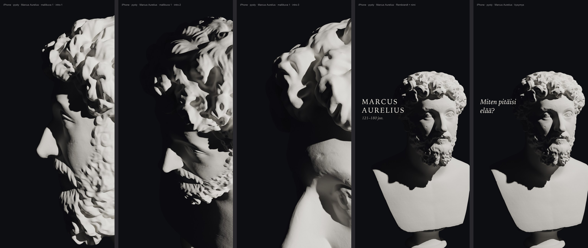

# Ajattelijat: Marcus Aureliuksen kipsibysti (Linnanrakentaja 2.10.2026)

Sama putki kuin Sokrateella (`tools/linssit/blender/sokrates_bysti.py --kohde marcus`, ks. sokrates-bysti-20261001.md).

## Lähde
- SMK – Statens Museum for Kunst, KAS979 "Portræt af Marcus Aurelius (kejser 161-180 e.Kr.)", kipsivalos
  (Formeri: Paris, Louvre nr. 383). Rights: Public Domain Mark 1.0, `public_domain: true` (api.smk.dk).
- 3D ladattu vain museon palvelimelta: `api.smk.dk/api/v1/download-3d/hh63t1750_51-smk-inv-979.stl` (99 Mt,
  2 M kolmiota, bysti sokkelilla). Skannaus: Scan the World / SMK (mainitaan kohteliaisuutena).
- Museo ei ilmoita mittoja. Malli on normalisoitu 0,51 m:n korkeuteen sokkeli mukaan lukien, kuten Sokrates.

## GLB-tasot
`/Users/Shared/Claude/proto-3d/_valmiit/marcus-aurelius-bysti/v1/`

| Taso | Kolmiot | Normaalikartta | Koko |
|---|---|---|---|
| L0 | 200 k | 2048 | 9,0 Mt |
| L1 | 50 k | 1024 | 2,7 Mt |
| L2 | 12 k | 1024 | 1,8 Mt |
| symboli | 3 k | – | 55 kt |

## Mallikuva
- Intro kiertävällä kovalla valolla. Tuuheat kiharat ja parta varjostavat enemmän kuin Sokrateella, joten
  aurinko alkaa sivummalta.
- Rembrandt + "MARCUS / AURELIUS / 121–180 jaa." ja sitten kysymys "Miten pitäisi elää?".

## Luennat (omistajan äänilupa 2.10. klo 07.2x)
Työkalu `tools/linssit/sokrates_luennat.mjs --kohde marcus`, tiedostot kansiossa
`/Users/Shared/Claude/proto-3d/_lahteet/marcus-aurelius/luennat/` (kuitti.json).

| Pätkä | Merkkejä | Otot | Kesto |
|---|---|---|---|
| a | 73 | 1 | 6,2 s |
| b | 182 | 1 | 14,2 s |
| c | 108 | 1 | 8,3 s |
| d | 184 | 1 | 15,2 s |
| e | 70 | 1 | 6,4 s |
| f | 140 | 1 | 11,6 s |
| **Yhteensä** | **757** | **6** | |

## Musiikki
- Jatko: J. S. Bach, Goldberg-muunnelmat, Aria, Kimiko Ishizaka (Open Goldberg Variations), CC0, Commons
  Kimiko_Ishizaka_-_01_-_Aria.ogg (299,5 s).
- Intro (Beethoven 7, Allegretto) on vielä auki.
