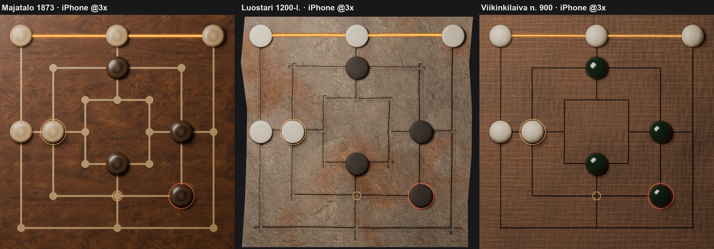

# Myllyn laudat: kolme esinettä ja niiden esikuvat (Linnanrakentaja 1.10.2026)

Omistaja hyväksyi lautavalikoiman 1.10. klo 21.0x ja tarkensi klo 21.1x: laudat tehdään aitojen historiallisten
esikuvien mukaan, koska niistä tulee ansaittavia esineitä. Kaikilla kolmella laudalla on sama kamera ja samat
24 pistettä (`pisteet.json`), ja ne renderöidään Blenderissä (Cycles) skriptillä `tools/linssit/blender/mylly_lauta.py`.

## Laudat

| Tunnus | Nimi | Esikuva | Lauta | Nappulat |
|---|---|---|---|---|
| `majatalo` | Majatalo 1873 | 1800-luvun majatalon pelilauta (ei yksittäistä esikuvaa) | öljytty pähkinä, viivat ja pisteet vaaleana vaahteraupotuksena | sorvattu vaahtera / pähkinä |
| `luostari` | Luostari 1200-l. | Ten Duinen -luostarin tiili, Abdijmuseum Ten Duinen, Koksijde, inv. 033880 | poltettu iso tiili ("kloostermop"); viivat painettu märkään saveen, joten urien reunat nousevat; murtuneet päät | luukiekko / tumma savikiekko |
| `viikinkilaiva` | Viikinkilaiva n. 900 | Gokstadin laivahaudan kaksipuolinen pelilauta, Kulturhistorisk museum, Oslo | haalistunut tammi kirveenjäljin; terävästi kaiverretut viivat | sarvi tai luu (Birka, hauta 581) / tummanvihreä lasi (Birka, hauta 750) |

### Luostari 1200-l. (Ten Duinen 033880)
- Museon kuvaus: iso tiili 1200-luvulta. Toiselle puolelle on painettu kolme neliötä ja neljä viivaa (24 pistettä)
  märkään saveen ennen polttoa. Esillä salissa 11 (*De spelende mens in de middeleeuwen*). Sama tyyppi on löydetty
  myös Viipurin linnasta.
- Mallinnettu kuvista: leveä U-ura, jonka reunat nousevat; ulkoneliön ja keskilinjojen vedot jatkuvat pitkälle yli
  (kuvassa lähes tiilen reunaan); viivat ovat vähän vinossa ja aaltoilevat; pisteissä ei ole kuoppia; pinta on
  harmaanbeige, ja siinä on oranssinpunaisia polttolaikkuja. Neliömäinen ruutu näyttää tiilestä lautaosan; päät on
  mallinnettu murtopinnoiksi (alkuperäisen toinen pää on lohjennut).
- Lähteet:
  - [tij-dingen.be: Ssssst… hier wordt (middeleeuws) gespeeld](https://www.tij-dingen.be/ssssst-hier-wordt-middeleeuws-gespeeld)
  - [tenduinen.be: familieparcours](https://www.tenduinen.be/nl/hierwordtgespeeld)
  - Commons [Brick with Nine Men's Morris (the mill game), inv.nr. 33880](https://commons.wikimedia.org/wiki/File:Brick_with_Nine_Men%27s_Morris_(the_mill_game),_inv.nr._33880.jpg) (Abbey Museum of the Dunes, CC BY-SA 4.0)
  - Commons [Baksteen met molenspel – Abdijmuseum Ten Duinen](https://commons.wikimedia.org/wiki/File:Baksteen_met_molenspel_-_anoniem_-_Abdijmuseum_Ten_Duinen_-_1.jpg) (Dominique Provost / Art in Flanders, PD)
  - Kuvia käytettiin vain muodon ja tyylin viitteenä, ei tekstuureina.
- Hylätty esikuva: englantilaisten katedraalien ristikäytävien laudat (Canterbury, Westminster, Gloucester, Norwich).
  Ne ovat pääosin 3 × 3 "nine holes" -lautoja, ja niistä ei ole Commons-kuvia (Päätoimittaja 1.10.).

### Viikinkilaiva n. 900 (Gokstad)
- Gokstadin laivahauta n. 895–903 (dendro). Lauta on kaksipuolisen puulaudan katkelma: toisella puolella
  13 × 13 tafl, toisella osa myllylautaa. Mukana löytyi sarvinappula. Viivat on kaiverrettu suoriksi ja terävästi
  (ammattimainen työ). Puulajiksi mainitaan tammi vain sekundäärilähteessä. Pistekuopista ei ole tietoa, joten
  pisteet ovat pelkkiä viivojen risteyksiä.
- Nappulat: Birkan hauta 750 (25 lasinappulaa, puolipallon muotoisia, korkeus 2,5–2,7 cm, tummanvihreitä ja
  vaalean sinivihreitä) ja hauta 581 (sarvinappulat). Mallissa tumma on tummanvihreää lasia ja vaalea sarvea.
- Lähteet:
  - [Gokstad Mound (Wikipedia)](https://en.wikipedia.org/wiki/Gokstad_Mound)
  - [Tafl games (Wikipedia)](https://en.wikipedia.org/wiki/Tafl_games)
  - [Gokstad ship game board fragment (W. Szabel)](https://wilhelmszabel.wordpress.com/2015/05/29/gokstad-ship-game-board-fragment/)
  - [World Tree Project 2221](http://www.worldtreeproject.org/document/2221)
  - [Birka grave Bj 581 (Wikipedia)](https://en.wikipedia.org/wiki/Birka_grave_Bj_581)
- Commonsista ei löytynyt kuvaa Gokstadin laudasta eikä Birkan nappuloista. Mittoja ja puulajia ei ole varmennettu
  museon luettelosta (unimus.no / DigitaltMuseum, C-numero tuntematon).

## Tekstuurit (vain CC0, Poly Haven)
- `wood_table_worn` (Dimitrios Savva, Rico Cilliers): majatalon pähkinä, vaalennettu.
- `rock_surface` (Amal Kumar): luostarin tiilen savipinta; sävy ja polttolaikut proseduraalisia.
- `grey_oak_veneer_02` (Jenelle van Heerden): viikinkilaivan tammi; tummuneet laikut ja kirveenjäljet proseduraalisia.
- Nappulat, upotus, lasi, luu ja savi ovat proseduraalisia materiaaleja.

## Kerrokset (Siirtosepän speksi 1.10.)
Kansio `/Users/Shared/Claude/proto-3d/_valmiit/mylly-laudat/v1/`. Kaikki tiedostot ovat suoran alfan PNG:itä.
- `lauta-<tunnus>.png`, 2048²: lauta, urat ja pisteet.
- `hehku-<tunnus>.png`, 2048²: kaikkien 16 myllyviivan kultahehku. Koodi rajaa yhden myllyn suorakaiteella
  (myllyn kolmen pisteen rajat ± 0,03 laudasta). Ristiviivojen vuoto jää nappuloiden alle.
- `nappula-vaalea-<tunnus>.png`, `nappula-tumma-<tunnus>.png` ja `nappula-varjo-<tunnus>.png`, 256²,
  keskitetty; halkaisija 0,098 laudasta eli 200 px. Varjo on valon suuntaan (ylävasemmalta) siirtynyt alfa.
- `rengas-valittu.png`, `rengas-poistettava.png` ja `rengas-kohde.png`, 320², keskitetty.
- `pisteet.json`: 24 pistettä normalisoituna 0–1 (x oikealle, y alas) Mylly.Paikat-järjestyksessä, nappulan
  halkaisija, 16 myllyä ja tiedostonimet laudoittain.

Valittu nappula nostetaan mallikuvassa 0,012 (noin 25 px) ylös; natiivissa riittää varjon siirto ja kultarengas.

Kuvat: [iPad-rajaus](kuvat/mylly-lauta-20261001/laudat-kolme-ipad.jpg) ja
[kerroskoe](kuvat/mylly-lauta-20261001/kerroskoe-viikinkilaiva.jpg), jossa viikinkilaiva on koottu pelkistä
toimituskerroksista samoin kuin natiivi sen kokoaa (lauta → rajattu hehku → varjo → nappula → rengas).
Jälkikäsittely: `tools/linssit/blender/mylly_jalki.py`.
