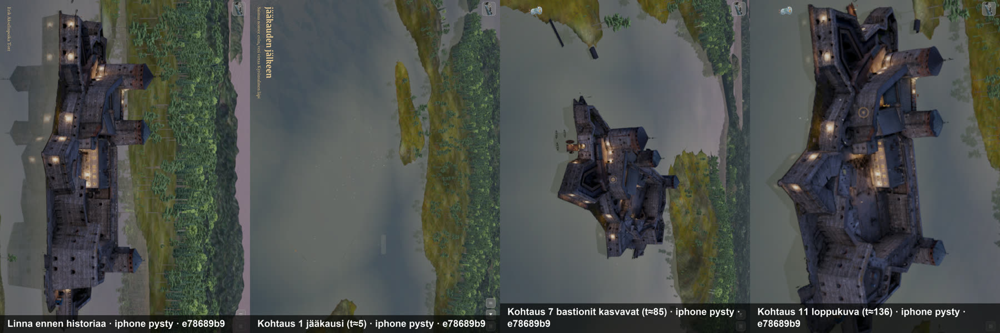
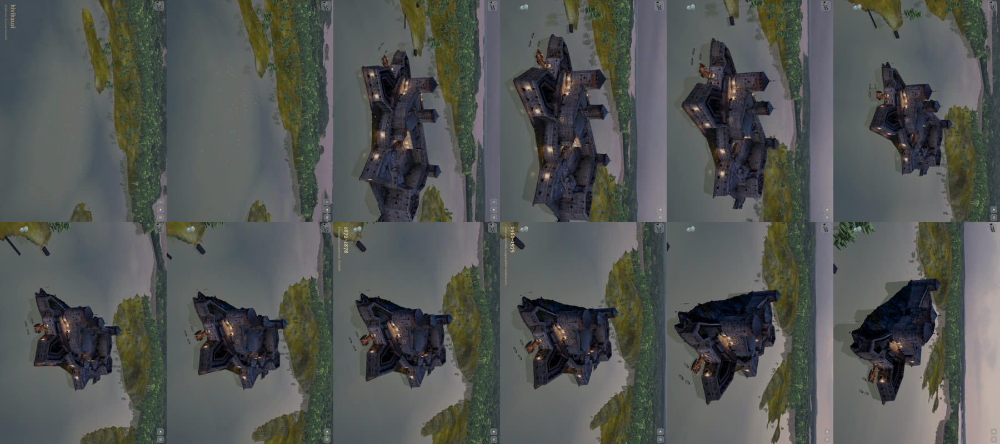
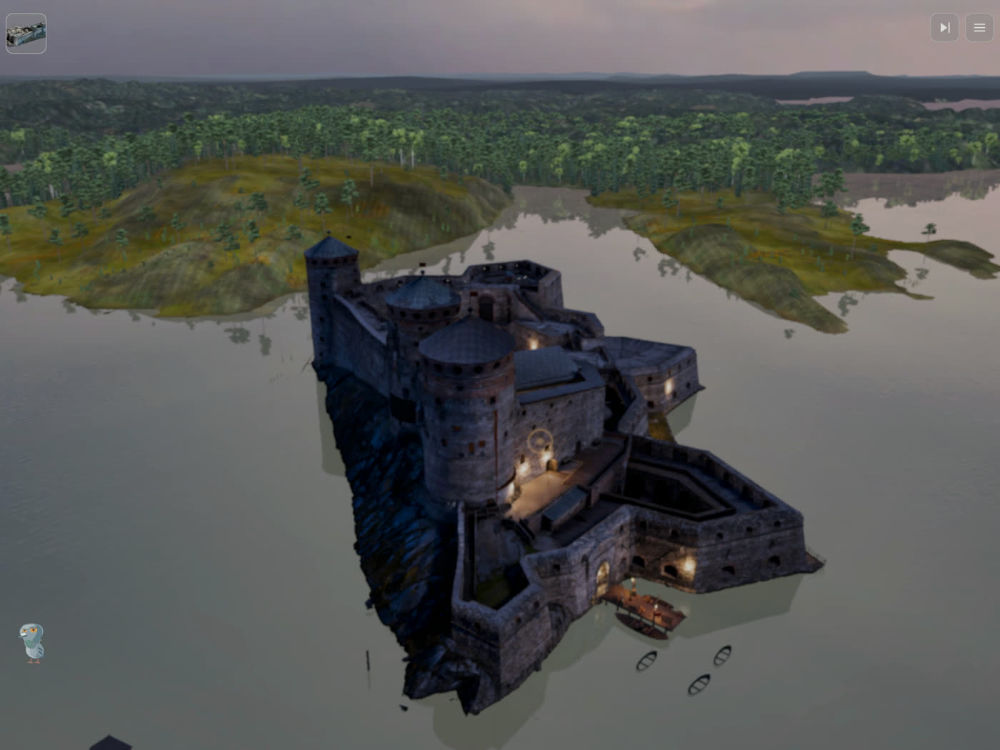

# Arvio 1: kuva-arkki pelistä (Siirtoseppä 9.10.2026 klo 09.5x, juna 174)

Raamattu LIIKKUVAT KOHTAUKSET TEHDÄÄN KUIN ELOKUVA, kohta 4. Käännös e78689b9f (siirtoseppa/juna174 0eff51668 + master, koehaara
34614a63c), iPad-simulaattori 8362879F (pysty, vaakalinna kierrettynä), mykkä. Todistus: `proto-3d/lokit/todistus-historia-174-20261009-0950/`
(TODISTUS.md OK, poikkeuksia 0). Video 139,8 s; ruudut poimittu kohtausten keskeltä ja nopeimmista siirtymistä (aika = historian t).

Arvioin vain tallennettuja kuvia ja pelin lokia.

## Mikä toimii

- Kamera kulkee yhtenä jatkuvana liikkeenä ilman nykäyksiä (ruudut 43–133, loki 5 s välein).
- Avainsanat tulevat oikeaan aikaan: jääkausi 1,1 s, kivikausi 12,2 s (kohtaus 2 + 2,7), 1475 20,7 s, 1477–1480-luku 38,5 s, ja
  myöhemmät 1872–1878 sekä 1961–1975 näkyvät ruuduissa.
- Kertojan rivit alkavat kohtausten alussa ja kestävät mitatusti (loki: kertoja 0 7,0 s, 1 8,0 s, 2 15,4 s, 3 10,7 s …).
- Linna piiloutuu ennen vuotta 1477 ja palaa kohtauksessa 4.

## Kolme suurinta virhettä

| # | Aika | Virhe | Syy | Korjaus (f5346bac4) |
|---|---|---|---|---|
| 1 | t=0–37 | Saari ja puuvarustus puuttuvat (pelkkä vesi), bastionit eivät kasva (t≈82), palon jäljet ja telineet puuttuvat | "poikki historia" käytti linnan tuotantopakettia, jossa ei ole vaihemalleja eikä vuosia (loki: "kasvu ei kävelydataa", ei vaihemallirivejä) | Historia lataa ensin pelattavan palan paketin; ☰-historia vain palan paketilla |
| 2 | t=0–12 | Linnan esittelyn kertoja (jakso "tornit", alkanut ennen historiaa) puhuu historian kertojan päällä | Kertoja vaiennettiin vain uusilta jaksoilta, ei jo soivalta | Soiva linnan kertoja katkeaa, kun historia tai peli alkaa |
| 3 | t=0–136 | Pulu näkyy vasemmassa alakulmassa koko historian ajan | DioraamaTaulu ei tunne historiaa | Pulu ja huonekortti piiloon historian ajaksi |

Ei virhe: t≈104–136 linnan alla näkyvä tumma kiila on kallio varjossa (t=125 läheltä).

## Seuraavaksi

Uudet kuvat korjatulla käännöksellä (arvio-2.md): erityisesti kohtaukset 1–3 (saari, puuvarustus), 7 (bastionit kasvavat),
8 (palon jäljet), 10 (telineet) ja siirtymä 8→9→10.
