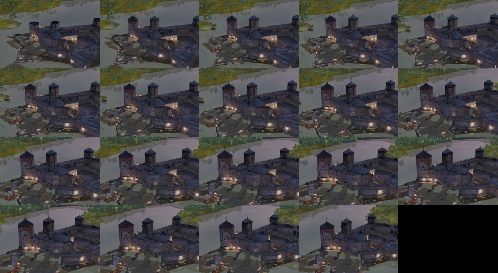
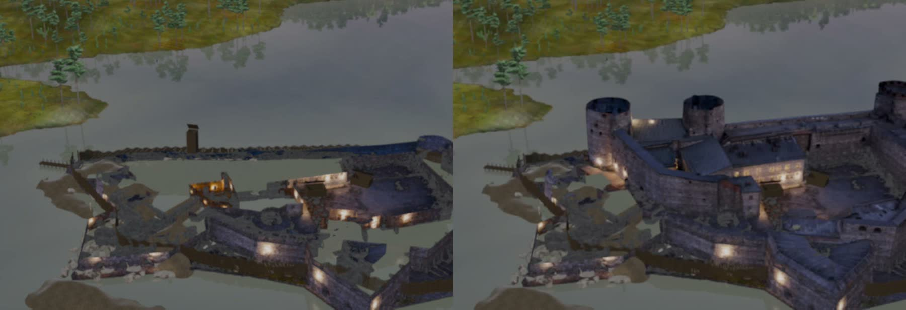
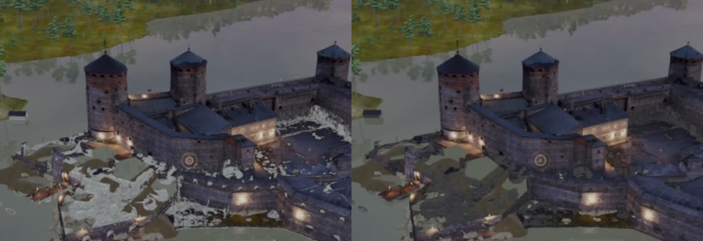
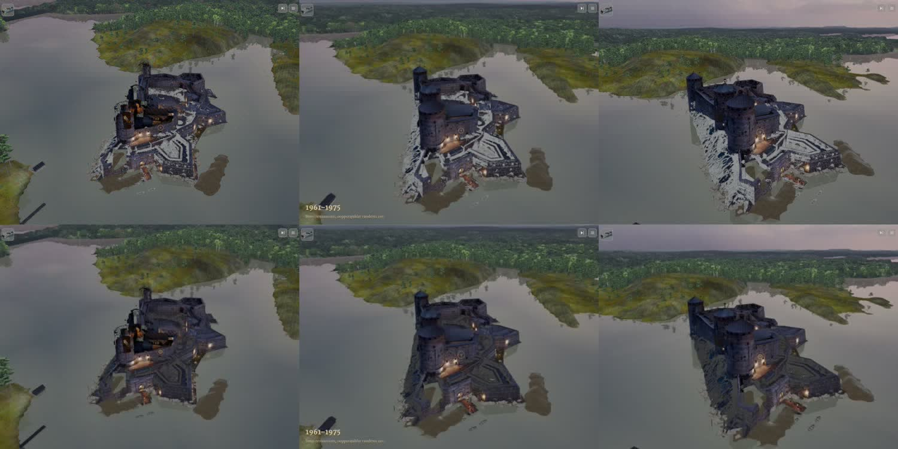
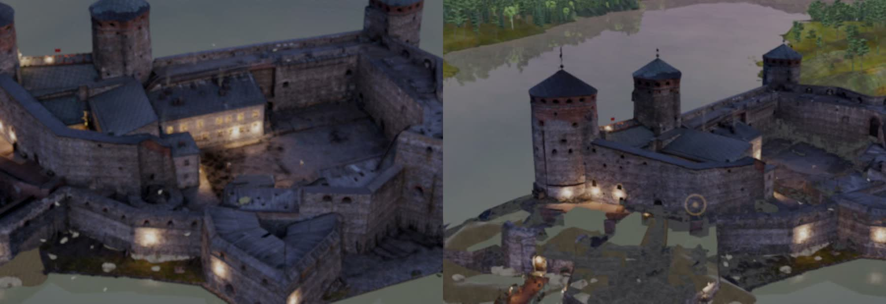
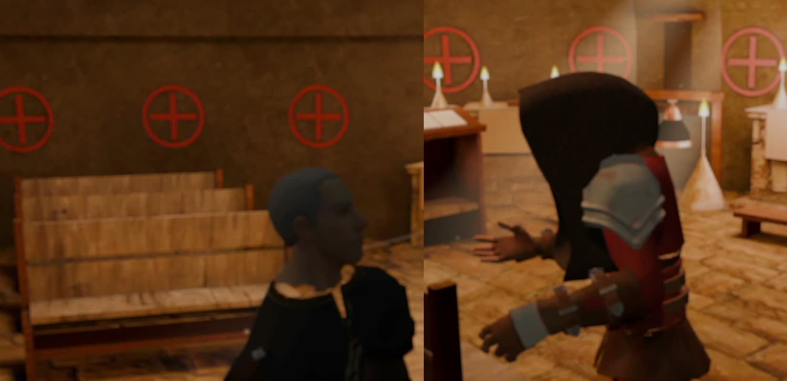

# Arvio 10: kuva-arkki pelistä (Siirtoseppä 9.10.2026 klo 17.1x, juna 173)

Raamattu LIIKKUVAT KOHTAUKSET TEHDÄÄN KUIN ELOKUVA, kohta 4. Käännös 33ff96184 (koehaara siirtoseppa/koe-173 faa04a55c =
siirtoseppa/juna173-historia 4792cf9e4 + master), iPad-simulaattori 8362879F, mykkä. Todistus:
`proto-3d/lokit/todistus-historia-arvio10-20261009-1701/` (TODISTUS.md OK, poikkeuksia 0). Historia alkaa videon kohdassa ≈ 21 s
(nousu 52–54 s = historian t 31–33). Vertailu arvioon 9: `todistus-historia-arvio9-20261009-1643/` (offset ≈ 23 s).

Arviot 7–9 lyhyesti: arvio 7 mustat laikut lounaispuolella yhä (atlas) → globaali mustan korvaus; arviot 8–9 laikut vaaleina
(korvaussävy liian kirkas hämärään) → 22af892ac sävy tunnelman mukaan (hämärä 0,045).

## Mikä korjaantui

- Mustan korvauksen sävy on nyt oikea: t = 33–70 ei näy mustia eikä vaaleita laikkuja (vasemmalla arvio 9, oikealla arvio 10, t = 45).
- Loppupuolen (t ≈ 100–130) laajat valkoiset alueet bastioneilla ja saarella ovat poissa (ylärivi arvio 9, alarivi arvio 10).
- Nousu (t = 31–36) näkyy edelleen liikkeenä, ei huonelaatikoita eikä hehkuvia torneja.

## Kolme suurinta virhettä

| # | Aika | Virhe | Syy | Korjaus |
|---|---|---|---|---|
| 1 | t = 33–70 | Lounaispuolella tasaisia vedenvärisiä aukkoja pääkehän ja ulkobastionin välissä | Vuoden 1499 leikkaus poistaa myöhemmät osat, mutta niiden alta ei ole saaren pintaa (kalliota), joten vesitaso näkyy; sama arviossa 9 | Junaan 174: ranta-1499:n maa-alue leikattujen osien alle (LR) tai historian maataso näkyviin aukkojen kohdalla |
| 2 | t ≈ 125–136 | Saaren pohjoisosassa sinertäviä täpliä (loppukuva) | Todennäköisesti korvaussävy tai taivasheijastus päivänvalon siirtymässä; päivätunnelman korvaus (0,27) on todentamatta | Junaan 174: tarkista korvaussävy tunnelman vaihtuessa |
| 3 | t = 33–70 | Ruskea litteä saaren muoto näkyy vedessä linnan edessä | Tyhjän saaren maa (MaaNakyy) piirtyy veden pinnan yläpuolelle | Pieni; jätetään |

## Arvio

Kriteeri (ei mustaa eikä vaaleaa laikkua t = 33–70) täyttyy, ja arvio 10 on kaikilta osin parempi kuin arvio 9. Virhe 1 on vanha
(arvio 2:n lounaispuolen leikkaukset) eikä estä junaa 173.

## MetaHuman-vouti v3 (LR, paikallinen koe samassa simuvuorossa)

Todistus `proto-3d/lokit/todistus-metahuman-v3-20261009-1706/` (OK, poikkeuksia 0). v2:n kuvat jäivät yleiskuviksi, koska ne otettiin
kertojan johdannon aikana. Nyt kuvat otettiin voudin oman puhe-eleen jälkeen, ja puolilähikuva rajasi voudin. Malli latautuu ja liikkuu
(eleet, kumarrus), mutta huppu peittää kasvot sivulta ja takaa kokonaan, eikä yhdessäkään ruudussa näy kasvoja tai ilmettä. Lisäksi
olkasuoja näyttää irtoavan olasta sivukuvassa. Vasemmalla kappalainen (vanha malli) vertailuksi.

