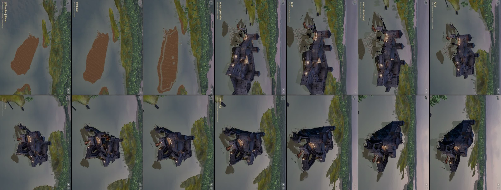
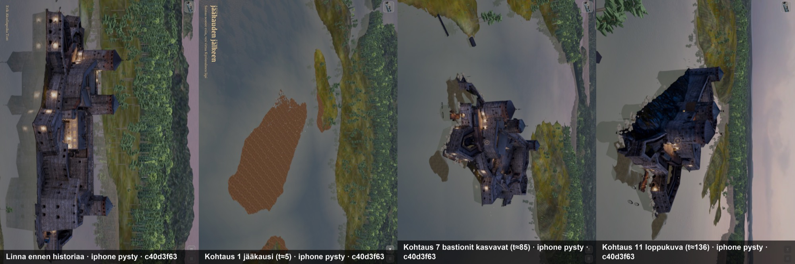
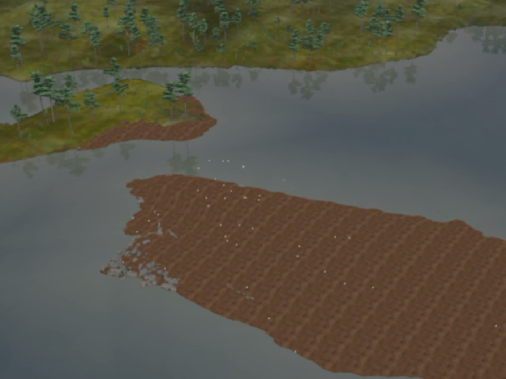
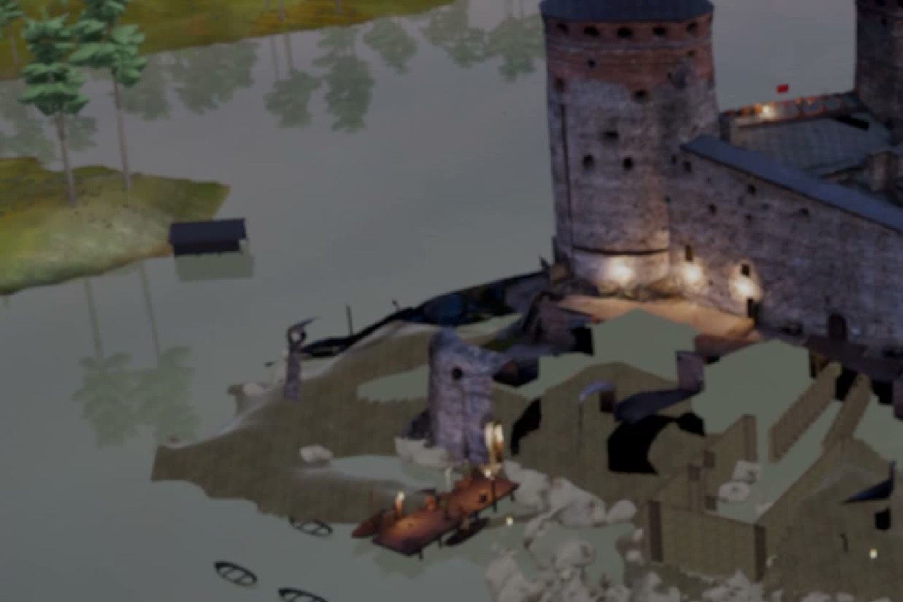
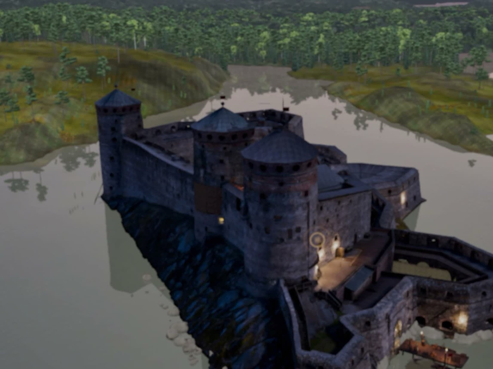

# Arvio 2: kuva-arkki pelistä (Siirtoseppä 9.10.2026 klo 12.0x, juna 172)

Raamattu LIIKKUVAT KOHTAUKSET TEHDÄÄN KUIN ELOKUVA, kohta 4. Käännös c40d3f639 (siirtoseppa/juna174 cb262e9c6 + master BUILD 170,
koehaara 468bccf39), iPad-simulaattori 8362879F (pysty, vaakalinna kierrettynä), mykkä. Todistus:
`proto-3d/lokit/todistus-historia-174b-20261009-1200/` (TODISTUS.md OK, poikkeuksia 0). Video 157,4 s, historia alkaa videon kohdassa
≈ 20,5 s (paketin lataus); ruutujen aika = historian t. Arvioin vain tallennettuja kuvia ja pelin lokia.

## Arvio 1:n korjaukset (f5346bac4) toimivat

- Historia lataa pelattavan palan paketin ensin: loki "vaihemallit 4/4 (1,6 s)", saari ja puuvarustus näkyvät (t = 0–37), palon jäljet
  ja telineet vaihtuvat vuosittain (t = 95–125).
- Linnan esittelyn kertoja ei puhu historian päälle; Pulu ja huonekortti eivät näy.
- Kertojan rivit ja kamera kuten kohtauslistassa (loki: kertoja 0–8 kestoineen, vuodet 5 s välein ankkureissa: t = 80 → 1749,
  t = 95 → 1868).

## Kolme suurinta virhettä

| # | Aika | Virhe | Syy | Korjaus |
|---|---|---|---|---|
| 1 | t = 0–37 | Tyhjä saari on litteä ruskea ruudukko (kalliokuva toistuu 32 kertaa ilman valoa ja muotoa), puuvarustus haalea ja läpikuultavan näköinen | Vaihemallit valaisemattomalla DioraamaMaasto-varjostimella; LR:n tyhja-saari.glb on toistuva rock_face-kuva + COLOR_1-sävy (sammal), jota varjostin ei käytä | 6718cf807: DioraamaValaistu (aurinko, varjot, pistevalot kuten esineillä). Sammalsävy (COLOR_1) puuttuu yhä: LR leipoo sen kuvaan tai pyytää varjostimeen |
| 2 | t = 40–70 | Lounaispuolella (porttikäytävä, esilinna) leikatut seinät, mustat aukot ja ilmassa olevia portaita: näyttää rikkinäiseltä raunioilta eikä rakentamattomalta | Kävelyosien historialeikkaukset (paketin leikkaukset vuosilla) leikkaavat myös lattiat ja maan; aukosta näkyy kameran tausta (musta) | LR: myöhempien osien leikkauslaatikot vain rakennuksiin (ei maahan ja lattioihin) tai koko osa vuodella; minä kytken |
| 3 | t = 0–37 | Valopisteitä leijuu tyhjän saaren yllä | Lykätyt kävelyosat, esineet ja liekit latautuvat historian aikana, kun linna on jo piilotettu | 6718cf807: linnan piilotus 0,5 s välein linnan ollessa piilossa |

Ei virhe: t = 104–136 linnan koillispuolen tumma massa on kallio varjossa (lähikuva t = 133).

## Seuraavaksi

Arvio 3 korjatulla käännöksellä (6718cf807): kohtaukset 1–3 (saari valaistuna, ei valopisteitä) ja LR:n leikkauskorjauksen jälkeen
kohtaukset 4–6.
