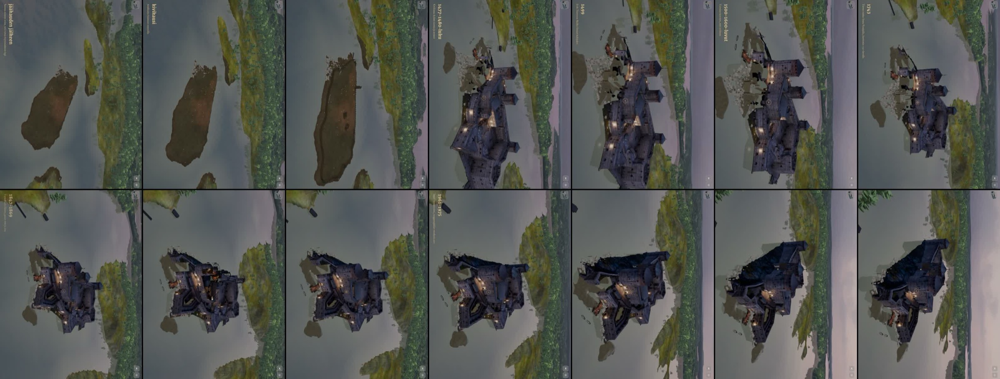
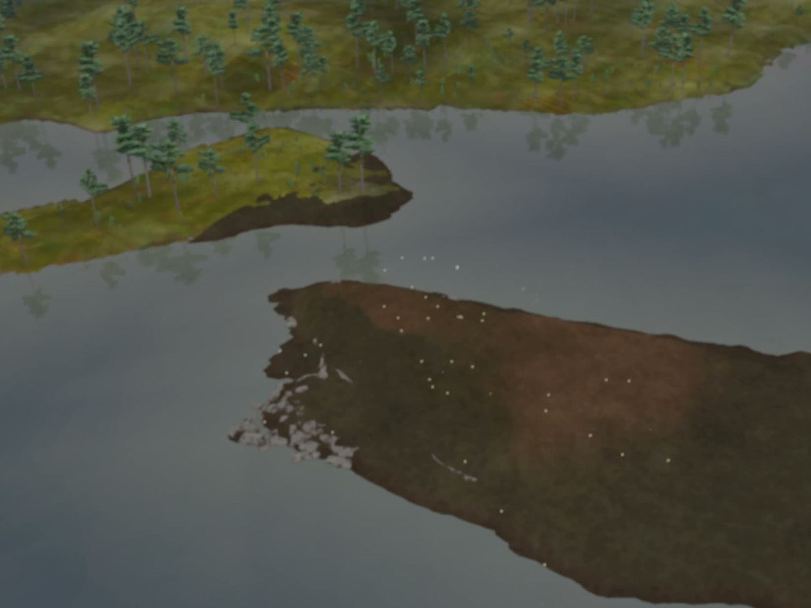
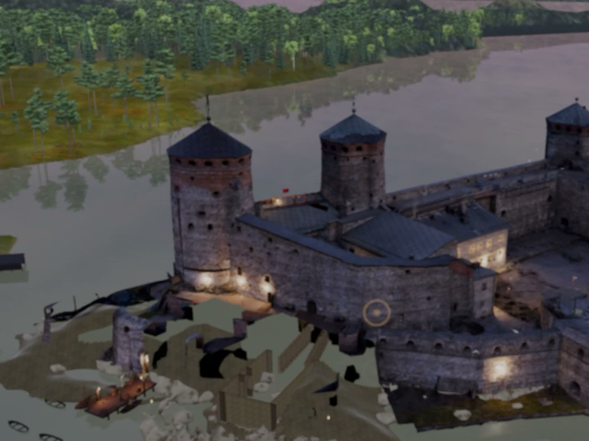

# Arvio 3: kuva-arkki pelistä (Siirtoseppä 9.10.2026 klo 13.1x, juna 172)

Raamattu LIIKKUVAT KOHTAUKSET TEHDÄÄN KUIN ELOKUVA, kohta 4. Käännös 5a24282dd (siirtoseppa/juna174 338bd8143 = arvio 2:n korjaukset
6718cf807 + v46b-alfaleikkaus d4c4f9958 + LR v46c, koehaara 07dd2eda4), iPad-simulaattori 8362879F, mykkä. Todistus:
`proto-3d/lokit/todistus-historia-arvio3-20261009-1310/` (TODISTUS.md OK, poikkeuksia 0). Video 158,3 s, historia alkaa ≈ 21,3 s.

## Mikä korjaantui

- DioraamaValaistun alfaleikkaus (v46b noki) kääntyy ja piirtyy: linna, esineet ja kuori kuten ennen, ei varjostinvirheitä.
- Tyhjä saari (LR v46c, yksi 2048²-kuva) valaistuna: ruudukko on poissa, rannoilla kivikkoa (t = 3–28).
- Puuvarustus näkyy kiinteänä (t = 28).

## Kolme suurinta virhettä

| # | Aika | Virhe | Syy | Korjaus |
|---|---|---|---|---|
| 1 | t = 0–37 | Valopisteet tyhjän saaren yllä yhä | SeikkailuEsineiden huonelataus ja kynttilät kytkevät renderöijiä takaisin päälle; 0,5 s:n piilotus ei riittänyt | 2ad8e8f6a: piilotus joka ruutu, myös seikkailun juuret näyttämön ulkopuolella |
| 2 | t = 40–70 | Lounaispuolen leikkauksissa yhä mustia aukkoja ja ilmaan jääviä lankkuja | v46c:n vesipohja −7,02 ei peittänyt aukkoja: musta tulee muualta kuin leikkausten pohjasta (todennäköisesti leikatun osan sisäpinnat tai valoatlaksen musta alue) | LR + minä: aukkojen paikat lähikuvasta (alla), seuraavaksi osa kerrallaan pois näkyvistä |
| 3 | t = 0–37 | Saari on tumman ruskea (graniitti ja sammal eivät erotu) | Kuvan sävy tai valaistuksen taso hämärässä | LR: kuvan kirkkaus; kuva-arkissa verrataan mantereen sävyyn |

## Seuraavaksi

Arvio 4 käännöksellä 2ad8e8f6a (LR v46d: pako-kellobastionin vesipohja) ja LR:n seuraavalla korjauksella: kohtaukset 1–3 ilman valopisteitä,
kohtaukset 4–6 ilman aukkoja.
