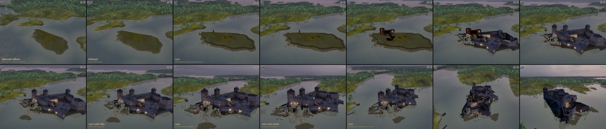
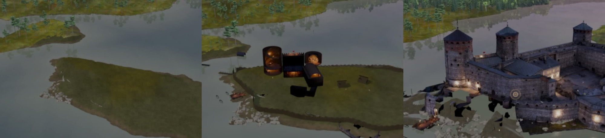

# Arvio 4: kuva-arkki pelistä (Siirtoseppä 9.10.2026 klo 14.1x, juna 173)

Raamattu LIIKKUVAT KOHTAUKSET TEHDÄÄN KUIN ELOKUVA, kohta 4. Käännös 6c256fbf3 (siirtoseppa/juna173-historia 7fbca9c90 = juna 172
553edcdc4 + v46e 77c46e2d6 + kivilinnan rakentuminen 14c0bbb6f, koehaara 903c36f49), iPad-simulaattori 8362879F, mykkä. Todistus:
`proto-3d/lokit/todistus-historia-arvio4-20261009-1406/` (TODISTUS.md OK, poikkeuksia 0). Video 158,8 s, historia alkaa ≈ 21,8 s.

## Mikä korjaantui

- Valopisteet ovat poissa tyhjän saaren yltä (t = 0–37; piilotus joka ruutu, 2ad8e8f6a).
- Saari v2c (LR v46e) on vihreä ja kivinen kuten manner; ei ruudukkoa.
- Saari kantaa puuvarustusta vuoteen 1477 asti (loki: "tyhja-saari pois (1477)", ennen 1476), puuvarustus ei seiso vedessä.
- Kivilinna ei ilmesty kerralla: kuori nousee vedestä t = 31–37 ja on valmis kohtauksen 4 alkaessa (14c0bbb6f).

## Kolme suurinta virhettä

| # | Aika | Virhe | Syy | Korjaus |
|---|---|---|---|---|
| 1 | t = 31–37 | Rakentumisen aikana huoneet näkyvät mustina laatikkoina ilman kuorta ja tornien sisus hehkuu oranssina | Rakentuviin otettiin myös leivotut huoneet (DioraamaLeivottu) | ec8a59336: vain kuori (DioraamaKuori) rakentuu; huoneet, esineet ja valot vasta valmiissa linnassa |
| 2 | t = 40–70 | Lounaispuolen mustat aukot ja ilmaan jäävät lankut yhä | Vuodeton sisätilaleikkaus (porttikaytava-T102) on nyt pois, eli aukot tulevat muualta: todennäköisesti b1499-leikkausten (vesiportin bastionit, porttikurtiini) kohdalla kuoren alta puuttuu täyttö, kun muut kävelyosat kuin ranta-1499 ovat historiassa piilossa | LR: mitä b1499-leikkausten kohdalla pitäisi näkyä vuosina 1477–1550 (ranta-1499:n täyttö vai ulkoalue-osa); minä kytken |
| 3 | t = 37 | Linnan valot, esineet ja hahmot ilmestyvät kerralla, kun rakentuminen valmistuu | Ne eivät tottele leikkausta | Pieni (linna valaistuu iltaan); jätetään, ellei kuva-arkki näytä hyppyä häiritsevänä |

## Seuraavaksi

Arvio 5 korjauksella ec8a59336 ja LR:n vastauksella aukkoihin: kohdat t = 31–37 ja t = 40–70.
