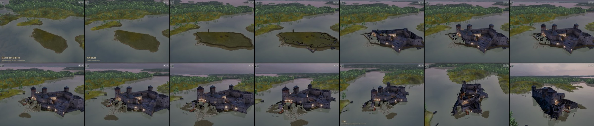
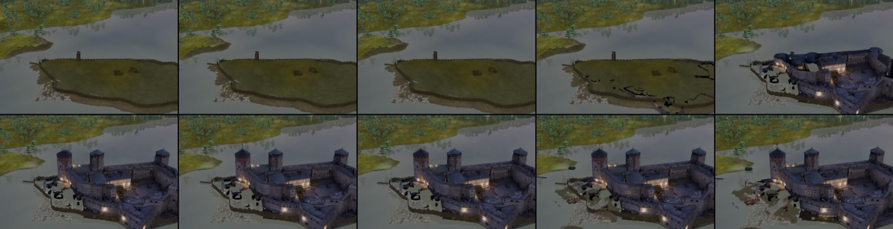
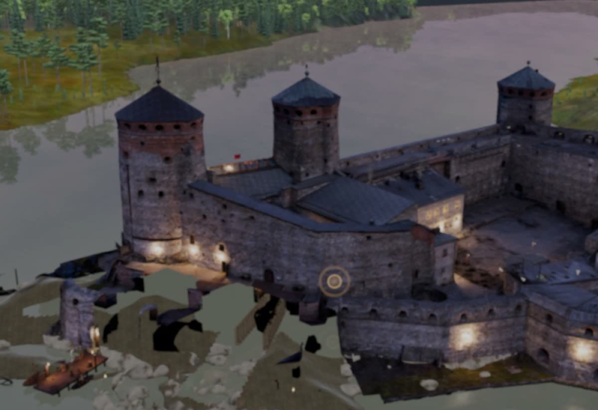

# Arvio 5: kuva-arkki pelistä (Siirtoseppä 9.10.2026 klo 14.4x, juna 173)

Raamattu LIIKKUVAT KOHTAUKSET TEHDÄÄN KUIN ELOKUVA, kohta 4. Käännös 3b3291496 (siirtoseppa/juna173-historia 41801a24e: arvio 4:n
korjaukset ec8a59336, valojen syttyminen 7682aa1ec, porttikaytava-T102 640d3f77a ja LR v46f; koehaara 0cba26f5c), iPad-simulaattori
8362879F, mykkä. Todistus: `proto-3d/lokit/todistus-historia-arvio5-20261009-1442/` (TODISTUS.md OK, poikkeuksia 0). Historia alkaa
videon kohdassa ≈ 26,1 s (aikaleimat avainsanasta "1477–1480-luku" = t 38,5).

## Mikä korjaantui

- Rakentumisen aikana ei enää mustia huonelaatikoita eikä hehkuvia torneja (vain kuori nousee).
- Saari kantaa puuvarustusta rakentumiseen asti; valopisteitä ei ole.
- LR v46f:n vesipohja kuoren alla: suurin osa lounaispuolen mustasta on nyt vettä.

## Kolme suurinta virhettä

| # | Aika | Virhe | Syy | Korjaus |
|---|---|---|---|---|
| 1 | t = 32–34 | Nousu näyttää ~2 s:n hypyltä | Raja kulki 60 metriin (tornit ~38 m), smootherstep kiihtyy keskellä | ff65c5d0f: 8 s ja raja 38 m |
| 2 | t = 33–36 | Rakentumisen aikana lounaispuolella mustia aukkoja | Ranta-1499:n täyttö ja vesipohja sekä T102 tulivat näkyviin vasta valmiissa linnassa | ff65c5d0f: ne nousevat kuoren mukana |
| 3 | t = 40–70 | Lounaispuolella yhä pieniä mustia aukkoja ja ilmaan jääviä kuoren paloja porttikurtiinin ja vesiportin bastionien kohdalla | Ontto fotogrammetriakuori leikataan b1499-laatikoilla (myöhemmät rakenteet pois), eikä laatikoiden sisällä ole täyttöä seinien alla | LR: täyttö (kallio tai ranta) b1499-laatikoiden sisään seinien alle; vaihtoehto PT:lle alla |

Vaihtoehto virheeseen 3, jos täyttö ei onnistu: historiassa b1499-rakenteet näkyvät alusta asti (ei leikkausta). Ei aukkoja, mutta
myöhemmät bastionit näkyisivät jo vuonna 1477.

## Seuraavaksi

Arvio 6 korjauksilla ff65c5d0f ja LR:n täytöllä.
