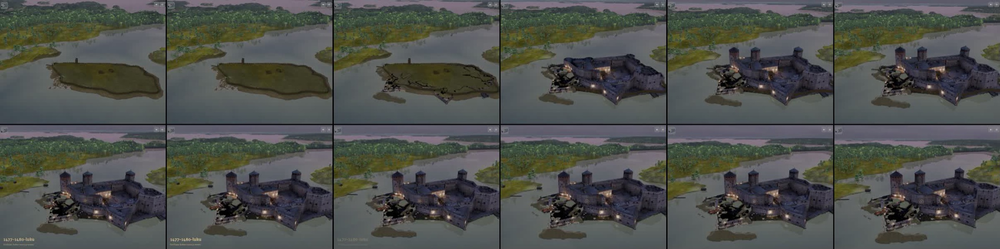
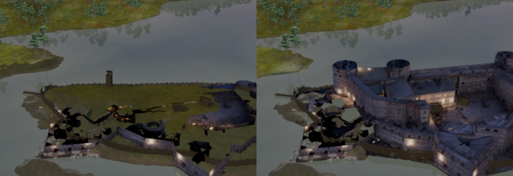
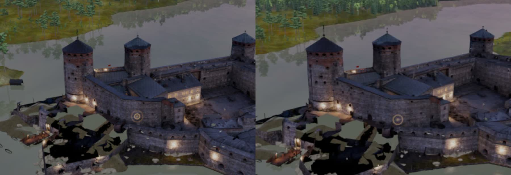
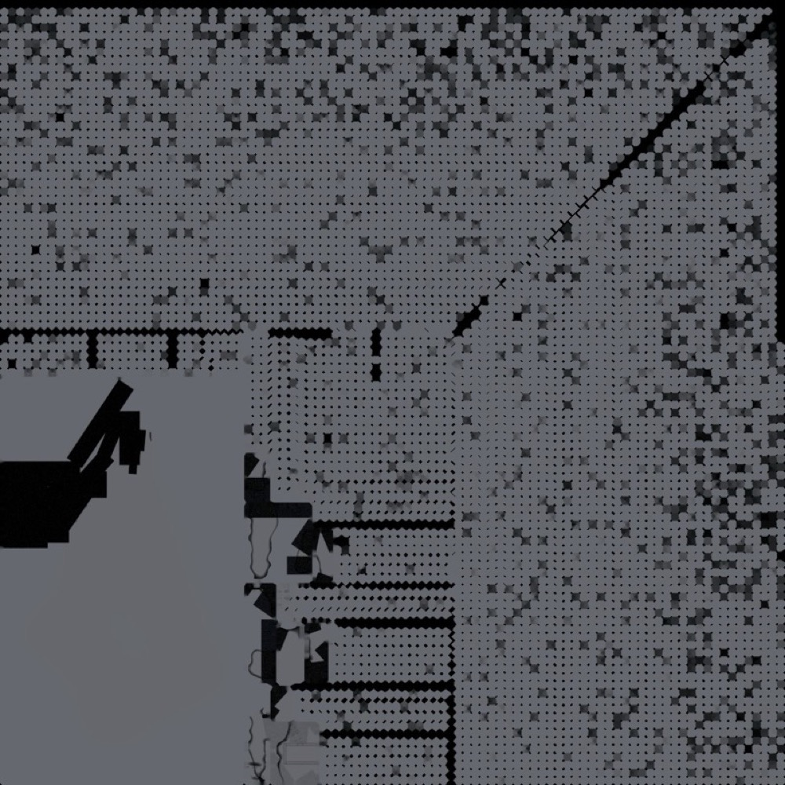

# Arvio 6: kuva-arkki pelistä (Siirtoseppä 9.10.2026 klo 15.4x, juna 173)

Raamattu LIIKKUVAT KOHTAUKSET TEHDÄÄN KUIN ELOKUVA, kohta 4. Käännös d10d3ed2e (siirtoseppa/juna173-historia b2fda9269: arvio 5:n
korjaukset ff65c5d0f, leikkaus maan yläpuolelta e5956eb15 ja LR v46g; koehaara 853908eb2), iPad-simulaattori 8362879F, mykkä. Todistus:
`proto-3d/lokit/todistus-historia-arvio6-20261009-1533/` (TODISTUS.md OK, poikkeuksia 0). Historia alkaa videon kohdassa ≈ 28,5 s
(avainsana "1477–1480-luku" = t 38,5).

## Mikä korjaantui

- Nousu näkyy nyt useamman sekunnin liikkeenä (t ≈ 31–36): ensin muurien juuret, sitten muurit ja tornit (ff65c5d0f).
- Huonelaatikoita tai hehkuvia torneja ei näy rakentumisen aikana.

## Kolme suurinta virhettä

| # | Aika | Virhe | Syy | Korjaus |
|---|---|---|---|---|
| 1 | t = 33–70 | Lounaispuolen täyttö näkyy yhä mustina laikkuina (lähikuvat t = 45 ja 55) | Ranta-1499:n leivotussa valoatlaksessa (albedo × valo) on mustia alueita ja mustaa reunatäyttöä pienten UV-saarten välissä; kaukaa mipit sekoittavat mustan pintaan (atlas alla) | 93cdb6260: historian ajaksi ranta-1499 tasaisella kalliosävyllä; LR: atlaksen täyttö (dilate) ja mustat alueet |
| 2 | t = 31–32 | Rakentumisen alussa saarella mustia murtumaviivoja kuoren juuressa | Kuoren leikkausraja kulkee saaren pinnan läpi, ja ontosta kuoresta näkyy hetken tyhjää | Pieni (1 s); jätetään |
| 3 | t = 33–35 | Nousevien tornien yläreuna on avoin (ontto kuori) | Fotogrammetriakuoressa ei ole sisäpintoja | Pieni; jätetään |

## Seuraavaksi

Arvio 7 korjauksella 93cdb6260 (koehaara bc3d80c4a): kohdat t = 33–70.
