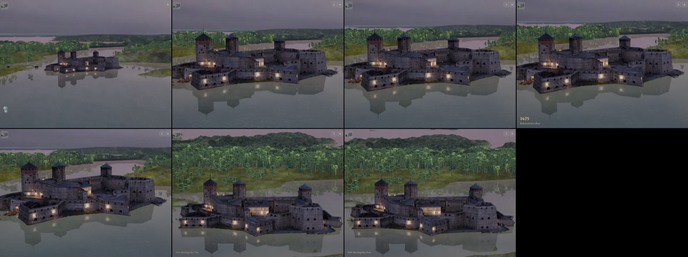
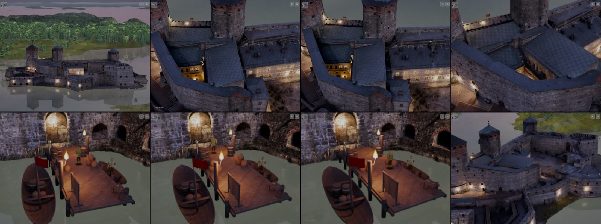
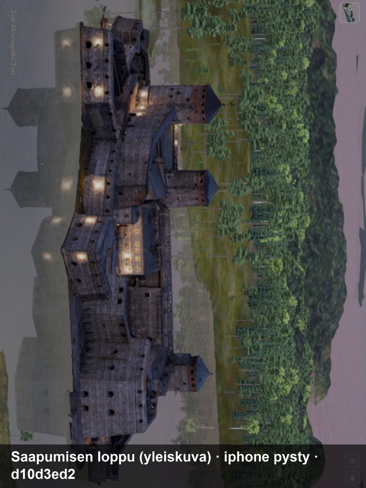
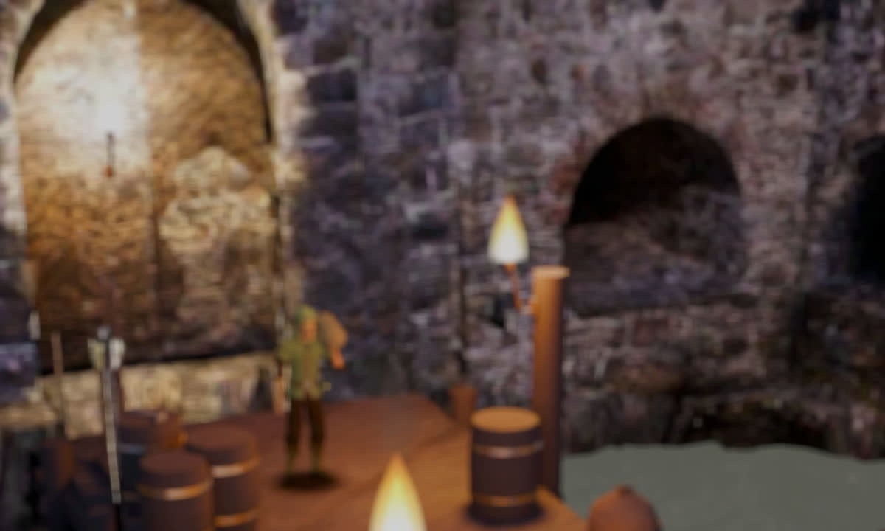
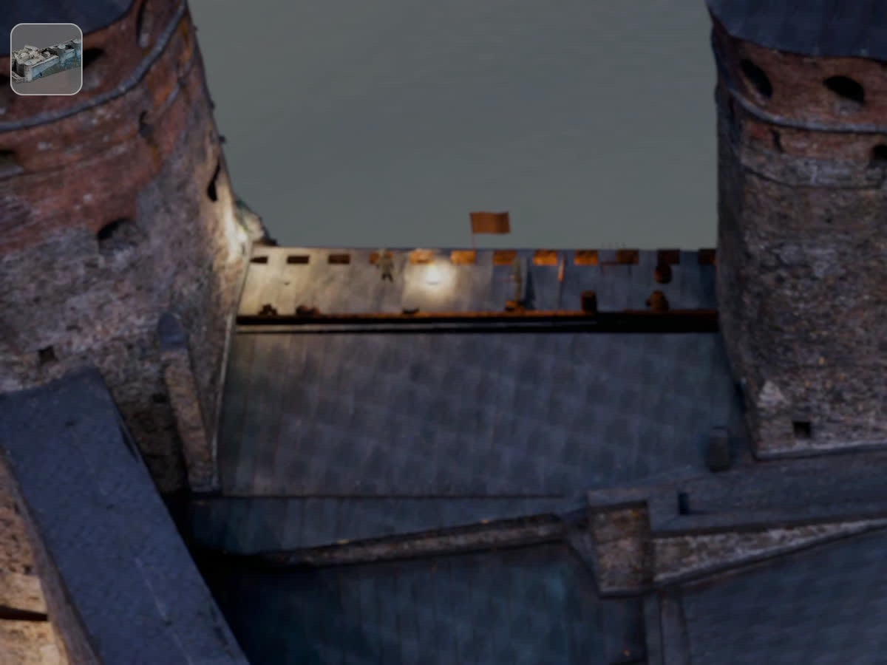

# Olavinlinnan ulkokuoren tarkkuus ja suttuiset pinnat (Siirtoseppä 9.10.2026, PT:n pyyntö Codex-työhön)

Omistaja: osa ulkoseinistä näyttää suttuiselta (ainakin takaosan muuri edestä). Kartoitus Codexin terävämpiä vuoden 1499 pintoja varten;
LR tekee ortografiset ohjekuvat (sama työ kuin ND ja KL). Lähde: paketti v46g 4d1977155f7b5ac5, käännös d10d3ed2e, iPad-simulaattori.

## 1. Kuva-arkki pelistä (saapuminen ja laituri)

Todistukset: `proto-3d/lokit/todistus-kuori-saapuminen-20261009-1539/` (videot saapuminen.mp4 26 s ja soutu.mp4 48 s).

## 2. Tekstuurin tarkkuus

Ulkokuori on **yksi fotogrammetriaverkko** (Olavinlinna_2021, 1,40 milj. kolmiota) ja **yksi kuva-atlas** (huippu 8192², normaali 4096²,
kevyt 2048²; lisäksi hämärä-versiot). Seiniä (|n.y| < 0,4, veden yllä) on 17 449 m².

| Mittari | Arvo |
|---|---|
| Tarkkuus 8k-tasolla, seinät | 31–36 px/m kaikissa 151 seinäruudussa (8 × 8 m), mediaani 33,7 px/m ≈ 3 cm/px |
| Tarkkuus 4k-tasolla (normaali) | ≈ 17 px/m |
| Ruudulla laiturilta (≈ 20 m, iPad, FOV 50°) | ≈ 110 px/m → kuva venyy noin 3-kertaiseksi (8k) tai 6-kertaiseksi (4k) |
| Kuvan oma terävyys (\|Laplace\| 15 px ikkunassa) | 7–52, muurien mediaani 30 → paikallinen sumeus tulee kuvauksesta, ei atlaksen jaosta |

Johtopäätös: **sumeus on kaikkialla rakenteellinen** (yksi atlas koko linnalle). Terävöittäminen ei auta; terävät pinnat vaativat
seinäosittaiset kuvat (2–4k per osa ≈ 100–200 px/m) tai toistuvan muurimateriaalin + kuoren makrosävyn (nykyinen detalji-maski
graniittilohkomuurilla, voimakkuus 0,8, on jo tätä, mutta 2,4 m:n toisto näkyy vain läheltä).

## 3. Viisi pahinta kohtaa (kuvan terävyys, muurit, yläreuna > 8 m)

Paikka = suunta ja etäisyys linnan keskeltä (kuoren kehyksessä; kompassi 0 = pohjoinen), korkeus kuoren y:nä (vesi −7).

| # | Paikka | Seinä katsoo | Korkeus | Ala | Terävyys / px/m | Pelissä näkyy |
|---|---|---|---|---|---|---|
| 1 | 253°, 25 m (länsi-lounas) | länteen | −2…14 | 58 m² | 10,8 / 31,9 | porttikäytävän ja Linnantuvan väli, laiturin takamuuri (kuva yllä) |
| 2 | 259°, 39 m (länsi) | kaakkoon | −3…17 | 95 m² | 12,0 / 30,9 | porttikäytävän tornin juuri, saapumisen loppukuva vasen reuna |
| 3 | 287°, 41 m (länsi-luode) | pohjoiseen | 2…17 | 105 m² | 18,9 / 32,4 | Kellotornin puolen muuri, soutu |
| 4 | 278°, 62 m (länsi) | luoteeseen | −2…30 | 124 m² | 20,1 / 34,1 | länsipään muuri ja torni, saapuminen |
| 5 | 301°, 35 m (luode) | luoteeseen | −2…28 | 226 m² | 20,7 / 33,9 | muuriportaiden puoli, sisäpihan pohjoisseinä |

Huom: kuoren koordinaatit eivät osu kävelydatan merkkeihin, joten paikat on annettu suuntina; LR paikantaa ne Blenderissä kuoresta
(`blender/ulkokuori/ulkokuori_huippu.glb`, ruutujen keskipisteet `ruudut.json`:ssa pyynnöstä).

## Suositus Codex-työhön

Vuoden 1499 asuun ortografiset ohjekuvat järjestyksessä 1–5 (keskiaikaiset muurit, ei myöhempiä lisäyksiä), sitten saapumisen
loppukuvan näkyvät julkisivut (kaakko ja etelä). Pelin puolella kuoren seinäosille tarvitaan osittainen materiaali (uusi UV-jako tai
erillinen kuva per osa) – LR:n vientiin.
