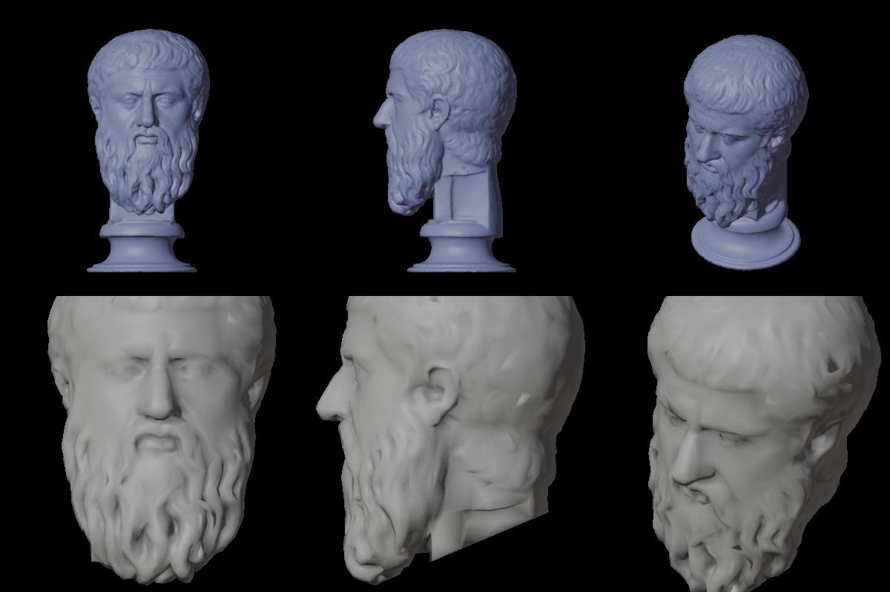

# Ajattelijat: Platonin kipsibysti, pelin aineistot (Linnanrakentaja 2.10.2026)

Päätoimittajan tilaus 2.10. klo 12.3x: GLB:t ja kartan pää valmiiksi. Kohtausta ei aloiteta ennen kuin omistaja on
valinnut Marcuksen jälkeisen ajattelijan. Sama putki: `tools/linssit/blender/sokrates_bysti.py --kohde platon`.

## Lähde
SMK KAS2111 "Platon (427-347 f.Kr.), græsk filosof", kipsivalos, 49 cm, Public Domain Mark 1.0 (api.smk.dk).
Skannaus Scan the World / SMK, 1,7 M kolmiota. Bysti on herma (ei olkapäitä) pyöreällä sokkelilla, pitkä parta.
Lähteet: `/Users/Shared/Claude/proto-3d/_lahteet/platon/LAHTEET.md`.

## GLB-tasot
`/Users/Shared/Claude/proto-3d/_valmiit/platon-bysti/v1/` (SHA256SUMS)

| Taso | Kolmiot | Normaalikartta | Koko |
|---|---|---|---|
| L0 | 200 k | 2048 | 9,2 Mt |
| L1 | 50 k | 1024 | 2,6 Mt |
| L2 | 12 k | 1024 | 1,7 Mt |
| symboli | 3 k | – | 55 kt |

## Kartan pää
`_valmiit/ajattelijat-kartta/v1/platon-kartta.glb`: 5 010 kolmiota, sama muoto kuin Sokrateella ja Marcuksella
(ks. ajattelijat-kartta-20261002.md). Hermassa ei ole olkapäitä, joten leikkaus on vain vino taso pitkän parran alta
hermapilarin takayläreunaan. Pää on parran takia korkeampi: 0,38 m.
