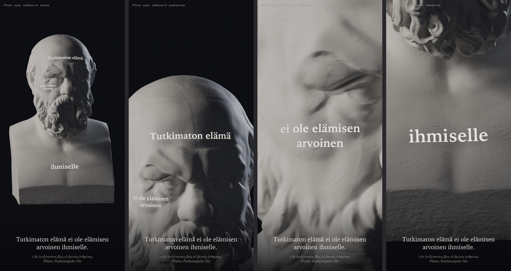
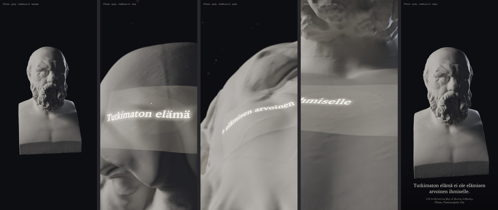

# Ajattelijat-pilotti: Sokrateen kipsibysti (Linnanrakentaja 1.10.2026)

Omistaja hyväksyi pilotin 1.10. klo 21.4x (Päätoimittajan tilaus). Mallikuva Blenderistä (Cycles): bysti koko
ruudun kokoisena tummaa taustaa vasten, sivuvalo ja kasvoille projektorista heijastettu mietelause kreikaksi,
alareunassa suomennos. Reaaliaikaisen heijastusvarjostimen tekee Linssiseppä mallin hyväksynnän jälkeen.

## Lähde
- SMK – Statens Museum for Kunst, [KAS635 "Portræt af Sokrates (469–399 f.Kr.)"](https://open.smk.dk/artwork/image/KAS635),
  kipsivalos (Formeri: Rom, Malpieri nr. 101), korkeus 51 cm. Esikuva on roomalainen marmorikopio.
- Oikeudet: [Public Domain Mark 1.0](https://creativecommons.org/publicdomain/mark/1.0/), `public_domain: true` (api.smk.dk).
- 3D-tiedosto ladattu vain museon palvelimelta: `api.smk.dk/api/v1/download-3d/gh93h3975_179-smk-inv-635.stl`
  (100 Mt, 2 M kolmiota). Skannaus: Scan the World / SMK (mainitaan kohteliaisuutena). Päätoimittajan hyväksyntä
  1.10.: "Ei Scan the World" -sääntö koski NC-lisenssejä, ja museon oma PDM-julkaisu on sallittu.
- Paikallinen kopio: `/Users/Shared/Claude/proto-3d/_lahteet/smk/KAS635/` (STL + museon JSON).

## Sitaatti
Platon, *Sokrateen puolustuspuhe* 38a: ὁ δὲ ἀνεξέταστος βίος οὐ βιωτὸς ἀνθρώπῳ, suomeksi "Tutkimaton elämä ei
ole elämisen arvoinen." Kreikka on Baskerville-fontilla, koska se sisältää polytonisen kreikan; suomennos on pelin
lukufontilla (Iowan Old Style).

## Tekniikka
- `tools/linssit/blender/sokrates_bysti.py --malli`: kipsimateriaali (matta, pinnanalainen sironta 0,18), sivuvalo
  vasemmalta, heikko vastavalo ja projektori. Projektori on spottivalo, jonka valosolmu muuntaa valon suunnan
  gobokuvan uv:ksi perspektiivijaolla, joten teksti kaartuu kasvojen muotojen mukaan (sama periaate sopii
  reaaliaikaiseen varjostimeen).
- `sokrates_gobo.py` piirtää gobon (kolme riviä, 4:3, pehmeä reuna), ja `sokrates_teksti.py` lisää suomennoksen
  ja merkinnät.
- `--lod`: L0 noin 200 k kolmiota ja normaalikartta 2048, joka on leivottu 2 M:n skannauksesta; L1 noin 50 k
  (1024); L2 noin 12 k (1024); karttasymboli noin 3 k. Kaikki GLB:inä kansioon
  `/Users/Shared/Claude/proto-3d/_valmiit/sokrates-bysti/v1/`.

GLB-koot: L0 9,6 Mt, L1 2,8 Mt, L2 1,9 Mt, symboli 55 kt. Gobo mukana kansiossa: `sokrates-gobo-apologia-38a.png`.

## Mallikuva v2 (omistajan palaute 1.10. 21.4x)
Kasvoille heijastetaan suomennos ("Tutkimaton elämä ei ole elämisen arvoinen ihmiselle", Sisältökirjurin käännös)
pinnoittain, ja jokaisella osalla on oma projektorinsa pinnan normaalin suunnasta:
- "Tutkimaton elämä" otsalle
- "ei ole elämisen / arvoinen" vasemmalle poskelle (katsojasta)
- "ihmiselle" rinnalle, koska aataminomena jää tässä hermassa parran alle

Teksti on pelin lukufonttia (Iowan Old Style, lihavoitu). Projektorit ovat pistevaloja, koska valon koko sumentaisi
pienen tekstin. Kreikka näkyy vain pienenä lähderivinä suomennoksen alla. Kamera-ajo kestää 8 s (30 fps):
kokonaiskuva → otsa → poski → rinta, ja jokainen lähikuva on mitoitettu niin, että tekstin leveys on noin 75 % iPhonen
pystykuvan leveydestä.

`sokrates_bysti.py --v2 <gobot> <ulos> --koko L K [--ruudut 1,90,160,230]`, ja gobot tehdään komennolla
`sokrates_gobo.py <ulos> --fontti iowan "rivi" ...`. Video: `docs/raportit/kuvat/sokrates-20261001/sokrates-v2-kameraajo.mp4`.
Huom: skannauksen tarkkuus näkyy lähikuvassa (poski) pehmeänä pintana; se on 2 M kolmion STL:n raja, ei renderöinnin.

## Mallikuva v3 (omistaja 1.10. 21.5x): videotykki jättiläiskasvoilla
- Teksti on aina yksin ruudussa. Alussa näkyy koko bysti ilman tekstiä. Kamera sukeltaa pinnan lähelle (18 mm,
  matala viisto kulma, syväterävyys f/11), jolloin otsan rypyt, kulmakaari ja nenänvarsi näyttävät vuoristolta.
- Jokaisella pinnalla on oma projektorinsa vinosti vasemmalta alta. Tekstinauha vierii pinnan poikki noin 3 s ja
  taipuu harjanteiden mukaan. Projektorin heikko musta taso (kehys) pysyy paikallaan. Valo on lämmin valkoinen,
  ja kirjainten ympärillä on halo. Keilan pöly näkyy vain projektorin palaessa.
- Järjestys: otsa → poski → rinta (aataminomena jää parran alle). Lopuksi kamera vetäytyy koko bystiin, ja koko
  lause tulee alareunaan kreikan lähderivin kanssa.
- `sokrates_bysti.py --v3b <gobot> <ulos> --koko L K`; gobot: `sokrates_gobo.py kehys.png --kehys` ja
  `sokrates_gobo.py nauha-<pinta>.png --fontti iowan --nauha "teksti"`. Projektorin solmupuu (staattinen kehys +
  vierivä nauha, perspektiivijako valon suunnasta) on suora malli Linssisepän reaaliaikaiselle varjostimelle.

