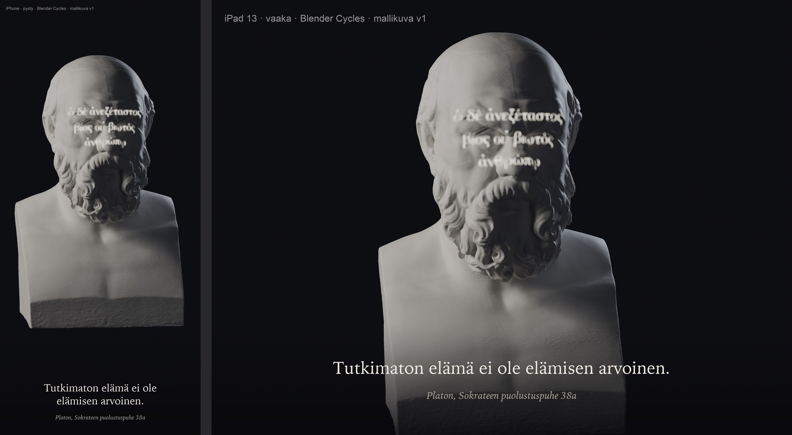
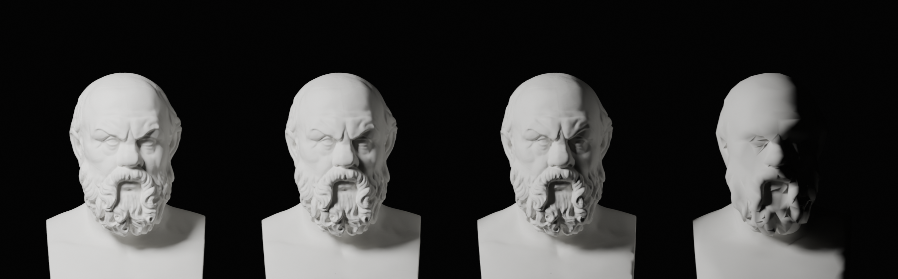

# Ajattelijat-pilotti: Sokrateen kipsibysti (Linnanrakentaja 1.10.2026)

Omistaja hyväksyi pilotin 1.10. klo 21.4x (Päätoimittajan tilaus). Mallikuva Blenderistä (Cycles): bysti koko
ruudun kokoisena tummaa taustaa vasten, sivuvalo ja kasvoille projektorista heijastettu mietelause kreikaksi,
alareunassa suomennos. Reaaliaikaisen heijastusvarjostimen tekee Linssiseppä mallin hyväksynnän jälkeen.

## Lähde
- SMK – Statens Museum for Kunst, [KAS635 "Portræt af Sokrates (469–399 f.Kr.)"](https://open.smk.dk/artwork/image/KAS635),
  kipsivalos (Formeri: Rom, Malpieri nr. 101), korkeus 51 cm. Esikuva on roomalainen marmorikopio.
- Oikeudet: [Public Domain Mark 1.0](https://creativecommons.org/publicdomain/mark/1.0/), `public_domain: true` (api.smk.dk).
- 3D-tiedosto ladattu vain museon palvelimelta: `api.smk.dk/api/v1/download-3d/gh93h3975_179-smk-inv-635.stl`
  (100 Mt, 2 M kolmiota). Skannaus: Scan the World / SMK (mainitaan kohteliaisuutena). Päätoimittajan hyväksyntä
  1.10.: "Ei Scan the World" -sääntö koski NC-lisenssejä, ja museon oma PDM-julkaisu on sallittu.
- Paikallinen kopio: `/Users/Shared/Claude/proto-3d/_lahteet/smk/KAS635/` (STL + museon JSON).

## Sitaatti
Platon, *Sokrateen puolustuspuhe* 38a: ὁ δὲ ἀνεξέταστος βίος οὐ βιωτὸς ἀνθρώπῳ, suomeksi "Tutkimaton elämä ei
ole elämisen arvoinen." Kreikka on Baskerville-fontilla, koska se sisältää polytonisen kreikan; suomennos on pelin
lukufontilla (Iowan Old Style).

## Tekniikka
- `tools/linssit/blender/sokrates_bysti.py --malli`: kipsimateriaali (matta, pinnanalainen sironta 0,18), sivuvalo
  vasemmalta, heikko vastavalo ja projektori. Projektori on spottivalo, jonka valosolmu muuntaa valon suunnan
  gobokuvan uv:ksi perspektiivijaolla, joten teksti kaartuu kasvojen muotojen mukaan (sama periaate sopii
  reaaliaikaiseen varjostimeen).
- `sokrates_gobo.py` piirtää gobon (kolme riviä, 4:3, pehmeä reuna), ja `sokrates_teksti.py` lisää suomennoksen
  ja merkinnät.
- `--lod`: L0 noin 200 k kolmiota ja normaalikartta 2048, joka on leivottu 2 M:n skannauksesta; L1 noin 50 k
  (1024); L2 noin 12 k (1024); karttasymboli noin 3 k. Kaikki GLB:inä kansioon
  `/Users/Shared/Claude/proto-3d/_valmiit/sokrates-bysti/v1/`.

GLB-koot: L0 9,6 Mt, L1 2,8 Mt, L2 1,9 Mt, symboli 55 kt. Gobo mukana kansiossa: `sokrates-gobo-apologia-38a.png`.
