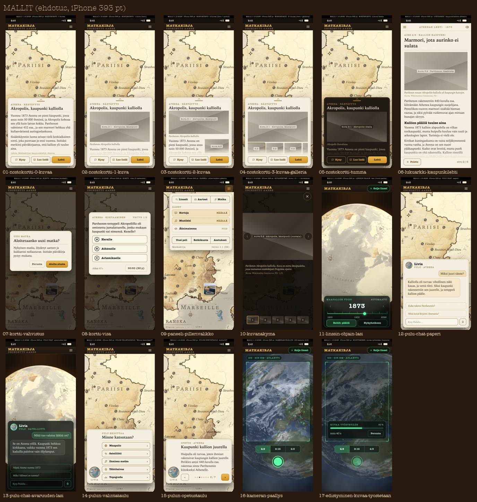

# UI-pohjat: kartoitus ja ehdotus (1.10.2026, Natiivi-UI)

Tilaus: Päätoimittaja 1.10. klo 09.3x omistajan pyynnöstä (lisäykset: laajuus, Pulun taulut, tyylikirja, ISS-kameran päällys,
sitova sääntö "uudet pinnat vain pohjilla"). Vaihe 1 = kartoitus (ei koodimuutoksia), vaihe 2 = ehdotus. **Ei toteutusta ennen
omistajan OK:ta.**

## Omistajalle: päätettävät (OK / muutos)

1. **Kuusi pohjaa + Pulun kolme osaa** (mallikuvat alla): NOSTOKORTTI, LUKUARKKI, KORTTI, PANEELI, KUVANÄKYMÄ, LINSSIN OHJAIN
   (+ KAMERAN PÄÄLLYS -variantti ja EDISTYMINEN-osa); PULU: chat, valintataulu, opetustaulu.
2. **NOSTOKORTTI puhelimella alareunaan ≤ 45 %**, veto ylös laajentaa 85 %:iin; iPadilla ja Macilla sivukortti oikeaan reunaan.
   Nyt nostokortit peittävät iPhonella 44–83 % (taulu alla).
3. **Hero-kuva 2:1** nosto- ja korttipohjissa (3:2 ei mahdu 45 %:iin), 3:2 lukuarkissa; kaksi kuvaa = hero + upotus oikealle.
4. **Teemat kolme** (PAPERI, TUMMA, LASI) kontekstin mukaan; **typografia 7 porrasta** (12/14/16/18/21/26/34).
5. **Yksi sulkupino**: Esc / Android-takaisin / ⌘W sulkee ylimmän kaikkialla, myös linsseissä (nyt vain lehdessä).
6. **Kaikki animaatiot ≤ 250 ms** (nyt 280–800 ms poikkeuksia).
7. **Tyylikirja**: `tyylikirja.json` ainoa lähde (web CSS + natiivi USS + C# generoidaan), kehittäjäsivu linssikatalogin alle
   (Pelikoodari, vasta OK:n jälkeen), "Tallenna ehdotus" äänimikserin mallilla.
8. **Pohjasäännön valvonta**: testi punaiseksi, jos uusi pinta käyttää pohjien ulkopuolisia värejä, kokoja tai luokkia
   (poikkeuslista omistajan päätöksin); merge-pyynnössä "Pohja: …".
9. **Siirtymäjärjestys**: ensin NOSTOKORTTI ja KORTTI (myös webiin), sitten PANEELI, KUVANÄKYMÄ, LUKUARKKI, LINSSIN OHJAIN.

## Mallikuvat (iPhone pysty, ehdotus)

Yksittäiset: `kuvat/ui-pohjat-20261001-malli-01-…17-….jpg` (01–05 nostokortti 0/1/2/3+ kuvaa ja tumma, 06 lukuarkki,
07–08 kortti, 09 paneeli, 10 kuvanäkymä, 11 linssin ohjain, 12–13 Pulun chat paperi/lasi, 14 valintataulu, 15 opetustaulu,
16 kameran päällys, 17 edistyminen). Kuvapaikat ovat harmaita laatikoita; tekstit esimerkkejä.

## Mitä kartoitettiin

- **Koodi**: 201 pintaa (UI-juuri 72, lehti 46, linssit 83) — kenttinä koko, teema, typografia, otsikko, kuvat, napit, sulku,
  animaatio, vieritys, ääni, Pulu. Taulut liitteessä `ui-pohjat-kartoitus-20261001-koodi.md`.
- **Natiivi laitteella** (käännös 6d128a39 = master BUILD 92 + apuraha-korostus): 92 näkymää iPhone 17 pysty ja iPad Air 11
  pysty, 31 iPad vaaka; jokaisesta kuva + `ui puu` (UI-puun laatikot), josta peitto-% ja fonttikoot laskettu
  (`proto-3d/lokit/natiivi-ui-1035/skriptit/kartoitus.sh`, `peitto.py`).
- **Web viitteeksi**: 44/48 näkymää 393×852 ja 834×1194 (`tools/pariteettikuvat.mjs`, tuotanto).
- **Tyylin lähteet**: värit, fontit, koot, välit ja kulmat web + natiivi (liite tokenit).

Kontaktiarkit: [iPhone 1/2](kuvat/ui-pohjat-20261001-iphone-1.jpg), [iPhone 2/2](kuvat/ui-pohjat-20261001-iphone-2.jpg),
[iPad pysty](kuvat/ui-pohjat-20261001-ipad-pysty.jpg), [iPad vaaka](kuvat/ui-pohjat-20261001-ipad-vaaka.jpg),
[web](kuvat/ui-pohjat-20261001-web.jpg). Täysikokoiset kuvat ja UI-puut: `proto-3d/lokit/natiivi-ui-pohjat/` (poistuu 2 vrk).

## Löydökset

- **Pohjia on jo yksi**: `Kortti` (pergamentti, max 420) ~10 dialogissa; `Pudotus` kolmessa valikossa. Muu on pintakohtaista.
- **Koko**: leveyskattoja 9 (340–960 pt); iPad-kynnyksiä 9 eri (560–1000 pt), ei yhtään USS @media- tai iPad-luokkaa.
- **Peitto** (iPhone pysty): nostokortit 44–83 %, avauskortti 73 %, maakuntakortti 81 %, visa/kysymykset 38–89 %, lomakkeet
  82 %, pillerivalikko 20–50 %; lasipinnat 5–48 %. 45 %:n raja ylittyy noin puolessa sisältöpinnoista.
- **Typografia**: otsikoita 9 eri tyyliä (KoneBold 16,5 … LukuLihava 30,4), leipä 13–16,5; laitteella mitattuna tekstikokoja
  9–40 pt, tyypillisesti 4–5 eri kokoa samassa pinnassa. Web 136 ja natiivi 88 eri fonttikokoa.
- **Teemat**: kolme perhettä (vaalea paperi 5 sävyä, tumma ruskea paperi/lasi, ISS-vihreä lasi) + radio puu/messinki, ISS
  metalli, vuosi sininen lasi, mikseri; "tummaa lasia" ≥ 3 eri arvoa. Paperi #f5f0e2 ja muste #211d18 kovakoodattuina ~100
  kertaa ohi tokenien.
- **Sulku**: viisi tapaa (✕, Sulje/Takaisin, vain napit, ohinapautus, tekstin napautus); kaksi eri "Takaisin"-tyyliä; Esc vain
  lehdessä; linssipinnoissa ei yhtään Esc-polkua.
- **Animaatio**: Ponnahdus 220/200 vain osassa; muut 160–800 ms (kutsu 350, avauskortti 280, kuvasuurennos 320, radio-sulku 800);
  osa linssipinnoista avautuu ilman animaatiota.
- **Osuma-alat** alle 44 pt useissa linssipinnoissa (valitsimen ✕ 32×28, vuosi 34×34, vertailulappu 30, tiedeliitteen piste 10×10).
- **Pulun chat** on jo yksi paneeli kahdella teemalla (paperi / linssin lasi) — sopii ehdotukseen sellaisenaan.

## Mittaustaulu (peitto-% laitteella, ehdotettu pohja)

Peitto = näkymän piirtävien laatikoiden unioni miinus paljas kartta (sama sessio), 2 pt ruudukko; ± 5 %-yks. (kartan panorointi,
Pulu suljettu pois). "–" = ei kuvattu tällä laitteella. Fonttikoot iPhonelta, kartan nimiöt (< 9 pt) pois.

| Näkymä | Ehdotettu pohja | Peitto % iPhone | iPad pysty | iPad vaaka | Fonttikoot iPhone (pt ≥ 9, yleisin ensin; kartan nimiöt pois) | Kuvia |
|---|---|---|---|---|---|---|
| 05-retkikunta | PANEELI | 48 | 17 | – | 14, 12, 11, 10 | 2 |
| 07-asetukset | PANEELI | 61 | 21 | 21 | 12, 14, 10 | 1 |
| 11-paivittyi | KORTTI | 31 | 11 | – | 14, 15 | 6 |
| 19-seloste | KORTTI | 10 | 4 | – | 12, 10 | 3 |
| 20-lippu | KORTTI | 60 | 25 | – | 14, 13, 12, 10 | 3 |
| 22-kutsu | KORTTI | 75 | 81 | – | 20, 12, 30, 14 | 10 |
| 37-visa | KORTTI | 60 | 25 | 24 | 16, 15, 14 | 1 |
| 37b-vaite | KORTTI | 38 | 16 | – | 16, 15, 14 | 1 |
| 37c-kuvakysymys | KORTTI | 84 | 38 | – | 16, 15, 14, 11 | 2 |
| 37d-kohtaaminen | KORTTI | 72 | 31 | – | 16, 15, 14 | 2 |
| 37e-tulos | KORTTI | 89 | 37 | – | 16, 15, 12, 14 | 5 |
| 38-paljastus | KORTTI | 32 | 16 | 16 | 16, 12, 10, 20 | 2 |
| 40-aloitusportti | KORTTI | 9 | 3 | 3 | 18, 16, 14, 39, 13 | 2 |
| 42-aloitusvalinta | KORTTI | 8 | 3 | 3 | 14, 22, 10 | 0 |
| 44-periaate | KORTTI | 82 | 45 | – | 15, 14, 18, 16, 13 | 3 |
| 45-apuraha | KORTTI | 82 | 59 | 41 | 16, 14, 18, 15, 39 | 3 |
| 47-huipennus | KORTTI | 58 | 21 | – | 15, 12, 10, 23 | 2 |
| 48-saapumiskortti | KORTTI | 0 | 0 | – |  | 0 |
| 51-palaute | KORTTI | 82 | 42 | – | 12, 13, 15, 10 | 1 |
| 51b-ehdotus | KORTTI | 82 | 42 | – | 12, 13, 15, 10 | 1 |
| 52-kuvavinkki | KORTTI | 82 | 46 | – | 13, 12, 15 | 5 |
| 53-reaktio | KORTTI | 39 | 31 | – | 13, 14 | 5 |
| 56-noppa | KORTTI | 0 | 1 | – |  | 4 |
| 69-sahkeliuska | KORTTI | 18 | 10 | – | 14, 15 | 6 |
| 71-sahketehtava | KORTTI | 7 | 6 | – | 14 | 6 |
| 31-nahtavyydet | KUVANÄKYMÄ | 70 | 56 | 53 | 12, 9, 10, 15 | 12 |
| 35-kohdekartta-kokoruutu | KUVANÄKYMÄ | 75 | 81 | – | 12, 20, 16, 14 | 22 |
| 46-apuraha-kuva | KUVANÄKYMÄ | 83 | 87 | – | 16, 14, 15, 18, 39 | 4 |
| 61-kuvanakyma | KUVANÄKYMÄ | 42 | 48 | 96 | 14, 13 | 10 |
| 62-pulu-kuvakortti | KUVANÄKYMÄ | 39 | 33 | – | 13, 15 | 5 |
| 111-maapallon-vuosi | LINSSIN OHJAIN | 13 | 7 | – | 15, 12, 11 | 0 |
| 114-maakyltti | LINSSIN OHJAIN | 3 | 1 | – | 14, 13 | 5 |
| 116-dioraama-yleis | LINSSIN OHJAIN | 5 | 2 | 2 | 14, 12 | 5 |
| 124-kuunnelma | LINSSIN OHJAIN | 28 | 15 | 11 | 15, 14, 11 | 5 |
| 126-mikseri | LINSSIN OHJAIN | 48 | 21 | 18 | 12, 15, 14 | 5 |
| 128-taivas-kortti | LINSSIN OHJAIN | 28 | 11 | – | 15, 14, 12 | 0 |
| 72-iss-kyyti | LINSSIN OHJAIN | 23 | 8 | – | 15, 12, 13, 18 | 2 |
| 73-cupola | LINSSIN OHJAIN | 42 | 18 | – | 15, 12, 13, 9 | 13 |
| 80-avaruuskavely | LINSSIN OHJAIN | 23 | 8 | – | 15, 12, 13, 18 | 2 |
| 83-radio | LINSSIN OHJAIN | 39 | 26 | 12 | 11, 10, 15 | 10 |
| 84-radio-soi | LINSSIN OHJAIN | 22 | 17 | – | 10 | 16 |
| 93-keksinnot | LINSSIN OHJAIN | 87 | 56 | – | 11, 16, 12, 14 | 11 |
| 99-matka-aloitus | LINSSIN OHJAIN | 48 | 20 | – | 16, 23, 40, 17 | 6 |
| 10-mitauutta | LUKUARKKI | 83 | 46 | – | 15, 14, 23 | 8 |
| 105-tiedeliite | LUKUARKKI | 90 | 79 | – | 16, 11, 12, 14 | 13 |
| 113-vertailuarkki | LUKUARKKI | 77 | 68 | – | 14, 10, 11, 13 | 10 |
| 33-opas | LUKUARKKI | 77 | 80 | – | 13, 11, 36, 20, 12 | 2 |
| 36-wiki | LUKUARKKI | 76 | 53 | – | 15, 12, 10, 23 | 3 |
| 50-tietoja | LUKUARKKI | 82 | 46 | 32 | 13, 14, 15, 12 | 3 |
| 65-luento | LUKUARKKI | 7 | 5 | – | 14 | 5 |
| 66-traileri | LUKUARKKI | 35 | 42 | – | 38, 14 | 7 |
| lehti-aihe | LUKUARKKI | 60 | 22 | 80 | 16, 23 | 6 |
| lehti-kansi | LUKUARKKI | 30 | 50 | 80 | 11, 16 | 6 |
| lehti-loppu | LUKUARKKI | 14 | 19 | – | 16, 14, 13 | 9 |
| maalehti-historia | LUKUARKKI | 33 | 23 | – | 16, 23 | 7 |
| 107-matka-nostokortti | NOSTOKORTTI | 81 | 49 | – | 12, 13, 10, 17, 11 | 9 |
| 21-avauskortti | NOSTOKORTTI | 73 | 47 | 37 | 16, 14, 12, 30, 22 | 12 |
| 23-kaupunkiliuska | NOSTOKORTTI | 26 | 12 | – | 14, 12, 20 | 2 |
| 24-nostokortti | NOSTOKORTTI | 44 | 33 | 31 | 13, 10, 12, 9 | 1 |
| 24b-nostokortti-juttu | NOSTOKORTTI | 83 | 62 | 59 | 13, 14, 16, 15, 10 | 3 |
| 24c-ihme | NOSTOKORTTI | 83 | 64 | – | 13, 16, 11, 10, 9 | 5 |
| 24d-leikekirja | NOSTOKORTTI | 81 | 53 | – | 16, 13, 14, 12 | 2 |
| 27-kartuscha | NOSTOKORTTI | 39 | 13 | 17 | 12, 10, 11, 9, 17 | 0 |
| 30-maakuntakortti | NOSTOKORTTI | 81 | 59 | 48 | 16, 12, 10, 15 | 3 |
| 32-nahtavyysarkki | NOSTOKORTTI | 83 | 75 | – | 16, 11, 9, 18, 19 | 14 |
| 01-ylapalkki-auki | PANEELI | 0 | 0 | 10 |  | 0 |
| 02-ilmoitus | PANEELI | 3 | 1 | – | 17 | 1 |
| 04-tapahtumakupla | PANEELI | 0 | 0 | – |  | 0 |
| 12-matkavalinta | PANEELI | 23 | 12 | 12 | 18, 12 | 0 |
| 13-heitto | PANEELI | 5 | 2 | – |  | 0 |
| 14-liiku | PANEELI | 5 | 2 | – |  | 4 |
| 15-laukku | PANEELI | 10 | 4 | 2 | 12, 10 | 3 |
| 16-julisteet | PANEELI | 73 | 78 | – | 10, 12 | 12 |
| 17-tietaja | PANEELI | 60 | 29 | – | 10, 11, 12, 18 | 11 |
| 28-karttaselite | PANEELI | 4 | 2 | – | 15 | 0 |
| 29-maakunnat | PANEELI | 4 | 2 | – | 15 | 0 |
| 49-pilleri-paa | PANEELI | 21 | 13 | 8 | 12, 10, 15 | 7 |
| 50-pilleri-linssit | PANEELI | 50 | 27 | 23 | 14, 11 | 16 |
| 51-pilleri-aarteet | PANEELI | 19 | 17 | – | 11, 14, 10 | 8 |
| 52-pilleri-matka | PANEELI | 35 | 14 | – | 14, 11, 12 | 8 |
| 54-esikatselu | PANEELI | 50 | 27 | – | 14, 11 | 16 |
| 57-topografia-selite | PANEELI | 12 | 5 | 5 | 12, 15 | 0 |
| 63-matkakirja | PANEELI | 22 | 0 | – | 12, 11 | 5 |
| 63b-matkakirja-pieni | PANEELI | 0 | 1 | – |  | 4 |
| pilleri-valikko | PANEELI | 20 | 7 | 17 | 12, 10, 15, 11, 14 | 1 |
| 66-kuva-pulu | PULU: CHAT | 55 | 55 | – | 13, 14, 15 | 10 |
| pulu-chat | PULU: CHAT | 29 | 11 | 10 | 15, 14 | 5 |
| pulu-sano | PULU: CHAT | 0 | 1 | – |  | 4 |
| 117-opetustaulu | PULU: OPETUSTAULU | 28 | 15 | 11 | 15, 14, 11 | 5 |
| 90-pulun-valintataulu | PULU: VALINTATAULU | 23 | 8 | 8 | 15, 12, 13, 18 | 2 |

## Ehdotus

### Yhteiset säännöt (kaikki pohjat)

- **Leveysluokat** (yksi kynnysjoukko koodissa, UiKerros): KAPEA < 600 pt (iPhone pysty), KESKI 600–939 (iPhone vaaka, iPad pysty,
  Android-tabletti), LEVEÄ ≥ 940 (iPad vaaka, Mac, Windows). Ei muita kynnyksiä.
- **Teemat** (tokeneina, sama rakenne): PAPERI (oletus: kaikki pelin sisältö, #f5f0e2 / muste #211d18), TUMMA (paperi kuvan tai
  yön päällä: #201a14 / #f1e6d0, kultareuna), LASI (linssin ohjaimet ja HUD: tumma lasi + linssin aksenttiväri; avaruus
  vihreä #5dffa8, muut kulta #d9a13b). Teeman valitsee konteksti, ei pinta.
- **Typografia-asteikko 7 porrasta**: 12 (kapiteeli/merkintä, Kone, harvennus), 14 (kuvateksti, apuri, Luku kursiivi), 16 (leipä,
  Luku), 18 (väliotsikko, KoneLihava), 21 (kortin otsikko, LukuLihava), 26 (arkin otsikko), 34 (nimiö, KoneBold). iPad/Mac +2
  portaissa 16–26.
- **Napit**: kolme tyyppiä (NAVIGOINTI kuvake+nimi+›, KYTKIN päällä #d9a13b, TOIMINTO ohut reunus) 38 pt korkeat, osuma-ala
  aina ≥ 44 pt (näkymätön laajennus). Ikoninapit (☰, kaiutin, ✕) 44 × 44 osuma-alalla.
- **Sulku**: yksi pino. Esc / Android-takaisin / Macin ⌘W sulkee ylimmän pinnan kaikkialla (myös linsseissä). Pohjakohtainen
  lisäsulku alla. Pulun chatissa ei ✕:ää.
- **Animaatio**: Ponnahdus kaikille (avaus 220 ms, sulku 200 ms, napautuskohta origona; lehden arkki ja kuvanäkymä liuku/lento
  240 ms). Ei mitään yli 250 ms (nyt 280–800 ms poikkeuksia).
- **Peitto**: ≤ 45 % ruudusta kaikissa paitsi LUKUARKKI ja KUVANÄKYMÄ (koko ruutu, tarkoituksella) ja KORTTI-modaali.
- **Ääni**: kaiutin (luenta) samassa paikassa jokaisessa sisältöpohjassa (otsikkorivin oikea reuna, ☰:n vasemmalla puolella).
  Avausääni "paper" kaikille paperipohjille, ei lasipohjille.

### Pohjat

### 1. NOSTOKORTTI (sisältö kartan päällä)
Nostokortti, maakuntakortti, kaupungin avauskortti, nähtävyysarkki (tiivis), ihmisen matkan nostokortti, kartuscha (auki).
- Koko: KAPEA alareunaan ankkuroitu, leveys 100 % − 2 × 12, korkeus ≤ 45 % (vierittyy sisältä, veto ylös laajentaa 85 %:iin);
  KESKI/LEVEÄ oikeaan reunaan sivukortiksi 380–420 pt, kartta jää näkyviin vasemmalle.
- Rakenne: kapiteeli-yläotsikko (paikka · aihe), otsikko 21, kuvat (säännöt alla), leipä 16, lähde/kuvaaja 12, alarivi napit
  (TOIMINTO: Kysy, Lue lisää, Lehti).
- Sulku: ohinapautus kartalle + veto alas + Esc. Ei ✕:ää (löydös 133).
- Teema: PAPERI; linssissä TUMMA.

### 2. LUKUARKKI (pitkä teksti)
Kaupunkilehti, maalehti, wiki "Lue lisää", tiedeliite, turistiopas, tietoja, vertailuarkki, Mitä uutta.
- Koko: koko ruutu, lukupalsta max 640 pt (lehti max 960 kahdella palstalla LEVEÄSSÄ), sivun reunat himmennetty kartta.
- Rakenne: ylärivi (☰ sisällys · nimiö/otsikko · kaiutin), sivu pystyvierityksenä, alapalkki (POISTU, sivu n/N).
- Sulku: POISTU + Esc + veto oikealle (KAPEA). Sivunkääntö liuku 240 ms.
- Teema: aina PAPERI.

### 3. KORTTI (dialogi, vahvistus, ilmoitus)
Vahvistus, kysymys/visa/väite, paljastus, matkamuisto, huipennus, apuraha, palaute, periaatteet, kehittäjäkoodi, mitä uutta
(lyhyt), saapumiskortti, minipopup (pieni variantti).
- Koko: keskitetty, max 420 pt (minipopup 320), himmennys rgba(14,9,4,.72); pergamenttikehys (nykyinen `Kortti`).
- Rakenne: otsikko 21 (+ alaotsikko kursiivi 14), leipä 16, enintään 1 kuva (hero), napit alhaalla oikealla (TOIMINTO
  ensisijainen kulta, toissijainen haamu).
- Sulku: modaali = vain napit; ei-modaali = Takaisin-haamu + ohinapautus + Esc.
- Teema: PAPERI (pergamentti).

### 4. PANEELI (valikot ja säätimet)
Pillerivalikko (pää, Linssit, Aarteet, Matka, Asetukset), äänentasot, matkalaukku, retkikunta, kehittäjätyökalut, linssin
hampurilainen, karttaselite, linssiselite, maakunnat-lappu.
- Koko: ankkuroitu avaajaansa (yläpalkin ☰ / linssin palkki), leveys 350 pt (KAPEA; "Retkikunta" vaatii ≥ 340), korkeus ≤ 70 % ruudusta, peitto ≤ 45 %.
- Rakenne: kapiteeliotsikko vasemmalla, rivit = kolme nappityyppiä kiinni toisissaan, alinäkymät ‹ Takaisin -paluulla.
- Sulku: ohinapautus + Esc + avaajan uusi napautus.
- Teema: PAPERI (vaalea pergamentti, VALIKOT YHTENÄ JÄRJESTELMÄNÄ); linssissä LASI.

### 5. KUVANÄKYMÄ (kuva koko ruudulla)
Kuvasuurennos, apurahan kokoruutu, astronautin kuvanäkymä, julistegalleria, kohdekartan kokoruutu, lipun tarina (kuva).
- Koko: koko ruutu, kuva contain, tausta TUMMA 92 %.
- Rakenne: ✕ yläoikealla (44 pt), ‹ › reunoilla (44 pt), kuvateksti + lähde alhaalla (≤ 3 riviä, kelattava selite), pikkukuva-
  nauha jos 3+ kuvaa.
- Sulku: ✕ + napautus kuvan ohi + veto alas + Esc. Avaus lentää pikkukuvasta 240 ms.

### 6. LINSSIN OHJAIN (HUD)
Radio, ISS-kytkinpöytä, maapallon vuosi, tähtitaivas, aikajanan palkki + keksijäkaruselli, vertailupalkki, kuunnelmakaistale,
mikseri, Sulje linssi -pilleri.
- Koko: alareunan nauha tai sivupaneeli, peitto ≤ 25 %; kehys linssin oma (radio puu/messinki, ISS metalli) vain kuorena, sisältö
  pohjan sääntöjen mukaan.
- Rakenne: otsikko kapiteeli 12 vasemmalla, säätimet KYTKIN/TOIMINTO, lukema Kone.
- Sulku: linssin Sulje-pilleri + Esc (sulkee ensin ohjaimen, sitten linssin).
- Teema: LASI linssin aksenttivärillä.

### 6b. KAMERAN PÄÄLLYS (LINSSIN OHJAIMEN variantti; ISS-kamera, Linssiseppä 2 toteuttaa)
- Rajausruutu: ohut kehys (1 pt, linssin aksentti 70 %), kulmamerkit 16 pt; ruudun ulkopuoli himmennetty 45 %. Muoto 4:5 (oletus)
  / 9:16 / 4:3, valinta KYTKIN-ryhmänä (kolme nappia kiinni toisissaan, 38 pt) ruudun alla; laukaisin TOIMINTO keskellä 64 pt.
- Peitto: kehys + napit ≤ 20 % (kuva itse ei ole peittoa). Sulku: linssin Sulje-pilleri + Esc. Teema LASI.

### EDISTYMINEN (yhteinen osa kaikille pohjille)
- Kun työ kestää sekunneista minuuttiin (kuvan teko, offline-lataus, kuvan haku): pieni lasi-/paperilappu pohjan sisällä, ei
  koko ruudun peitettä. Rakenne: vaiheen nimi (Kone 12 kapiteeli), palkki (määrätty %: täyttyvä; tuntematon: liukuva juova),
  arvio "noin 40 s" kun tiedossa, Peruuta-haamu. Yli 10 s kestävä työ ei lukitse muuta UI:ta; valmistuessa lappu vaihtuu
  tulokseen 200 ms ristihäivytyksellä.

### PULU (ei oma pohja vaan kolme kiinteää osaa)
- **CHAT**: yksi rakenne kaikkialla (kartta, lehti, linssit): kuplat, 2 kysymysehdotusta, kirjoituskenttä; vain teemaväri vaihtuu
  (PAPERI / avaruuden LASI). Ei ✕:ää: sulku Pulun napautuksella, ohinapautuksella, Esc.
- **VALINTATAULU** (nyk. PulunTauluNakyma "Minne katsotaan?"): otsikko, 3–6 riviä (NAVIGOINTI), Pulu vasemmassa reunassa.
- **OPETUSTAULU** (nyk. DioraamaTaulu, kohta n/N): otsikko, teksti 3–5 riviä, n/N + ‹ ›, Pulu vasemmassa reunassa.
  Molemmat taulut samaa rakennetta (taulun kehys, sama typografia), teema vaihtuu (linna PAPERI, avaruus LASI).

### Kuvasäännöt (kaikki sisältöpohjat)
- 0 kuvaa: pelkkä teksti, otsikon alla ohut viiva.
- 1 kuva: HERO koko leveydelle. NOSTOKORTTI ja KORTTI: 2:1 (kortti ≤ 45 % ruudusta ei kanna 3:2:ta: 3:2 olisi 246 pt), rajaus kuvan painopisteestä (rajaus-kenttä); LUKUARKKI 3:2, KUVANÄKYMÄ alkuperäinen suhde.
- 2 kuvaa (omistaja 1.10.): 1. HERO koko leveydelle, 2. UPOTUS tekstin viereen oikealle (40 % leveys, 4:3, kuvateksti alla 12).
- 3+ kuvaa: HERO + GALLERIA-nauha (pikkukuvat 3:2, 64 pt korkea), napautus avaa KUVANÄKYMÄN.
- Kuvateksti aina kuvan alla 12–14 Luku kursiivi; lähde/lisenssi 12 Kone himmeä.

### Yhteinen tietomalli
`KorttiData { yla, otsikko, alaotsikko, kappaleet[{otsikko, teksti, korostus, lista[]}], kuvat[{url, rooli: hero|upotus|galleria,
kuvateksti, lahde, rajaus}], napit[{teksti, tyyppi: toiminto|navigointi|kytkin, toiminto}], luettava, pulu{kysymykset[]}, teema }`
Sama JSON-muoto natiiville ja webille (apurahan esittely.json on jo lähes tämä). Pohja päättää asettelun; data ei sisällä mittoja.

### Pohjagalleria ja kuvaregressio
- Testinäkymä `ui pohjat [pohja] [teema] [kuvia 0–3]`: jokainen pohja esimerkkidatalla (kiinteä JSON), kaikki teemat.
- Savuke kuvaa gallerian iPhone pysty, iPhone vaaka, iPad pysty, iPad vaaka; vertailu viitekuviin (pikselierorajalla), kuvat
  tyylikirjasivulle automaattisesti.

### Tyylikirja
- `tyylikirja.json` (primitiivit + roolit teemoittain: värit, fontit, koot, välit, kulmat, kestot, alfa-asteikko) on ainoa lähde;
  generaattori tuottaa webin CSS-muuttujat, natiivin USS-muuttujat ja C#-vakiot; testi varmistaa täsmäyksen.
- Kehittäjäsivu linssikatalogin alla (web): värit, pohjat esimerkkidatalla, natiivin galleriakuvat rinnalla; värivalitsimet →
  "Tallenna ehdotus" -JSON samalla /laheta-reitillä kuin äänimikseri (sivu "Tyylikirja"); rooli vie tokeneihin.
  Toteutus Pelikoodarille vasta omistajan OK:n jälkeen.

### Laajuus
Pohjat natiiviin kaikille pinnoille; webiin vain NOSTOKORTTI ja KORTTI (muut web-ikkunat ennalleen, omistajan hyväksymä ero).

### Pohjat pelin perustana (sitova sääntö, omistaja 1.10.2026)
Jokainen uusi ominaisuus, linssi, ikkuna, kortti, nosto ja paneeli tehdään olemassa olevilla tyylimäärittelyillä ja pohjilla;
puuttuva osa → kysymys Päätoimittajalle (omistajalle), ei omaa ratkaisua; merge-pyynnössä mainitaan käytetty pohja.
Ehdotus, jotta sääntö on helppo noudattaa ja valvoa:
- **Pohjaluettelo** yhdessä paikassa (tyylikirja.json `pohjat`-osio + kehittäjäsivu): pohjan nimi, sallitut variantit, teemat,
  esimerkkidata. Pohjan valinta koodissa yhdellä kutsulla (esim. `Pohja.Nostokortti(data, teema)`), ei omia mittoja.
- **Koneellinen vahti** (testi, kuten tests/dokumentit.test.mjs): uusi USS-luokka, kovakoodattu väri tai fonttikoko pohjien ulkopuolella
  → testi punaiseksi, ellei rivi ole poikkeuslistassa omistajan päätöksellä (päivämäärä + perustelu).
- **Merge-pyynnön rivi** "Pohja: NOSTOKORTTI (2 kuvaa, PAPERI)" ja pohjagallerian kuvapari (ennen/jälkeen), jos pohjaa muutettiin.
- **Pohjan muutos** = tyylikirjan muutos: vain omistajan OK:lla, ja se päivittää kaikki pinnat kerralla (galleria + kuvaregressio näyttää vaikutuksen).
- Nykyiset 201 pintaa siirretään pohjiin vaiheittain (ensin NOSTOKORTTI + KORTTI, koska ne tulevat myös webiin); siirtymäaikana
  vanhat pinnat ovat poikkeuslistalla nimeltä.

## Sivuhavainnot (eivät kuulu tähän erään; rivit Päätoimittajalle)

- Keksintöpaneelin henkilöteksti #6b4d1c tummalla #201a14 ≈ 2,2:1 kontrasti (USS-väri jäänyt vaalean paperin ajalta).
- Kuollutta koodia: taikalasit-nappi (aina piilossa), Muut-paneeli (ei kutsujaa), `.mk-minipuluKortti*` ilman koodia, tuplasäännöt
  `.mk-astrokuva__vakanen` ×3 ja `.mk-selite__sulje` ×2.
- Lukijoilta-liitteen kuvapyynnöt liittävät kehittäjäavaimen URL-kyselyyn (`Lukijoilta.cs:258, :421`); kehittäjäpinta, mutta avain
  päätyy palvelinlokeihin.
- "Mitä uutta" ja "Peli päivittyi" eivät sulkeudu `ui sulje` -komennolla (testikomennon puute; pelaajalle Sulje-nappi toimii).
- `tools/pariteettikuvat.mjs`: laukku, laukku-linssit ja ratas aikakatkaisu (molemmat koot), noppa-valintavihje iPhone-koossa —
  toistuu, ei satunnainen.
- Testikomentojen aukot: matkamuisto vaatii id:n, uutiskortti, Lukijaääni-ikkuna ja vuosi-paneeli ilman `ui`-komentoa.

## Liitteet

- `ui-pohjat-kartoitus-20261001-koodi.md`: koodikartoitus (201 pintaa, kaikki kentät, Havainnot) ja tyylin lähteet (tokenit).
- Skriptit: `proto-3d/lokit/natiivi-ui-1035/skriptit/` kartoitus.sh, kartoitus-nakymat.txt, kartoitus-vaaka.txt, peitto.py,
  pohjataulu.py, arkki.py.
