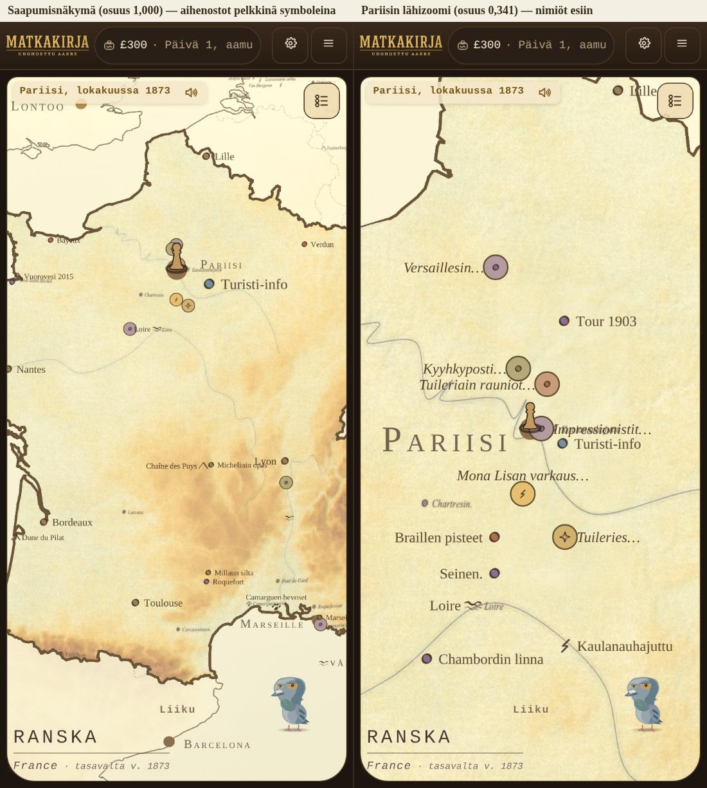

# Aihenoston nimiö vain lähizoomissa — Opus-agentin raportti 17.9.2026

Haara `claude/bold-ride-vow4ki-aihenimio`, pohja `origin/main` =
v1927 (`413204c`). Omistajan päätös: Raamattu KARTTAUUDISTUKSEN
PAATOKSET 27 **TARKENNUS 4 kohta 10** (17.9.2026 klo 04.15 UTC,
kortti *"Nimiö vain lähizoomissa"*). Ei versionostoa, ei PR:ää,
Raamattuun ei koskettu.

*Vasemmalla koko Ranskan saapumisnäkymä (osuus 1,000): Pariisin
aihenostot ovat pelkkiä symboleja. Oikealla Pariisin lähizoomi
(osuus 0,341): nimiöt ovat esillä kuten v1927:ssä. Molemmat
390 × 844, dpr 2, Ranska-tallenne, pelaaja Pariisissa.*

## 1. Mikä kynnys valittiin ja miksi juuri se

Tehtävä oli käyttää **samaa kynnystä**, jolla tavallisten nostojen
nimiöt tulevat esiin kaupunkia lähestyttäessä. Se kynnys on
`js/pallolauta/nostot.js` **`lahizoomiAuki`**, eli
`LAHIZOOMIN_OSUUS_ULOIMMASTA = 0,7` — näkymän osuus uloimmasta
sallitusta zoomista.

Se on kartan ainoa zoom-osuuden kynnys, ja se on juuri se portti,
joka päästää kaupungin omat nostot pääkartalle: `karsiKaupunkikartan-
Nostot` (js/fokuskohteet.js) merkitsee kohdekartan nostot
`lahi: true` -lipulla *"vain lähizoomiin"*, ja `merkkiPortti` lukee
lipun `lahizoomiAuki`-vastauksen kautta. Nostojen nimiöt siis
"tulevat esiin lähestyttäessä" täsmälleen tällä luvulla.

**Kynnys on sama FUNKTIO, ei sama luku.** Uusi
`aihenostonNimioNakyy(uloinOsuus)` kutsuu `lahizoomiAuki`a sen
sijaan, että toistaisi luvun 0,7 omana vakionaan. Jos kynnystä
joskus siirretään, aihenoston nimiö siirtyy mukana. Tämä on myös
vartioitu: tests/aihemerkit.test.mjs ajaa molemmat kymmenellä
osuudella ja vaatii saman vastauksen.

Sivuhuomio, joka ei muuttanut ratkaisua: kohdemaan merkit kulkevat
portista `kohdemaa: true` -lipulla, joka ohittaa `lahi`-lipun
(PAATOKSET 25, *"kohdemaan KAIKKI nostot ja kaupungit piirtyvät heti
saapumisnäkymässä"*). Merkit ovat siis saapumisnäkymässä jo nyt —
mutta se on merkkien, ei nimiöiden sääntö, ja omistajan tarkennus
koskee nimenomaan NIMIÖTÄ. Ryhmitys pitää Pariisin rykelmän silti
viitenä aihenostona molemmissa näkymissä, joten muutos ei kosketa
yhtäkään muuta päätöstä.

## 2. Mitä koodiin tuli

| tiedosto | muutos |
|---|---|
| `js/pallolauta/nostot.js` | `aihenostonNimioNakyy(uloinOsuus)` (kutsuu `lahizoomiAuki`), vastakoelippu `aihenimionKynnysSallittu()` (`?aihenimiokynnys=0`), ladonnassa `nimioNakyy: Boolean(nimio) && aihenimioLahella` |
| `tools/savukkeet/savuke-pariisi-lahizoom.mjs` | uusi mittari `aihenimioitaDom`, vartiot **3i** (kumpikin näkymä) ja **3i2** (vastakoe) |
| `tests/aihemerkit.test.mjs` | neljä uutta testiä: kynnys, tuntematon osuus, sama portti kuin `lahizoomiAuki`, laatikko ilman nimiötä |

**Laatikko seuraa lippua eikä nimeä.** `aihemerkinLaatikko` lukee
`d.nimioNakyy` ja antaa pelkän värilautasen, kun nimiötä ei ole; sama
lippu jättää rivin pois sovittelun `lappuja`-listalta. Sovittelu ei
siis varaa saapumisnäkymässä tilaa tekstille, jota ei piirretä —
juuri tämä on se, mikä 9b:n luvun pudottaa (luku 3).

Nimi ITSE jää datumiin: se on yhä saavutettavuusteksti ja viuhkan
kohtien lähde, ja napautus avaa viuhkan nimineen myös
saapumisnäkymässä. Vain piirretty nimiö katoaa, kuten kohta 10 sanoo
(*"aihenosto on pelkkä symboli"*).

## 3. Mitat: 9b ennen ja jälkeen

`savuke-nimikyltti`, sama ajo molemmilla ruuduilla, ainoa ero on
`js/pallolauta/nostot.js` (mitattu `git stash`illa samasta puusta):

| | aihemerkkejä saapuen | nimiöitä ruudulla | **9b limittyviä pareja** |
|---|---|---|---|
| **ennen** (v1927) puhelin | 8 | 28 | **8** |
| **jälkeen** puhelin | 8 | 20 | **5** |
| **ennen** (v1927) työpöytä | 8 | 32 | **9** |
| **jälkeen** työpöytä | 8 | 24 | **4** |

Puhelimen luku on takaisin entisellä tasollaan (5 = v1925:n ja
v1926:n luku, omistajan tavoite *"enintään 5"*), ja työpöytä meni
vartion oman katon 4 alle eli **vihreäksi**. Savuke nousi
**60/68 → 61/68**.

Muut punaiset ovat ennallaan eivätkä ole tämän erän aiheuttamia:
**4** (kyltti / maapaneelin teksti, hajonta 50,30 %, molemmat ruudut)
ja **7a/7b** (Venetsia ja Firenze, työpöytä) — sama nelikko kuin
v1925:ssä, v1926:ssa ja v1927:ssä. 9b jää puhelimella yhä yhden parin
katon yli (5 > 4); se on savukkeen oma katto eikä omistajan luku, ja
jätin sen löysäämättä — kolme paria poistui mittaamalla, neljäs jää
omaksi päätöksekseen.

## 4. Savuke-pariisi-lahizoom: 62/62 (oli 56/56)

Kuusi uutta vartiota (3i ja 3i2 molemmilla ruuduilla, 3i kummassakin
näkymässä), kaikki vihreitä. Mitatut luvut, puhelin 390 × 844:

| näkymä | osuus | aihemerkkejä kartalla | Pariisin aihenostot | nimiöitä (kerros / DOM) |
|---|---|---|---|---|
| saapuminen | 1,000 | 8 | 5 | **0 / 0** |
| lähizoomi | 0,341 | 6 | 5 | **5 / 6** |

Työpöydällä 1400 × 900 sama tulos (saapuen 0/0, lähizoomissa
jokaisella nimiö). Aihenostot ovat molemmissa näkymissä samat viisi
— `skandaalit:"Mona Lisan varkaus…"`, `historia:"Tuileriain
rauniot…"`, `kulttuuri:"Impressionistit…"`, `kauppa:"Kyyhkyposti…"`,
`ihmeet:"Tuileries…"` — eli kohta 7 (*"zoomista riippumatta"*) ja
kohta 8 (nimen muoto) pitävät, vartiot 3d, 3e ja 3e3 vihreinä
molemmissa näkymissä. Lähizoomin DOM-luku 6 on koko ruudun
aihemerkit (Pariisin 5 + yksi muualla), kerroksen luku 5 on Pariisin
omat.

**Kaksi mittaria, ei yhtä.** 3i lukee sekä kerroksen lipun
(`nimioNakyy`, jota myös sovittelu käyttää) että sen, mitä
elementtiin oikeasti piirrettiin (`data-nimio`). Jos ne joskus
eroavat, vika on niiden välissä eikä kynnyksessä.

**Vastakoe 3i2** (`?aihenimiokynnys=0`, sama näkymä, sama sivu,
lippu käännetään `history.replaceState` + uusi ladonta): kynnys pois
→ saapumisnäkymässä **8/8 nimiöllistä, DOM 8**; kynnys takaisin →
**0/8, DOM 0**. Vartio 3i mittaa siis kynnystä eikä sitä, ettei
nimiöitä olisi lainkaan.

Ennallaan pysyivät myös 3e4 (yksikään nimiö ei ole piilossa
lähizoomissa) ja **3h** (aihenostojen limittyviä pareja 1 ≤ katto 1,
PAATOKSET 27 TARKENNUS 3).

## 5. Kaikki ajot

| ajo | tulos |
|---|---|
| `tests/aihemerkit.test.mjs` | 25/25 (oli 21, neljä uutta) |
| `tests/pallosovittelu.test.mjs` | 14/14 |
| `tests/nimiolimitys.test.mjs` | 3/3 |
| `tests/nostot-kartalla.test.mjs` | 9/9 |
| `savuke-pariisi-lahizoom` 390 + 1400 | **62/62** |
| `savuke-nimikyltti` 390 + 1400 | **61/68** (oli 60/68) |
| `savuke-pallo-nostolaput` | **8/8** |

Koko `npm test` jätettiin tietoisesti ajamatta (erän ohje); ajetut
testitiedostot ovat ne, joita muutos koskee.

## 6. Mitä EI tehty

- Raamattuun ei kirjoitettu riviä (vain Fable kirjoittaa). TARKENNUS
  4:n tilarivi *"Tila: työ Opus-agentilla"* odottaa päivitystä.
- Versionumeroa ei nostettu eikä PR:ää avattu.
- `savuke-nimikyltti` 9b:n kattoa (4) ei löysätty. Jos katto halutaan
  vihreäksi myös puhelimella, se on oma mittauksensa: jäljellä oleva
  viisi paria on saapumisnäkymän tavallisten nostojen ja kaupunkien
  nimiöiden keskinäistä limitystä, ei aihenostojen.
- Vartiota 3h:n kattoa (1) ei koskettu — se on hyväksytty
  TARKENNUS 3:ssa.

**Kokonaiskesto:** noin 55 minuuttia (17.9.2026 klo 04.25–05.20 UTC),
josta selainajoja (kaksi savuketta kahdella ruudulla, 9b:n ennen-mittaus
ja kuvankaappaus) noin 35 minuuttia.
