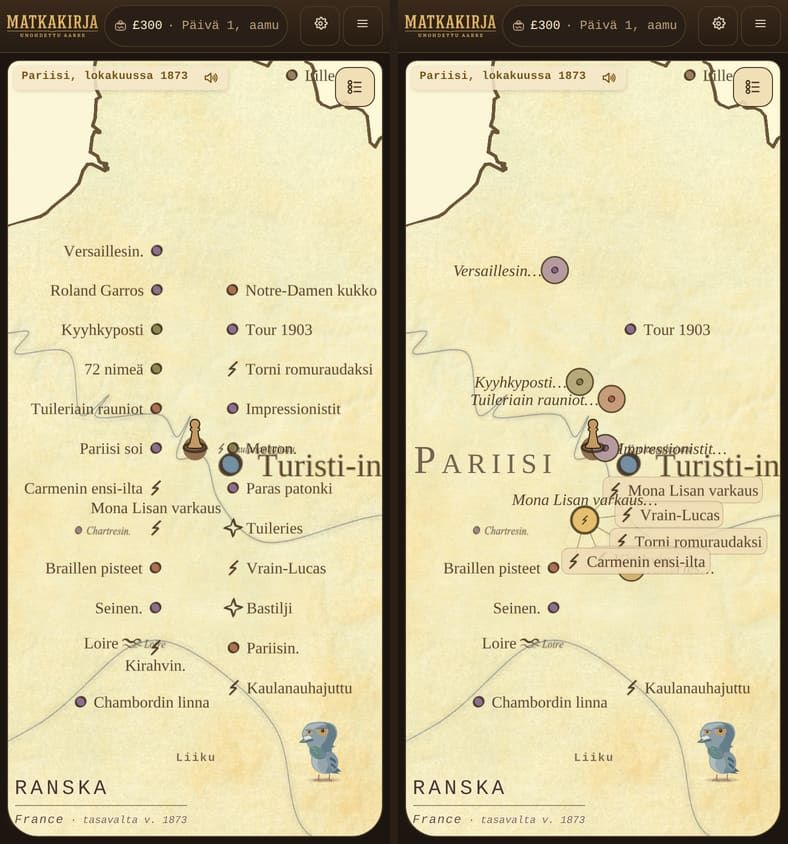

# Aihenostot (PAATOKSET 27 TARKENNUS 2) — valmis

Haara: `claude/bold-ride-vow4ki-aihenostot` (pariisi-lahizoom-haaran päällä).

Omistajan päätös (Raamattu, KARTTAUUDISTUKSEN PAATOKSET 27 TARKENNUS 2,
16.9.2026 klo 19.00 UTC, Pariisin lähizoomin ennen/jälkeen-kuvasta,
sanatarkasti): *"Nuo saman kategorian jutut piti yhdistaa yhdeksi
nostoksi ja sitten sita klikkaamalla sen kategorian nostot aukeaisi
omaksi viuhkakseen esille. Sen yhdistetyn noston voi nimeta tarkeimman
noston nimella ja laittaa loppuun vain kolme pistetta."*

*Vasemmalla ilman ryhmitystä (`?aihemerkit=0`): 21 nostoa latoo nimensä
tikapuiksi ja kaupungin nimi PARIISI jää musteen alle. Oikealla
aihenostot nimiöineen ja viuhka auki* Mona Lisan varkaus… *-merkistä.
Molemmat 390 × 844, dpr 2, Pariisin lähizoomi (osuus 0,341 uloimmasta).*

## Mitattu Pariisissa (390 × 844, dpr 2, Chromium)

| Mitta | Saapumisnäkymä | Lähizoomi |
| --- | --- | --- |
| Aiheita, joilla ≥ 2 nostoa | 5 | 5 |
| Aihenostoja (Pariisi) | 5 | 5 |
| Nimiö piilotettu sovittelussa | 0 | 0 |
| Aihenostojen limittyviä pareja | 1 / 8 | 1 / 6 |

Aiheet ja nimiöt ovat samat molemmissa näkymissä ja molemmilla ruuduilla
(390 ja 1400 px):

- **skandaalit** (5 nostoa) → *"Mona Lisan varkaus…"* — omistajan oma
  esimerkki sanatarkasti
- **historia** (3) → *"Tuileriain rauniot…"*
- **kulttuuri** (3) → *"Impressionistit…"*
- **kauppa** (3) → *"Kyyhkyposti…"*
- **ihmeet** (2) → *"Tuileries…"*

Rykelmän 21 nostosta 18 on aihenoston jäsenenä ja 3 omana merkkinään
(*Braillen pisteet*, *Tour 1903*, *Bouquinistit* — ne ovat yli
kaupunkikaton säteen 8 laudan yksikköä Pariisin laatasta, eivät siis
kaupungin rykelmässä). Yksikään ei ole piilossa.

## Mitä tehtiin

1. **Kaupunkijäsenyys nostoriville.** `js/fokuskohteet.js`
   `nostonKaupunkiAvain` antaa nostolle kaupungin: ensin kohdekartan
   eksplisiittinen nostolinkki, muuten lähin kaupunki
   `KAUPUNKIKATON_SADE`n (8 laudan yksikköä) säteellä merkin ladotusta
   pisteestä. Sama säde kuin kaupunkiruuhkan karsinnalla — ei uutta
   mitoitusta. `maanKohdemerkit` vie kentän riville, `js/pallolauta/
   nostot.js` kantaa sen ryhmitykseen.
2. **Aina-yhdistys kaupungin sisällä.** `ryhmitaNostot`
   (`js/pallolauta/aihemerkit.js`): sama ei-tyhjä `kaupunkiAvain` +
   sama aihe → yhdistä AINA, zoomista riippumatta. Kaupungin
   ulkopuolella vanha limitys/etäisyys-ehto jää voimaan sellaisenaan, ja
   `maasto: true` -tarkistus on yhä ensimmäisenä (kohta 6 voittaa
   kohdan 7).
3. **Nimiö.** `aihenostonNimio` lyhentää nimen kartan omalla tavalla,
   poistaa lyhennyspisteen ja lisää `…` (yksi merkki, kuten muualla
   pelissä). Piirto ja mittaus `enintaan = Infinity`, jottei kartan 18
   merkin sääntö söisi ellipsiä. **Tärkein = paketin ensimmäinen
   LADONNASSA** (uusi `ladontaNro`), ei ruudulla: ruutujärjestys antoi
   samalle rykelmälle nimen *Kaulanauhajuttu…* saapuessa ja *Carmenin
   ensi-ilta…* lähizoomissa, ladontajärjestys antaa molemmissa
   *Mona Lisan varkaus…* — omistajan oman esimerkin. Sama luku on myös
   aihenoston avain, joten auki oleva viuhka pysyy auki.
4. **Lukumäärä pois pallosta** (kohta 8). `AIHEMERKIN_LUKU_KOKO` ja
   `.pallolauta-aihemerkki-luku` poistettu.
5. **Laatikko ja sovittelu.** `aihemerkinLaatikko` kattaa nyt nimiön
   samalla kaavalla kuin `nostonLaatikko`, ja aihenosto on mukana
   sovittelussa (oma `.pallolauta-aihemerkki-siirto`, sama 200 ms:n
   liuku kuin nostoilla). Aihenosto saa sovittelussa `este`-lipun (ks.
   alla).

## Yksi asia, joka jouduttiin ratkaisemaan matkalla

Aihenoston paikka on ryhmän jäsenten keskipiste ja nimi lasketaan
ajossa — sillä ei ole sitä käsin hiottua ladontaa, jonka nojalla muut
laput saavat jäädä paikoilleen, ja kaupungin rykelmän aihenostot
syntyvät kaikki saman kaupungin päälle. Mitattuna kaksi paria latoi
nimiönsä päällekkäin saapumisnäkymässä ja yksi pari lähizoomissa.

`js/pallolauta/sovittelu.js` sai siksi lapun lipun `este`:

- `este`-lappu sovitellaan **viimeisenä** ja väistää **kaikkea** jo
  sijoitettua, ei vain väistäneitä naapureita;
- käsin ladotun lapun käytös ei muutu millään tavalla (vastakoe
  testeissä);
- **aihenoston nimi ei kuitenkaan katoa naapurin takia**: jos yksikään
  asento ei ole vapaa toisten lappujen suhteen, kokeillaan vielä
  pelkkiä kiinteitä esteitä eli täsmälleen vanhaa sääntöä. Ilman tätä
  porrasta *Kyyhkyposti…* menetti nimensä — juuri se vika, jonka
  korjaamiseksi tarkennus kirjoitettiin. Kaupungin nimi pysyy silti
  ensisijaisena.

Jäljelle jää mitattu 1 limittyvä pari lähizoomissa (savukkeen
`AIHENOSTOJEN_LIMITYSKATTO`): *Kyyhkyposti…* ja *Tuileriain rauniot…*
syntyvät parinkymmenen pikselin päähän toisistaan ja molempien nimiö on
toista sataa pikseliä pitkä. Luvun KASVU on regressio; nollaan ei pääse
ilman että toinen nimi katoaa.

## Vartiot

**`tools/savukkeet/savuke-pariisi-lahizoom.mjs` — 50/50 läpi**
(390 × 844 ja 1400 × 900, dpr 2). Uudet väitteet:

- **3d** aihenostoja = aiheiden määrä, joilla ≥ 2 nostoa Pariisissa —
  mitattuna sekä saapumisnäkymässä että lähizoomissa (sääntö on
  *"zoomista riippumatta"*). Odotus lasketaan näkymästä eikä vakiosta.
- **3e** jokaisella aihenostolla on nimiö muotoa `Nimi…`, ja runko on
  ryhmän ladontajärjestyksen ensimmäisen jäsenen nimen alkuosa.
- **3e2** pallossa ei ole lukumäärää (`.pallolauta-aihemerkki-luku` 0).
- **3e3** skandaalirykelmän nimiö on sanatarkasti *"Mona Lisan
  varkaus…"* — omistajan oma esimerkki.
- **3e4** yhdenkään aihenoston nimiö ei ole piilossa lähizoomissa.
- **3f** maastokohde ei ole yhdenkään aihenoston jäsen, eikä aihe, jolla
  on vain yksi nosto, saa aihenostoa.
- **3h** aihenostojen limittyviä pareja ≤ mitattu katto lähizoomissa.
- **3g VASTAKOE** `?aihekaupunki=0` (uusi lippu, luetaan joka
  ladonnassa) sammuttaa kaupungin aina-yhdistyksen ilman uutta
  sivunlatausta: aihenostoja **0**, kun säännön kanssa **5** ja odotus
  **5**. Vastakoe mittaa siis täsmälleen samaa näkymää kuin vartio 3d.
- **4b** aihemerkin viuhka avautuu ja sen kohta avaa kortin (oli jo).

**`tests/aihemerkit.test.mjs` — 21/21 läpi** (oli 10). Uudet: sama
kaupunki yhdistää zoomista riippumatta; vastakoe ilman kaupunkiavainta;
eri kaupunki ei yhdistä; sama kaupunki mutta eri aihe ei yhdistä;
maastokohde ei yhdisty edes samassa kaupungissa; yksinäinen saman
aiheen nosto pysyy omanaan; nimiön muoto, lyhennys ja tyhjä nimi;
laatikko kattaa nimiön ja seuraa sovittelun siirtoa.

**`tests/pallosovittelu.test.mjs` — 14/14 läpi** (oli 9). Uudet:
`este`-lappu väistää toista `este`-lappua; **vastakoe** ilman lippua
samat kaksi jäävät päällekkäin; `este` sovitellaan viimeisenä eikä
käsin ladottu väistä sitä; `este`-lapun nimi ei katoa naapurin takia;
aihemerkin siirtymä CSS:ssä.

**Muut ajetut:** `tests/nostot-kartalla`, `osumareititys`,
`pallolepokerros`, `pallopiste`, `pallonimet`, `kohdekaupunki`,
`nostopoltto-merkkiportti`, `arktis`, `etelamanner`, `nostomerkit`,
`rules`, `dokumentit` — **478/478 läpi**.

**Muiden kaupunkien lähizoomi:**
`tools/savukkeet/savuke-pallo-nostolaput.mjs` (Bukarest, Ateena,
Helsinki, Istanbul) — **8/8 läpi**. Sen vartio 4 oli rikki jo ennen
tätä erää: se etsi jokaiselta `laji: 'nosto'` -merkiltä luokkaa
`.pallolauta-nosto-siirto`, jota aihemerkillä ei ole koskaan ollut.
Savuke lukee nyt molemmat siirtoryhmät, ja väite on jälleen voimassa.

## Mitä EI tehty

- Raamattuun ei koskettu, versiota ei nostettu, PR:ää ei tehty
  (tehtävänannon mukaisesti).
- Aihenostojen keskinäinen limitys ei ole nollassa lähizoomissa
  (1 pari, ks. yllä) — nollaan pääsy vaatisi joko nimen katoamisen tai
  aihenoston irrottamisen jäsentensä keskipisteestä. Jos omistaja
  haluaa nollan, se on oma päätöksensä siitä, kumpi maksetaan.
- Saapumisnäkymän luvut (koko Ranska 390 px:ssä) ovat savukkeessa
  INFOna eivätkä vartiona: PAATOKSET 27 TARKENNUS 2:n oma mittausohje
  koskee Pariisin lähizoomia.
- Kuvassa oikean laidan *"Turisti-in…"* -kyltti on leikkautunut. Se on
  turisti-infon oma merkki (`js/kaupunkinosto.js`), ei aihenosto, eikä
  se kuulu tähän erään — mutta se näkyy omistajalle isona ja katkaistuna
  ruudun laidassa, ja ansaitsee oman erän.

## Muuttuneet tiedostot

- `js/fokuskohteet.js` — `nostonKaupunkiAvain`, `KAUPUNKIKATON_SADE`
  vietynä ulos, `kaupunkiAvain` merkkiriville
- `js/pallolauta/aihemerkit.js` — kaupungin aina-yhdistys,
  `aihenostonNimio`, nimiön piirto, `aihemerkinLaatikko` nimiöineen,
  lukumäärä pois
- `js/pallolauta/nostot.js` — `ladontaNro`, aihenoston nimiö ja kylki,
  sovittelun `este`-lippu, `?aihekaupunki=0`, laajennetut mittarit
- `js/pallolauta/sovittelu.js` — lapun `este`-lippu (viimeisenä, väistää
  kaikkea, mutta ei menetä nimeään naapurin takia)
- `css/styles.css` — `.pallolauta-aihemerkki-siirto`, lukumäärän tyyli
  pois
- `tests/aihemerkit.test.mjs`, `tests/pallosovittelu.test.mjs`
- `tools/savukkeet/savuke-pariisi-lahizoom.mjs`,
  `tools/savukkeet/savuke-pallo-nostolaput.mjs`
- `docs/raportit/viesti-fable-aihenostot-20260916.md` (tämä),
  `docs/raportit/kuvat/aihenostot-390-20260916.jpg`
