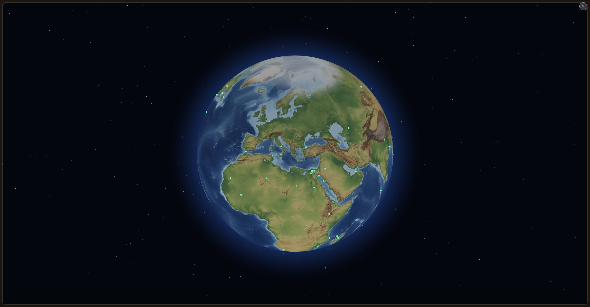
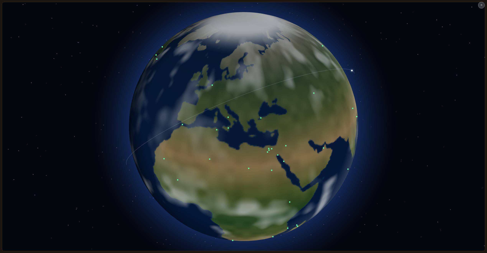
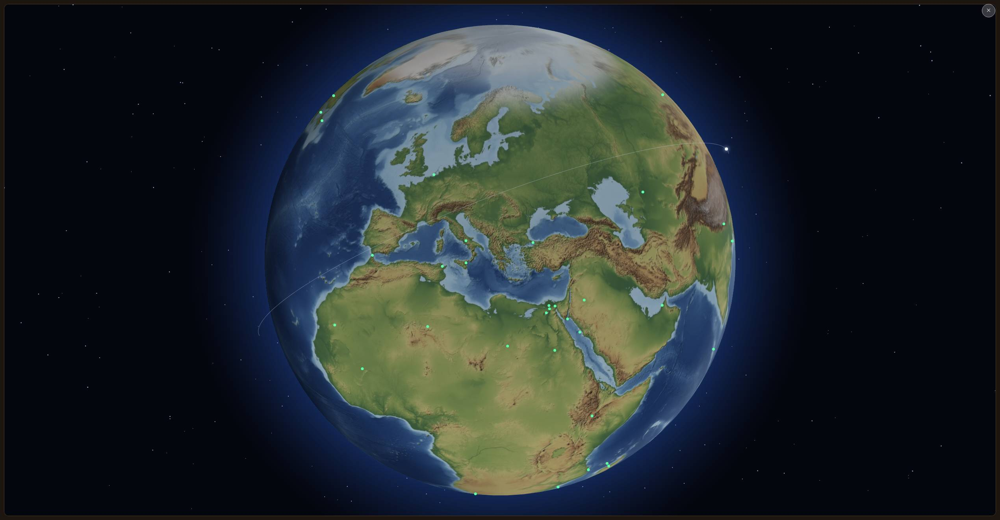

# Viesti Fablelle: Astronautin kamera WebKitissä — tyhjä ruutu ja musta pallo (v1926)

17.9.2026, Opus. Haara `claude/bold-ride-vow4ki-astro-webkit2`
(pohjana `origin/main` 8a24acf5, v1929).
Ei PR:ää, ei versionostoa, ei Raamattu-muutoksia.

Viat: Raamattu, ASTRONAUTIN KAMERA **LISÄYS 13 kohdat 36 ja 37**;
Codexin havainnot `posti/codex-fable-astronaut-webkit-tyhja-20260916.md`
(kaksi ylintä osiota, 17.9.). Aiemmat erät:
`docs/raportit/viesti-fable-pallo-musta-20260916.md` ja
`docs/raportit/viesti-fable-astro-webkit-20260916.md`.

**MOLEMMAT VIAT ON TOISINNETTU KONTISSA PIKSELILLEEN** — ei arviona
vaan ajona, jonka vaiheloki on sanasta sanaan Codexin lokikuva. Sen
jälkeen molemmat on korjattu ja korjaus mitattu samalla koelaitteella.

---

## 0. Yhteenveto yhdellä silmäyksellä

| | Vika 36 (tyhjä ruutu, 0 pistettä) | Vika 37 (musta pinta) |
|---|---|---|
| Juurisyy | **Yksikään kehys ei piirtynyt.** Pinta ja CSS2D-kohdemerkit syntyvät VAIN render-silmukassa; ajastimet toimivat, joten koko avausketju raportoi onnistuneensa. | **8k-ladonta on WebKitin rajojen yli** (33,5 Mpx, 48,5 Mt PNG, 134 Mt tekstuuri) ja jokainen sen kolmesta epäonnistumistavasta on hiljainen. Vartija mittasi OSOITETTA, ei pikseleitä. |
| Varmuusaste | **korkea** mekanismista, kohtalainen WebKitin syystä | **korkea** ketjusta, kohtalainen siitä, mikä kolmesta askeleesta petti |
| Korjaus | kehysvahti pakottaa piirron ajastimesta; pisteet asetetaan uudestaan kunnes ne ovat DOMissa; `kehykset`-puute vartijaan | ladontakatto 4096 × 2048 kaikkialla; tyhjän kankaan tarkistus tiukemmaksi; **pinnan kirkkaus luetaan piirtopuskurista** → `pinta-musta` + varapolku generoituun vyöhykepalloon |
| Todiste | kehykset poikki → ennen: ruskea ruutu, `pisteita=0`; jälkeen: pallo + 64 pistettä | valehteleva kangas → ennen: musta pallo, `puute=ei`; jälkeen: `pinta-musta` → värillinen pallo |

---

## 1. Miten mittasin ilman WebKitiä

Kontissa on vain `/opt/pw-browsers/chromium`, eikä `playwright install`
ole sallittu. Safarin rajat lavastettiin siis Chromiumiin
`addInitScript`illä ENNEN yhtään sivuskriptiä, ja koelaite on
omistajan oma mitta: **kotelo 2 539 × 1 321 CSS, dpr 1,
`navigator.standalone = true`**.

Neljä lavastusta. Kaksi niistä osui, ja **juuri se rajaus on tämän
raportin tärkein tulos**:

| Lavastus | Tulos ennen korjausta | Codexin kuva? |
|---|---|---|
| Iso PNG-blob ei dekoodaudu | pallo + reliefi kunnossa: three.js jättää vanhan tekstuurin voimaan, eli **rikkinäinen blob ei voi mustata palloa** | ei |
| `texImage2D` hylkää ison tekstuurin | pallo + reliefi kunnossa — lavastus ei purrut lainkaan (three.js vie tekstuurin GPU:lle jotain muuta WebGL2-polkua kuin `texImage2D`ia; en jäljittänyt kumpaa, koska seuraava lavastus osui) | ei |
| **rAF lakkaa kutsumasta takaisin aktivoinnissa** | **ruskea tyhjä ruutu, ei palloa, ei pisteitä, `vartija puute=pisteet pisteita=0` kahdesti** | **kyllä, vika 36** |
| **Kangas valehtelee: `drawImage` ei piirrä, `getImageData` antaa uskottavia pikseleitä** | **pallo + 64 vihreää pistettä + ratakaari, tekstuuri MUSTA, `vartija puute=ei`** | **kyllä, vika 37** |

Kaksi ensimmäistä ovat yhtä tärkeitä kuin kaksi jälkimmäistä: ne
sulkevat pois selityksiä, jotka olisivat kuulostaneet uskottavilta.

---

## 2. Vika 36 — miksi kohdepisteitä ei synny DOMiin

**Juurisyy yhdellä kappaleella.** Kohdepisteet eivät ole dataa vaan
CSS2D-elementtejä, ja CSS2DRenderer lisää ne DOMiin VASTA PIIRTÄESSÄÄN:
`lauta.linssit.merkit(...)` vain kirjaa listan, Globe.gl:n Kapsule
sulattaa sen 1 millisekunnin ajastimella, ja elementti päätyy ruudulle
vasta seuraavassa piirretyssä kehyksessä. Asennetussa WebAppissa
kehyksiä ei tullut yhtäkään — ja koska pallon pintakin piirtyy vain
samassa render-silmukassa, sama yksi puute selittää molemmat oireet:
ruskean tyhjän ruudun (WebGL-kangas on läpinäkyvä, alta näkyy pelin oma
nahkatausta `.map-pane`) JA nollan kohdepisteen. Kaikki muu avauksessa
lepää AJASTIMILLA — kirjaston lataus, vaiheloki, reliefiketju,
vartija — joten ne kaikki raportoivat onnistuneensa. `vaihe
nimi=pisteet ok=1 ms=1` oli täysin rehellinen: lista MENI kirjastolle
yhdessä millisekunnissa. Se ei vain koskaan päätynyt ruudulle.
**Varmuusaste mekanismista: korkea** (toisinnettu pikselilleen).
**WebKitin oma syy sille, miksi kehykset loppuivat: kohtalainen** —
asennettu macOS-WebApp lakkaa antamasta kehyksiä, kun ikkuna on
peitetty tai kun se on palannut taustalta, eikä sitä voi kontista
todentaa; korjaus on tarkoituksella tehty niin, ettei se riipu syystä.

### Toisinto (ennen korjausta), vaiheloki sanasta sanaan

```
kirjasto yritys=0 ok=1 ms=661
avaruus-alku kotelo=2518x1242 kangas=2518x1242 hukassa=0 itsenainen=1 dpr=1
alku lahde=8192x4096 kangas=8192x4096 ruutu=2539 kokoPallo=1
avaruus-pinta tekstuuri=1 tarkkuus=8k
vaihe nimi=avaruus ok=1 ms=205
vaihe nimi=pulu ok=1 ms=1
vaihe nimi=aanet ok=1 ms=1
vaihe nimi=linssiaani ok=1 ms=2
vaihe nimi=pisteet ok=1 ms=0
ladonta koko=8192x4096 ok=1 tapa=suodatin ms=2015
vartija puute=pisteet pisteita=0 vaiheet=0
blob kt=49686 ms=2329
valmis syy=blob osoite=blob:http:// ms=4739
vartija puute=pisteet pisteita=0 vaiheet=0
```

Ruudulla: ruskea tyhjä pinta, ✕ oikeassa yläkulmassa ja ilmoitus
*"Kohdepisteitä ei saatu pallolle. Voit poistua linssistä ja yrittää
uudelleen."* — sama merkkijono, jonka Codex kuvasi.

### Korjaus

**1. Kehysvahti** (`js/linssit/satelliitti-avaruus.js`
`varmistaKehykset`). Linssi lukee `renderer().info.render.frame` 300
ms:n välein 12 sekunnin ajan. Jos laskuri ei etene, vahti PAKOTTAA
piirron ajastimesta: `pallo.pauseAnimation()` tyhjentää kirjaston
kehyspyynnön ja `pallo.resumeAnimation()` ajaa piirtosyklin HETI
(`renderObjs.tick()` on synkroninen) ja pyytää uuden kehyksen. Sama
tikki piirtää sekä WebGL:n että CSS2D:n, joten pinta ja kohdepisteet
tulevat molemmat. Piilotetulla sivulla ei pakoteta — se olisi akun
tuhlausta.

**2. Pisteet asetetaan uudestaan, kunnes ne näkyvät**
(`js/linssit/satelliitti.js`). Halpa `querySelectorAll` 300 ms:n välein,
enintään yhdeksän kertaa; jos DOMissa ei ole yhtään
`.satelliitti-piste`, lista asetetaan uudestaan ja kehys pakotetaan.
Ajastimella eikä kehyspyynnöllä — kehykset olivat juuri se, mikä
puuttui. Loppuu itsestään heti kun pisteet ovat ruudulla.

**3. Vartija nimeää SYYN eikä seurausta.** `avauksenPuute` sai kentän
`kehyksia`, ja se tarkistetaan ENNEN pintaa ja pisteitä: ilman kehyksiä
kumpikaan ei VOI olla ruudulla. Pelaajan lause on nyt *"Laite ei
piirtänyt näkymästä yhtään kuvaa."* eikä *"Kohdepisteitä ei saatu
pallolle."* `null` (ei mitattavissa) ei ole puute.

### Toisinto korjauksen jälkeen, sama lavastus

```
alku lahde=8192x4096 kangas=4096x2048 ruutu=2539 kokoPallo=1 webkit=1
ladonta koko=4096x2048 ok=1 tapa=suodatin ms=1163
vartija puute=ei pisteita=64 vaiheet=0
blob kt=14805 ms=1206
pinta-mittaus kirkkaus=153 reliefi=1 varapolku=0
kehykset piirtoja=54 alussa=34 pakotettu=20
```

Pallo, reliefi ja 64 kohdepistettä ruudulla, ei ilmoitusta — vaikka
rAF ei kutsunut takaisin kertaakaan.



---

## 3. Vika 37 — miksi tekstuuri jäi mustaksi

**Juurisyy yhdellä kappaleella.** 2 539 CSS-pikselin ruutu valitsee
8k-reliefin, ja ladontakangas sai tähän asti olla lähdekuvan omassa
koossa: **8192 × 4096 = 33,5 Mpx**, josta syntyy **48,5 megatavun
PNG-blob** (mitattu: `blob kt=49686`) ja **134 megatavun RGBA-tekstuuri
GPU:lle**. Ketjussa on kolme WebKit-rajaa, ja jokainen niistä
epäonnistuu HILJAA: iOS:n kangaskatto on 4096 × 4096 = 16,7 Mpx
(yli menevä kangas ei heitä vaan jää tyhjäksi), 48 Mt:n PNG:n purku ei
mahdu jokaisen WebKit-prosessin muistiin (`` jää lataamatta eikä
three.js saa siitä tietoa), ja 134 Mt:n tekstuurin lataus GPU:lle voi
epäonnistua ilman poikkeusta (näytteenotto antaa mustaa). Vartija ei
voinut nähdä mitään näistä, koska se mittasi **osoitetta** (`onko
globeImageUrl asetettu`) ja **pisteiden määrää** — molemmat kertovat
AIKOMUKSESTA, ja mustan pallon ketjussa jokainen aikomus toteutui.
Tyhjän kankaan tarkistus taas katsoi vain kymmentä näytettä kuvan
keskikaistalta ja vain KIRKKAINTA niistä, joten yksivärinen tai
reunoilta tyhjä kangas meni läpi. **Varmuusaste siitä, että 8k-ketju on
syy: korkea** (kolmas avaus erosi kahdesta edellisestä vain siinä, että
se pääsi niin pitkälle; Chromiumissa sama ketju tuottaa 48,5 Mt:n blobin
ja 134 Mt:n tekstuurin, ja se on mitattu). **Varmuusaste siitä, mikä
kolmesta askeleesta petti: kohtalainen** — sitä ei voi erottaa ilman
oikeaa WebKitiä, ja siksi korjaus poistaa kaikki kolme kerralla eikä
valitse niiden väliltä.

### Korjaus

**a) Ladontakangas ei koskaan yli 16 Mpx — käytännössä 4096 × 2048.**
`js/linssit/reliefikuva.js`: `LADONNAN_KATTO = 4096` on katto
KAIKILLA laitteilla, `LADONNAN_KATTO_WEBKIT = 4096` WebKitillä ja
`LADONNAN_PIKSELIKATTO = 16 777 216` on ehdoton yläraja, jota
`katto`-parametrillakaan ei voi ylittää. Uusi puhdas funktio
`webkitSelain(navigator)` tunnistaa Safarin ja asennetun WebAppin
(`navigator.standalone` tai WebKit-UA ilman Chromium-merkkejä).
Mitattu vaikutus samalla koelaitteella: **blob 49 686 kt → 14 805 kt
(−70 %)**, tekstuuri 134 Mt → 33,5 Mt, ladonta 1 951 ms → 1 135 ms.
Katon nostaminen vaatii mitatun tuen, ei arviota ruudun leveydestä.

**b) Tyhjän kankaan tarkistus tiukemmaksi.** Näytteitä on nyt 18
kymmenen sijaan, ja **neljä laitaa ja neljä kulmaa ovat mukana**.
Ehtoja on kolme yhden sijaan: kirkkaimman on ylitettävä kynnys (12),
keskiarvon on ylitettävä lähes mustan raja (`TUMMUUDEN_KYNNYS` 18) JA
näytteiden välillä on oltava vaihtelua (`VAIHTELUN_KYNNYS` 6). Vaihtelu
on se ehto, jota tyhjä tai yksivärinen kangas ei voi täyttää — oikeassa
reliefissä on aina meren ja maan ero. "Jos tarkistusta ei voi tehdä,
kangas hyväksytään" on ennallaan: vartija ei saa olla tiukempi kuin
sen tieto.

**c) Pinnan toteutunut piirto mitataan WebGL:stä.** Uusi
`pinnanKirkkaus(pallo)` piirtää yhden kehyksen ja lukee `readPixels`illa
5 × 5 -ruudukon pallon keskustasta (30 % säteestä) — **omin käsin
piirretty kehys on pakko**, koska pelin konteksti luodaan ilman
`preserveDrawingBuffer`ia eikä puskuria voi lukea muuten. Mittaus
ajetaan 900 ms pinnan vaihdon jälkeen. Jos kirkkain näyte alittaa
kynnyksen 12:
* lokiin tulee `pinta-musta toimenpide=varapolku kirkkaus=0`,
* **reliefi otetaan pois ja generoitu vyöhykepallo palaa pinnalle**
  (blob-osoite vapautetaan), ja
* mittaus uusitaan, jotta varapolkukin todistetaan.

`avauksenPuute` sai kentän `pinnanKirkkaus` ja uuden puutteen
`pinta-musta` (*"Maapallon pintakuva jäi mustaksi."*). Jos varapolku
auttoi, puutetta ei ole — pelaaja näkee värillisen Maan, ja loki kertoo
mitä tapahtui.

### Toisinto ja korjaus mitattuna

Lavastus "kangas valehtelee" (drawImage ei piirrä, getImageData antaa
uskottavia, vaihtelevia pikseleitä — ainoa lavastus, joka läpäisee
kangastason tarkistuksen):

```
ENNEN:  ladonta koko=8192x4096 ok=1   blob kt=622
        vartija puute=ei pisteita=64        ← musta pallo läpäisi vartijan
JÄLKEEN: pinta-mittaus kirkkaus=0 reliefi=1 varapolku=0
         pinta-musta toimenpide=varapolku kirkkaus=0
         pinta-mittaus kirkkaus=122 reliefi=0 varapolku=1
```

Kuvakaappauksesta luettu pallon keskipisteen kirkkaus korjauksen
jälkeen **62,5** (kynnys 20) — värillinen Maa, ei musta pallo.



Ja sama Mac-kotelo Safarin kangaskatolla, ilman valehtelevaa kangasta —
tämä on se kuva, jonka omistajan pitäisi nähdä WebAppissa:



---

## 4. Mitä uusi vaiheloki näyttää

`?pallodiag=1` sai neljä uutta riviä. Ne ovat se, mitä Codexin on
luettava Macilla:

| Rivi | Mitä se kertoo |
|---|---|
| `alku … kangas=4096x2048 … webkit=1` | ladontakangas ja selainperhe. `webkit=1` vahvistaa, että WebApp tunnistettiin; `kangas` ei saa koskaan olla yli 4096 × 2048. |
| `pinta-mittaus kirkkaus=N reliefi=1 varapolku=0` | pallon keskustan kirkkaus PIIRTOPUSKURISTA. Yli 20 = värillinen pinta; 0 = musta. |
| `pinta-musta toimenpide=varapolku kirkkaus=0` | musta pinta havaittiin ja generoitu vyöhykepallo palautettiin. Tämän rivin PUUTTUMINEN ehjässä ajossa on yhtä tärkeä tieto. |
| `kehykset piirtoja=N alussa=M pakotettu=K` | kehysvahdin loppuraportti 12 s:n jälkeen. `pakotettu=0` = laite antoi kehykset itse; `pakotettu>0` = laite ei antanut ja vahti pelasti tilanteen. |
| `pisteet-uusinta domissa=N yrityksia=K` | kohdepisteet jouduttiin asettamaan uudestaan. Ilmestyy vain, jos ensimmäinen asetus ei riittänyt. |

---

## 5. MAC-AJO-OHJE (omistajan Mac Studio / asennettu Safari WebApp)

Tämä on se osa, jota kontti ei voi tehdä. Kaksi tapaa; **A on
pakollinen, B on lisätodiste**.

### A. Asennettu WebApp, pelaajan oma polku

1. Julkaise haaran sisältö (tai aja peli paikallisesta puusta) ja avaa
   asennettu WebApp osoiteriviltä lipulla:
   **`?pallodiag=1`**. Sovelluksessa: *Näytä → Lataa sivu uudelleen
   lähteestä*, tai avaa peli kerran Safarissa lipulla ensin.
2. Varmista päivitysdialogista, että versio on tämän haaran versio.
3. Matkalaukku → Astronautin kamera → **Aktivoi**.
4. Lue ruudun vasemman alakulman musta lokilaatikko.

**Odotetut rivit, tässä järjestyksessä:**

```
kirjasto yritys=0 ok=1 ms=…
avaruus-alku kotelo=2539x1321 kangas=2539x1321 hukassa=0 itsenainen=1 dpr=1
alku lahde=8192x4096 kangas=4096x2048 ruutu=2539 kokoPallo=1 webkit=1
avaruus-pinta tekstuuri=1 tarkkuus=8k
vaihe nimi=avaruus ok=1 ms=…
vaihe nimi=pulu ok=1 ms=…
vaihe nimi=aanet ok=1 ms=…
vaihe nimi=linssiaani ok=1 ms=…
vaihe nimi=pisteet ok=1 ms=…
kuva px=8192x4096 ms=…
ladonta koko=4096x2048 ok=1 tapa=suodatin ms=…
vartija puute=ei pisteita=64 vaiheet=0
blob kt=14000…15000 ms=…
valmis syy=blob osoite=blob:https:// ms=…
pinta-mittaus kirkkaus=<yli 20> reliefi=1 varapolku=0
vartija puute=ei pisteita=64 vaiheet=0
kehykset piirtoja=… alussa=… pakotettu=0
```

**Viisi asiaa, jotka ratkaisevat:**

1. **`kangas=4096x2048` ja `webkit=1`** rivillä `alku`. Jos tässä lukee
   `8192x4096`, WebKit-tunnistus ei mennyt perille — kerro se, se on
   oma vikansa.
2. **`blob kt` on noin 14 800, ei 49 686.** Se on koko korjauksen a)
   mitta yhtenä lukuna.
3. **`pinta-mittaus kirkkaus=` yli 20 ja `varapolku=0`.** Jos näet
   rivin `pinta-musta`, **korjaus toimi mutta vika on yhä laitteessa**:
   silloin tiedämme vihdoin, että musta pinta syntyy vielä 4k-ladonnalla,
   ja seuraava askel on pudottaa ladonta 2048 × 1024:ään. Ota siitä
   kuva — se on arvokkain yksittäinen havainto, jonka voit toimittaa.
4. **`kehykset … pakotettu=`.** `pakotettu=0` tarkoittaa, että WebApp
   antoi kehykset itse (vika 36 ei uusiutunut). **`pakotettu>0`
   tarkoittaa, että vika 36 ON yhä laitteessa ja kehysvahti korjasi
   sen** — ja se on suoraa todistusaineistoa juurisyystä. Kumpi tahansa
   luku on hyvä tulos; kerro kumpi.
5. **Ruutu itse: pallo, maasto ja 64 vihreää pistettä**, eikä
   ilmoituslaatikkoa. Pisteiden pitää ilmestyä noin sekunnissa
   aktivoinnista (kontissa mitattu 11 s, mutta siellä SwiftShader
   piirtää 2–3 kehystä sekunnissa — Macilla kehykset ovat 60/s).

**Toista avaus kolme kertaa** (sulje linssi → matkalaukku → Aktivoi).
Codexin kolmas avaus oli se, jossa pinta mustui; kolme kierrosta on
siis vähimmäismäärä.

**Lisäksi:** vie sovellus taustalle linssin ollessa auki, odota minuutti
ja palaa. Jos loki näyttää `kehykset … pakotettu>0` vasta tämän
jälkeen, tiedämme WebKitin kehyskadon syyn tarkasti.

### B. Oikea WebKit Playwrightilla (lisätodiste, ei korvaa A:ta)

Mac Studiolla, repon juuressa:

```sh
npx playwright install webkit
PLAYWRIGHT_BROWSERS_PATH=0 NODE_USE_ENV_PROXY=1 \
  node tools/savukkeet/savuke-astro-pallo.mjs NAKYMAT=vartija
```

Savuke ajaa Chromiumilla oletuksena; WebKit-ajoa varten vaihda
`chromium.launch` → `webkit.launch` savukkeen alusta (yksi rivi) ja aja
sama komento. Odotetut rivit ovat samat kuin A:ssa, ja neljä uutta
väitettä (`SAFARIN RAJAT`, `KEHYKSET POIKKI`, `MUSTA PINTA`,
`VASTAKOE`) ovat ne, joiden pitää olla vihreitä oikealla moottorilla.
**Tämä on nimenomaan se ajo, jota kontti ei voinut tehdä** — jos jokin
niistä on punainen WebKitissä, lavastukseni oli liian lempeä ja
juurisyy on syvemmällä.

---

## 6. Vartiot

### Yksikkötestit

`node --test tests/satelliitti-avaruus.test.mjs tests/satelliitti.test.mjs
tests/pallolinssit.test.mjs tests/pallo.test.mjs tests/pallolauta.test.mjs
tests/sw.test.mjs tests/dokumentit.test.mjs` — **224/224 läpi**
(kymmenen uutta tai uudistettua vartiota).

Uudet ja muutetut vartiot:

* **`valitseLadonta` ei koskaan ylitä 16 Mpx:ää.** Leveä ruutu (2 539)
  saa 4096 × 2048 eikä enää lähdekuvan omaa kokoa; WebKit-lippu ei voi
  löysätä kattoa; nimenomainenkaan `katto` ei voi ylittää
  pikselikattoa. *(Tämä on vanha vartio, joka vartioi invarianttia, joka
  muuttui TARKOITUKSELLA — siksi se on päivitetty eikä poistettu.)*
* **`webkitSelain`** tunnistaa Safarin ja iPhonen, EI Chromea (joka
  kantaa "Safari"-merkkijonoa omassa UA:ssaan), ja `navigator.standalone`
  riittää yksin. Puuttuva navigator ei kaada eikä arvaa.
* **`tyhjaKangas`**: läpinäkyvä ja musta hylätään kuten ennen; **uutta**
  on, että yksivärinen kirkas pinta hylätään ja lähes musta hylätään,
  vaikka yksi näyte ylittäisi kynnyksen. Oikea reliefi (meri + manner)
  kelpaa. "Ei voi tarkistaa → hyväksytään" on ennallaan.
* **Näytteet ulottuvat reunoihin** (lähdekoodivartio: vähintään 16
  näytettä ja näyte kummastakin päästä molempia akseleita).
* **`avauksenPuute`**: `kehykset` nimetään ENNEN pintaa ja pisteitä,
  koska se selittää molemmat; `pinta-musta` nimetään, kun osoite on
  paikallaan mutta mitattu kirkkaus alittaa kynnyksen; `null` (ei
  mitattavissa) ei ole puute kummassakaan. Jokaiselle puutteelle on
  pelaajan kielinen LAUSE (iso alkukirjain, piste lopussa), ei koodinimi.
* **`pinnanKirkkaus` PIIRTÄÄ.** Vartio tarkistaa, että mittaus kutsuu
  `renderer.render`iä — ilman omaa kehystä puskuri olisi jo vaihdettu ja
  mittari väittäisi mustaa aina. Mittaamattomissa oleva tilanne on
  `null` eikä nolla.
* **Kehysvahti pakottaa PARINA** (`pauseAnimation` + `resumeAnimation`),
  vain kun laskuri ei etene, ei koskaan piilotetulla sivulla, ja purku
  ottaa kellon pois.
* **Pisteiden uusinta** on ajastimella eikä kehyspyynnöllä, loppuu ennen
  vartijan aikakatkoa ja siivotaan purkaessa.

### Savukkeet

`tools/savukkeet/savuke-astro-pallo.mjs` sai neljä uutta väitesarjaa
omassa Mac-kotelossaan (2 539 × 1 321, dpr 1, WebKit-liput):

* **10. SAFARIN RAJAT** — ladontakangas ≤ 4096 × 2048 ja pinta
  värillinen, kun kangaskatto on 16,7 Mpx.
* **10b. KEHYKSET POIKKI** — rAF lakkaa kutsumasta takaisin
  aktivoinnissa: kohdepisteiden on silti tultava DOMiin, kehysvahdin on
  pakotettava piirto eikä pelaajalle saa jäädä ilmoitusta.
* **10c. MUSTA PINTA** — valehteleva kangas: mittauksen on nähtävä musta
  PIIRTOPUSKURISTA ja varapolun palautettava värillinen pinta.
* **10d/VASTAKOE** — ehjässä ajossa pisteet ovat DOMissa ajoissa ja
  PYSYVÄT pinnan vaihdon yli, mustaa pintaa ei havaita, varapolkua ei
  käytetä eikä kehyksiä tarvitse pakottaa. **Ilman vastakoetta yksikään
  yllä olevista mittareista ei voisi mennä punaiseksi.**

Ajot:

* `savuke-astro-pallo NAKYMAT=vartija` — **22/22 läpi**.
* `savuke-astro-pallo NAKYMAT=tyopoyta` — **59/59 läpi**. Reliefi 8k,
  ladonta 4096 × 2048, blob 14 805 kt (ennen 49 686 kt), pinnan mitattu
  kirkkaus 165, `kehykset … pakotettu=0`.
* `savuke-astro-pallo NAKYMAT=puhelin` — **37/37 läpi**. Reliefi 4k,
  ladonta 2048 × 1024, pinnan kirkkaus 150. **Tässä ajossa molemmat
  uudet mekanismit laukesivat oikeasti**: `pisteet-uusinta domissa=64
  yrityksia=2` ja `kehykset … pakotettu=1` — kontin SwiftShader on
  hitaimmillaan juuri se laite, jolle ne on tehty.
* `savuke-satelliittilinssi NAKYMAT=tyopoyta` — **34/34 läpi**.

Yhteensä **152 savukeväitettä läpi, 0 punaista.** Kumpikaan aiemman
raportin epävakaa väite (pallon pyöriminen mittauksen aikana) ei
kaatunut näissä ajoissa.

---

## 7. Yksi asia, joka jää sinulle päätettäväksi

**8k-kuvan valinta on nyt turhaa työtä leveällä ruudulla.**
`valitseReliefi` lataa yhä 2,9 Mt:n 8k-kuvan, kun CSS-leveys on ≥ 1024
— mutta ladonta piirtää sen 4096 × 2048 -kankaalle. Tarkkuutta se ei
enää tuo (kangas on kuvan 4k-version kokoinen), vain latausaikaa.

**En muuttanut `valitseReliefi`ä**, ja syy on tarkka: sama funktio
palvelee myös topografialinssiä (`js/linssit/topografia.js`), joka
piirtää kuvan kalvolle SELLAISENAAN eikä monikangasketjun kautta —
sille 8k on oikeasti terävämpi eikä sitä koske tämä vika. Valinnan
sitominen ladontakattoon on siis oma päätöksensä ja oma mittauksensa,
ja se koskee kahta linssiä. Kaksi vaihtoehtoa:

1. **Astronautin kamera pyytää 4k:ta aina** (yksi parametri
   `valitseReliefi`lle): säästää 2,1 Mt latausta joka avauksella,
   topografialinssi jatkaa 8k:lla. Suosittelen tätä.
2. **Ladontakatto nostetaan takaisin 8192:een ei-WebKitissä**: pitää
   Chromen terävyyden, mutta jättää eron kahden selaimen välille.
   Vaatii mitatun tuen ennen kuin sen voi tehdä.

Sen lisäksi: **jos Codexin Mac-ajo näyttää rivin `pinta-musta` vielä
4k-ladonnalla**, katto on pudotettava 2048 × 1024:ään WebKitissä. Se on
yhden vakion muutos (`LADONNAN_KATTO_WEBKIT`), ja koodi on jo
rakennettu niin, että se riittää.

---

## 8. Mitä ei koskettu

Raamattuun ei kirjoitettu, versionumeroa ei nostettu, PR:ää ei tehty,
`dist/`-kansiota ei luotu. Reliefin **valinta** (`valitseReliefi`, 8k vs.
4k), kytkimet `RELIEFIN_8K_KAYTOSSA` ja `RELIEFI_KOKO_PALLO`, kuvat
ämpärissä, kirjaston latausketju (`js/pallo.js` aikakatko ja uusinta),
vaihekääre, linssivirheen ulkoasu ja `sw.js` ovat ennallaan — uusia
moduuleja ei syntynyt, joten huoltokarttaan ei tarvinnut lisätä mitään.
Topografialinssiin ei koskettu.

Muutetut tiedostot:

```
js/linssit/reliefikuva.js              ladontakatto, webkitSelain
js/linssit/satelliitti-avaruus.js      pinnanKirkkaus, varmistaKehykset,
                                       tyhjaKangas, avauksenPuute, varapolku
js/linssit/satelliitti.js              pisteiden uusinta DOMiin asti
tests/satelliitti-avaruus.test.mjs     uudet ja päivitetyt vartiot
tests/satelliitti.test.mjs             pisteiden uusinnan vartio
tools/savukkeet/savuke-astro-pallo.mjs neljä uutta väitesarjaa
docs/raportit/viesti-fable-astro-webkit2-20260917.md  tämä raportti
docs/raportit/kuvat/astro-webkit2-*.jpg               kolme kuvaa
```

---

## 9. Kokonaiskesto

Noin 3 h 20 min yhtäjaksoista työtä: lukeminen ja koeympäristön
pystytys 40 min, vikojen toisintaminen ja epäilysten karsinta
(neljä lavastusta) 45 min, korjaus 50 min, vartiot ja savukkeet 25 min,
ajot ja raportti loput. Savukeajot ovat kontissa hitaita — yksi
`NAKYMAT=vartija` -kierros on noin 11 minuuttia ja täysi työpöytäajo
noin 20 minuuttia, ja niitä ajettiin yhteensä kuusi.
