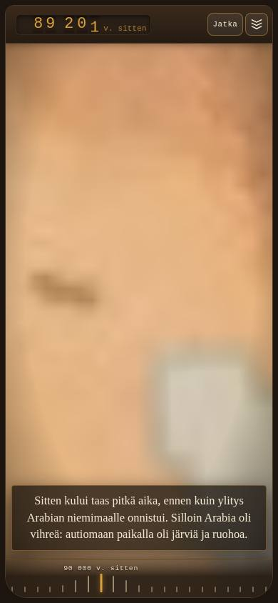

# Viesti Fablelle — pulu pois esityksestä, lyhyet kappaleet, hitaampi maapallon zoom

**Opus-työagentti, 16.9.2026.** Haara
`claude/bold-ride-vow4ki-ihmisen-matka-kappaleet`, pohjana `origin/main`
(`70267f5c`, v1923). Toimeksianto: Raamatun osio **IHMISEN MATKA
-LINSSI: RINTAMAN VALKKYMINEN, MUSTA ALKU, LIIKU POIS**, jatkot 2 ja 3.

Omistaja sanatarkasti (16.9.2026 klo 15.40 UTC, kaksi iPhone-kuvaa
avaruusvaiheen jälkeen, 95 521 ja 81 675 v. sitten): *"Ota pulu pois
näkyvistä ja ota simpukka kommentti pois kokonaan. Pulu näkyviin vasta
kun linssin animaatio on ohi. Tee tekstityksestä lyhyempiä kappaleita,
että ei mene niin paljon kartan päälle."*

Ja saman päivän jatko 3: *"Zoomaa maapallo hitaammin näkymään. Aloita
nykyisestä hetkestä mutta zoomaus voi valmistua viisi sekuntia
myöhemmin. Ei haittaa vaikka sana Afrikka tulee jo ennen zoomin loppua.
Pienen tauon jälkee kartta voisi hyvin hitaasti alkaa zoomata jo kohti
Marokkoa ja alkaa kiihtyä siitä kohdasta mistä zoomaus nyt alkaa."*

**Lyhyesti.** Pulun juurisyy oli yksi rivi: sisääntulo ajastettiin
jokaisen alalaitaan laskeutuvan jakson alusta, eli pulu käveli ruudulle
jo ensimmäisen kohteen kohdalla ja seisoi tekstilaatikon kulmassa koko
loppuesityksen. Ajastus on nyt vain esityksen lopussa. Simpukkavirke on
poissa tekstistä ja luennasta — **äänite on siksi vanhentunut ja
uusittava** (avain alla, kohta 6). Tekstitys jaetaan enintään kolmen
virkkeen ja 240 merkin osiin, jotka vaihtuvat virkerajalla luennan
tahdissa; mitattu korkein laatikko 390 px:llä on **139 px eli 17 %
kartasta** (ennen 210 px, 25 %). Maapallon zoomi kestää **2 329 → 7 329
ms (+5 000 ms)**, sen jälkeen on **1,2 s tauko**, ja Marokon ajo saa
hitaan esivaiheen. Marokon **saapumishetki ei siirry** — mutta ajo
lyhenee, ja siitä on alla oma huomio omistajalle (kohta 5).

---

## 1. Pulun juurisyy — mitattu, ei arvattu

`js/linssit/ihmisen-matka-esitys.js`, funktio `aloitaJakso`, rivi oli:

```js
if (!keskella) ajastaPulunSisaantulo(tila.tekstiViive ? TEKSTIN_LASKU_MS : 0);
```

`keskella` on tosi vain avausjaksoilla (`pimea`, `valot`), joissa lause
ladotaan ruudun keskelle. Heti kun teksti laskeutui alalaitaan —
eli **ensimmäisessä kohteessa (`jebel-irhoud`)** — ajastin lähti, ja
`PULUN_SISAANTULO_MS` (2 s) päästä pulu käveli oikeasta reunasta
paikalleen. Sen jälkeen se oli ruudulla loppuun asti. Juuri tämän
omistaja näki kuvissaan 95 521 ja 81 675 v. sitten.

Piilotus itse oli jo oikein: body-luokka `aikajana-pulu-piilossa`
asetetaan ohjaajan syntyessä (linssiä avattaessa). Vika oli siinä, MISTÄ
luokka purettiin.

**Korjaus.** Sama mekanismi, uusi paikka:

| Paikka | Ennen | Nyt |
|---|---|---|
| `aloitaJakso` (joka jakso) | ajasti sisääntulon | ei tee mitään |
| `paata()` (esitys päättyi) | — | `ajastaPulunSisaantulo(0, { jalkeen })` |
| `jatkaMuistista` | `naytaPulu({ ele: false })` | ei tuo pulua kesken kaaren |
| `pura()` (linssi kiinni) | `naytaPulu({ ele: false })` | ennallaan |
| `tauko()` | ei koskenut pulua | ennallaan — tauko ei tuo pulua |

Ei uutta ajastinta eikä uutta luokkaa. Kävelyele (`walkBack`, 2,2 s) ja
sen 2 sekunnin hengähdys ovat entiset — vain hetki on eri.

**Sivuvaikutus, joka on linjauksen mukainen:** piilossa oleva pulu ei
puhu (`sanoPulu` palaa heti), joten kaanonin kesken kaaren tulevat
välihuomiot (`ranta` *"Simpukoita. Hyvä alku."*, `denisova`, `meri`)
eivät enää kuulu. Se on juuri se, mitä *"ota pulu pois näkyvistä"*
tarkoittaa. **Viimeinen välihuomio säilyy:** `paata` sanoo kaanonin
viimeisen jakson `pulu`-kentän (*"Kartta on sinun…"*) heti kun pulu on
kävellyt perille — kupla tulee siis edelleen pulun viereen, ei tyhjään.

**Pluskupla samaan nippuun (omistajan lisähavainto puhelimella).**
`.pollo-kuplapalautus` on `position: fixed` -nappi **bodyn suorana
lapsena** (js/pollo.js) — ei pulun napin eikä paneelin sisällä — ja se
puuttui piilotuslistalta. Se jäi siksi kellumaan esityksen päälle,
vaikka pulu itse oli piilossa. Valitsin on nyt mukana
`css/aikajana.css`:n `body.aikajana-pulu-piilossa` -säännössä
(`visibility: hidden` + `pointer-events: none`), ja lista on nimetty
vakiona `PULUN_PIILO_OSAT`, jota `tests/ihmisen-matka-esitys.test.mjs`
vartioi. Savukkeessa mitattiin `oliValmiina: true` — nappi todella oli
DOMissa linssin aikana.

---

## 2. Simpukkavirke poistettu

`js/linssit/ihmisen-matka-kertomus.js`, jakso `arabia` (90 000 v.
sitten). Poistettu kokonaan sekä `teksti`- että `luenta`-kentästä:

> ~~Etelän rannikolla ehdittiin hioa okraa punaiseksi ja pujotella
> simpukankuoria helmiksi, ennen kuin ylitys Arabian niemimaalle
> onnistui.~~

Kappale alkaa nyt sujuvasti, täsmälleen Raamatun linjauksen mukaan:

> Sitten kului taas pitkä aika, ennen kuin ylitys Arabian niemimaalle
> onnistui. Silloin Arabia oli vihreä: autiomaan paikalla oli järviä ja
> ruohoa. Yhden järven rannalta on löydetty yksi ainoa sormiluu. Se
> riittää todisteeksi. Tästä ihmiset lähtivät kohti Aasiaa, eivätkä
> enää palanneet.

Kappale lyheni **373 → 285 merkkiä**. `[pause]`-tagi säilyi samassa
kohdassa. **Blombos säilyy hiljaisena nostona** (`hiljaiset:
['blombos']`) — kartan piste, kortti ja gallerian kuva ovat ennallaan;
nosto ei koskaan tarvinnut omaa virkettään.

---

## 3. Lyhyemmät kappaleet — jakoalgoritmi

Kaksi uutta **puhdasta funktiota** `ihmisen-matka-esitys.js`:ssä,
vartiona uusi `tests/ihmisen-matka-kappaleet.test.mjs` (7 testiä).

### `jaaOsiin(teksti, { merkkeja = 240, virkkeita = 3 })`

1. Kappale pilkotaan ensin virkkeiksi entisellä `jaaLauseiksi`-funktiolla
   (**virkettä ei katkaista koskaan**, tekstiä ei muuteta — vain jaetaan).
2. Lasketaan, montako osaa kappale **vähintään** tarvitsee:
   `max(⌈merkit / 240⌉, ⌈virkkeet / 3⌉, 1)`, ja siitä **tavoitemitta**
   `merkit / osia`.
3. Virke liitetään menossa olevaan osaan vain jos kaikki kolme pätee:
   osassa on alle 3 virkettä, pituus pysyy ≤ 240 merkissä, **ja**
   liittäminen vie LÄHEMMÄS tavoitemittaa kuin tähän pysähtyminen.
4. Yksin yli 240 merkin virke jää omaksi osakseen sellaisenaan —
   katkaisu kesken virkkeen olisi pahempi kuin korkea laatikko.

Kohta 3 on se, joka tekee osista tasapitkiä. **Mitattu ahneella
täytöllä** (pelkkä "täytä kunnes ei mahdu"): `denisova` katkesi
**234 + 35** merkkiin, eli viimeinen laatikko välähti ruudulla parin
sekunnin ajan yhtenä lyhyenä virkkeenä. Tasajaon jälkeen **135 + 134**.

### `osienHetket(osat, kesto, aikaleimat)`

Osa vaihtuu **virkerajalla luennan tahdissa**: jos jaksolla on
`aikaleimat.lauseet` ja siinä on yhtä monta lukua kuin kappaleessa on
virkkeitä, osan hetki on sen **ensimmäisen virkkeen leima** — laatikko
vaihtuu tarkasti silloin, kun kertoja aloittaa osan ensimmäisen
virkkeen. Ilman leimoja (tai kun määrä ei täsmää) hetki on merkkiosuus,
sama mitta kuin `kertomuksenVarakesto`lla. Vaihto tehdään pimeässä:
osa häipyy `LAUSEEN_HAIVE_MS` (340 ms) ennen seuraavan alkua, aivan
kuten avauksen lauseilla.

Avausjaksot käyttävät samaa funktiota rajalla `{ virkkeita: 1 }`, joten
*"lause kerrallaan keskelle ruutua"* ja `avauksenVaiheet`-koreografia
toimivat ennallaan.

### Jako kaanonissa (merkkiä/virkettä osaa kohden)

| Jakso | Ennen | Nyt |
|---|---|---|
| `jebel-irhoud` | 205 | 205/3v |
| `levantti` | 282 | 156/2v + 125/3v |
| `arabia` | 373 | 145/2v + 139/3v |
| `australia` | 223 | 223/3v |
| `denisova` | 270 | 135/1v + 134/3v |
| `beringia` | 247 | 171/2v + 75/2v |
| `chile` | 245 | 85/1v + 92/1v + 66/1v |
| `eurooppa` | 258 | 130/2v + 127/2v |

21 kappaletta → **35 osaa**, pisin osa **223 merkkiä**.

---

## 4. Mitattu laatikon korkeus (savuke, Chromium)

`tools/savukkeet/savuke-ihmisen-kappaleet.mjs` latoo **jokaisen 35
osan** oikeaan laatikkoon (`.aikajana-kertomusteksti-sisus`, alalaidan
asu) oikealla ruudulla ja lukee `getBoundingClientRect().height`.

| Ruutu | Kartan korkeus | Raja 30 % | **Korkein osa nyt** | Koko kappale yhtenä (ennen) |
|---|---|---|---|---|
| 390 × 844 | 828 px | 248 px | **139 px (17 %)** — `jebel-irhoud` | 210 px (25 %) — `arabia` ennen 16.9. |
| 1400 × 900 | 879 px | 264 px | **92 px (10 %)** | 139 px (16 %) |

Yksikään osa ei ylitä rajaa kummallakaan ruudulla. Kuvassa mitattu
Arabia-kohta: **92 px = 11 % kartasta**.

**Yksi rehellinen varaus.** Kontin Chromium ei saa Google Fonts
-kirjasimia (savuke katkaisee ulkoiset pyynnöt), joten rivin mitta
poikkeaa omistajan iPhonesta: hän mittasi vanhasta kuvasta noin 45 %,
kontti antaa samalle tekstille 25 %. Suhde on kuitenkin sama mitta
molemmilla — laatikko lyheni **kolmanneksella** (210 → 139 px) ja
pisin kappale kutistui 373 → 223 merkkiin, joten iPhonen 45 % vastaa
noin 27 %:a. Fonttikokoon ei koskettu.



---

## 5. Kamera: zoomi +5 s, tauko ja hidas esivaihe (jatko 3)

### Toteutus

`avauksenVaiheet` palauttaa nyt kolme lukua entisen sijaan:

| Kenttä | Merkitys |
|---|---|
| `zoomPerus` | **entinen** kesto — määrää yhä LÄHTÖHETKEN |
| `zoomKesto` | `zoomPerus + ZOOMIN_JATKO_MS` (5 000 ms) |
| `zoomLoppu` | `zoomAlku + zoomKesto` |

Lähtöhetki `zoomAlku = afrikka − zoomPerus` on siis **bitilleen sama
kuin ennen** (*"Aloita nykyisestä hetkestä"*), ja sana "Afrikasta"
kuuluu kesken zoomin, kuten omistaja hyväksyi. Kehyssilmukka käynnistää
ajon kestolla `ajat.zoomLoppu − tila.kulunut`.

Zoomin perille tullessa (`sytytaValot`) kamera **jää paikalleen**
`MAROKON_TAUKO_MS = 1 200 ms`. Tauko joustaa: jos Marokon ajolle ei
jäisi `MAROKON_POHJA_MS` (1 600 ms), tauko lyhenee ensin. Lähtö
tarkistetaan kehyssilmukasta (`tila.kohdeajonTauko`), ei omasta
ajastimesta — niin se ei jää roikkumaan linssin sulkeutuessa.

Marokon ajon käyrä on uusi puhdas funktio
`marokonKaari(t) = marokonPehmennys(t ** 1.35)`: **yksi aikamuunnos**,
ei kahta peräkkäistä käyrää, joten nopeus pysyy jatkuvana (ei nykäystä
siinä kohdassa, jossa kiihdytys alkaa), matka on yhä tasan yksi ja
jarrutus lopussa on ennallaan.

| t | `marokonPehmennys` (ennen) | `marokonKaari` (nyt) |
|---|---|---|
| 0,2 | 0,0114 | **0,0021** |
| 0,3 | 0,0384 | **0,0108** |
| 0,5 | 0,1776 | **0,0858** |
| 0,7 | 0,4872 | **0,3350** |
| 0,9 | 0,9318 | **0,8801** |

### Mitattu aikasarja, ENNEN ja JÄLKEEN (390 × 844, 500 ms:n välein)

Sama kone, sama recepti, `origin/main` vs. haara. Kontin
ohjelmisto-WebGL venyttää näytteenottoa (näyte noin sekunnin välein),
joten luvut ovat suuntaa-antavia — käyrän MUOTO on se, mitä katsotaan.
`alt` = kameran korkeus, `lat/lng` = keskipiste.

**ENNEN (`origin/main`)**

```
 10545  alt 300.000  lat  1.00  lng 17.00   avaus
 11674  alt 188.424  lat  1.01  lng 17.57   avaus      ← zoomi lähtee
 12997  alt  42.157  lat  1.05  lng 19.39   avaus
 16171  alt   1.306  lat  1.14  lng 23.61   avaus
 16916  alt   0.143  lat  1.14  lng 23.74   avaus      ← Afrikka ruudussa
 17510  alt   0.143  lat  1.14  lng 23.74   avaus
 18426  alt   0.143  lat  1.14  lng 23.74   avaus
 19245  alt   0.143  lat  1.14  lng 23.74   afrikka   ajo 7545 ms
 20654  alt   0.146  lat  1.45  lng 23.51   afrikka
 21828  alt   0.160  lat  2.72  lng 22.53   afrikka
 22764  alt   0.197  lat  5.62  lng 20.30   afrikka
 23599  alt   0.285  lat 10.73  lng 16.37   afrikka
 25160  alt   0.783  lat 24.78  lng  5.57   afrikka
 27112  alt   0.143  lat 33.74  lng −1.33   afrikka   ← Marokossa
 36996  alt   0.143  lat 33.74  lng −1.33   jebel-irhoud
```

**JÄLKEEN (haara)**

```
 10775  alt 300.000  lat  1.00  lng 17.00   avaus
 12089  alt 276.642  lat  1.00  lng 17.10   avaus      ← zoomi lähtee (sama hetki)
 13414  alt 159.128  lat  1.02  lng 17.77   avaus
 14712  alt  62.998  lat  1.04  lng 18.90   avaus
 17284  alt   9.865  lat  1.09  lng 21.15   avaus      ← "Afrikasta" kuuluu tässä
 20096  alt   3.561  lat  1.11  lng 22.39   afrikka    ← zoomi yhä kesken
 22356  alt   1.173  lat  1.14  lng 23.74   afrikka   TAUKO
 23778  alt   0.143  lat  1.14  lng 23.74   afrikka   ajo 3253 ms
 25023  alt   0.151  lat  1.90  lng 23.16   afrikka    ← esivaihe: 2 % matkasta
 26042  alt   0.281  lat 10.53  lng 16.52   afrikka
 27725  alt   1.492  lat 33.74  lng −1.33   afrikka
 28575  alt   0.143  lat 33.74  lng −1.33   afrikka   ← Marokossa
 37879  alt   0.143  lat 33.74  lng −1.33   jebel-irhoud
```

Kaksi asiaa näkyy suoraan: zoomi käyttää **kolme näytettä enemmän**
laskuun (300 → 0,14 kestää 12,1 s → 22,4 s eli noin viisi sekuntia
pidempään myös kontin venytetyllä kellolla), ja tauko on oma
näytteensä. Korkeuden nousu 0,14 → 1,49 Marokon ajon puolivälissä on
pallolaudan oma kaari pintaa pitkin — se on samalla tavalla ENNEN-
sarjassa (0,14 → 1,33), ei uusi ilmiö.

### Mallin tarkat luvut (varakesto, ilman äänitettä)

| | ENNEN | JÄLKEEN |
|---|---|---|
| `zoomAlku` | 5 014 ms | **5 014 ms (sama)** |
| zoomin kesto | 2 329 ms | **7 329 ms (+5 000)** |
| zoomi perillä | 7 343 ms | **12 343 ms** |
| tauko | — | **1 200 ms** |
| Marokon ajo | 7 343 → 16 215 ms = **8 872 ms** | 13 543 → 16 215 ms = **2 672 ms** |
| Marokon **saapuminen** | 16 215 ms | **16 215 ms (sama)** |

### Huomio omistajalle — tässä on valinta

Marokon ajon **päätepiste** on kiinni luennassa (`kohteeseenAsti`:
kamera on perillä silloin, kun `jebel-irhoud`-jakso alkaa). Siksi
saapumishetki ei siirry — mutta zoomin viisi lisäsekuntia ja 1,2 s
tauko **lyhentävät ajoa** yhtä paljon: mallin luvuilla 8,9 s → 2,7 s.
Käyrä on nyt hitaampi alussa, mutta koko matka tehdään lyhyemmässä
ajassa, joten loppuosa on nopeampi kuin ennen.

Toteutin sen näin, koska toimeksianto sanoi *"Marokon saapumisaika
±0,5 s ennallaan"* ja *"ei kertomuksen/luennan ajoituksen muutosta"*.
**Jos omistaja haluaa Marokon ajonkin pysyvän rauhallisena**, valinta on
jompikumpi:

1. Marokon ajo saa valua seuraavan jakson päälle (saapuminen siirtyy
   noin 6 s, kertoja jatkaa kuten nyt) — yksi rivi: `kohteeseenAsti()`
   korvataan kiinteällä vähimmäiskestolla; **tai**
2. zoomin jatko lyhennetään 5 s → 2–3 s, jolloin Marokon ajolle jää
   5–6 s.

En tehnyt kumpaakaan omin päin: molemmat ovat linjauksia, eivät
toteutusvalintoja.

---

## 6. ÄÄNITE UUSITTAVA — avaimet Codexille

Kertomus on **yksi yhtenäinen äänite**, joten yhdenkin virkkeen poisto
vanhentaa koko tiedoston ja sen aikaleimat:

| Mitä | Avain ämpärissä |
|---|---|
| ääni | `aikajana/ihmisen-matka/puhe/ihmisen-matka-kertomus.mp3` |
| manifesti | `aikajana/ihmisen-matka/puhe/kertomus-manifesti.json` |
| jakson varareitti | `aikajana/ihmisen-matka/puhe/ihmisen-matka-kertomus-arabia.mp3` |

Uusintakomento:

```
node tools/generoi-linssiluennat.mjs --linssi ihmisen-matka --kertomus --yhtena
```

Sama tieto on koodissa vakiona `AANITE_PAIVITETTAVA`
(`js/linssit/ihmisen-matka-kertomus.js`), ja `arabia`-jaksossa on
kenttä `aanitePaivitettava: true`.

**Peli ei hajoa odotellessa.** `osienHetket` (ja entinen
`lauseidenHetket`) vertaa aikaleimojen MÄÄRÄÄ virkkeiden määrään: nyt
leimoja on yksi liikaa, joten niihin ei luoteta ja hetket lasketaan
merkkiosuuksista. Laatikot jakautuvat siis tasaisesti jakson kestolle.
Siihen asti kertoja lukee vanhan virkkeen, mutta **ruudun teksti on
kaanonin mukainen** eikä mikään jää jumiin tai hyppää. Kun äänite on
uusittu, kenttä `aanitePaivitettava` poistetaan ja ajoitus palaa
tarkkoihin leimoihin itsestään.

---

## 7. Vartiot

### Yksikkötestit

| Tiedosto | Tulos |
|---|---|
| `tests/ihmisen-matka-kappaleet.test.mjs` (**uusi**, 7 testiä) | jako virkerajoilla, ≤ 240 merkkiä, ei katkaise virkettä, tasapituus, hetket leimoista ja merkkiosuuksista |
| `tests/ihmisen-matka-esitys.test.mjs` | 40/40 — pulun sisääntulo VAIN `paata`ssa, tauko ei tuo pulua, muistista jatko ei tuo pulua, `PULUN_PIILO_OSAT` neljä valitsinta CSS:ssä, zoomin jatko, tauko, `marokonKaari` |
| `tests/ihmisen-matka-luenta.test.mjs` | kaanonin teksti sanatarkasti, simpukkavirke ei saa palata tekstiin eikä luentaan, `AANITE_PAIVITETTAVA` |

Koko ajettu joukko: **738/738 läpi**
(`tests/ihmisen-matka*`, `tests/aikajana*`, `tests/linssikehys`,
`tests/rules`, `tests/dokumentit`, `tests/satelliitti-avaruus`,
`tests/pulucam`). `node --check` puhdas kaikille muokatuille
tiedostoille.

### Savukkeet (Chromium `/opt/pw-browsers/chromium`)

| Savuke | Tulos |
|---|---|
| `savuke-ihmisen-kappaleet.mjs` (**uusi**, 390 + 1400) | **26/26** |
| `savuke-ihmisen-kehys.mjs` (390 + 1400) | **21/21** (10 + 10 + 1) |
| `savuke-ihmisen-rintama.mjs` | **7/7** |

Uuden savukkeen väitteet: pulu ei näy yhdessäkään 12 näytteestä
esityksen aikana (nappi, paneeli, pluskupla, kasvokangas + body-luokka
+ esityksen oma mittari); pluskupla on `visibility: hidden` +
`pointer-events: none`, ja **vastakokeena** sama nappi ilman
piiloluokkaa on `visible`; simpukkavirke ei ole DOMissa missään
näytteessä; jokainen 35 osasta mahtuu 30 %:iin kartasta; **vastakoe**
koko kappaleella yhtenä laatikkona; zoomin kesto ≥ vanha + 4 s; zoomin
korkeus laskee monotonisesti eikä siinä ole tasannetta; tauko on oma
näytteensä; Marokon esivaihe kulkee 2 % matkasta ensimmäisellä
kolmanneksella muttei peruuta; kamera on Marokossa viimeistään kun
jakso vaihtuu; pulu on ruudulla kun esitys on päättynyt; ei
sivuvirheitä.

**Kameran KÄYRÄ mitataan vain 390 px:llä.** 1400 px:n ohjelmisto-WebGL
vie kontin pääsäikeen niin tiukasti, että 250 ms:n näytteenotto venyy
2–3 sekuntiin: mitattuna zoomista saatiin neljä näytettä ja 1,2 s:n
tauosta ei yhtäkään. Leveällä ruudulla mitataan mallin luvut, pulu ja
laatikoiden korkeudet. Rajaus on savukkeen otsikossa ja koodissa
(`KAMERASARJA_LEVEYDET`) — ei hiljainen ohitus.

### Yksi muutos vanhaan savukkeeseen, ja miksi

`savuke-ihmisen-kehys.mjs`-väite 2 vertasi ENNEN sitä hetkeä, jolloin
kehys ja kartta ylittävät peittävyyden 0,95. Kun zoomi venyi viidellä
sekunnilla, valkeneminen siirtyi kohtaan, jossa kontin näytteenottoväli
on jo 1,2 s: mitattuna kehys luki **0,948** ja kartta **1,000 samassa
näytteessä**, ja ylityshetket erosivat tasan yhden näytteen verran
(961 ms) — vaikka käyrät kulkivat päällekkäin. Vertailu oli siis
sidottu näytteenottoväliin, ei käytökseen.

Jaoin väitteen kahteen: alkuhetki (± 500 ms) ja "kumpikaan ei jää
roikkumaan" jäivät entiselleen, ja niiden rinnalle tuli **pistevertailu**
— kehyksen ja kartan peittävyys on joka näytteessä sama ± 0,25. Se
sanoo saman asian tiukemmin. Mitattu 390 px:llä: `0.26/0.26`,
`0.64/0.64`, `1.00/1.00`. Savuke kasvoi 19 → 21 väitteeseen.

---

## 8. Muutetut tiedostot

| Tiedosto | Mitä |
|---|---|
| `js/linssit/ihmisen-matka-esitys.js` | pulun sisääntulo vain `paata`ssa; `PULUN_PIILO_OSAT`; `jaaOsiin` + `osienHetket`; `OSAN_MERKIT`/`OSAN_VIRKKEET`; `ZOOMIN_JATKO_MS`, `AVARUUDEN_KATTO_MS`, `MAROKON_TAUKO_MS`, `MAROKON_ESIVAIHE`, `marokonKaari` |
| `js/linssit/ihmisen-matka-kertomus.js` | simpukkavirke pois, `aanitePaivitettava`, `AANITE_PAIVITETTAVA` |
| `css/aikajana.css` | `.pollo-kuplapalautus` piilotuslistalle |
| `tests/ihmisen-matka-kappaleet.test.mjs` | **uusi** |
| `tests/ihmisen-matka-esitys.test.mjs` | vartiot uudelle käytökselle |
| `tests/ihmisen-matka-luenta.test.mjs` | kaanonin teksti + äänitteen merkintä |
| `tools/savukkeet/savuke-ihmisen-kappaleet.mjs` | **uusi** |
| `tools/savukkeet/savuke-ihmisen-kehys.mjs` | väite 2 kahteen osaan |
| `docs/raportit/kuvat/ihmisen-matka-kappaleet-390-20260916.jpg` | **uusi** (23 kt) |

Ei versionostoa, ei PR:ää, ei Raamatun muokkausta — haara odottaa
Fablen katselmusta.
