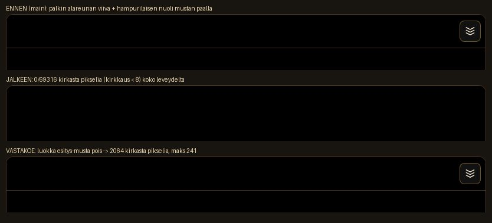

# Viesti Fablelle: Ihmisen matka — rintama ei välky, musta alku on kokonaan musta

**Opus-sessio 15.9.2026. Lähtötilanne: main = #2512 (80ab5b50).
Ei versionostoa, ei mergeä, ei Raamattu-muokkausta.**

Omistajan havainnot 15.9.2026 klo 12.00 UTC (työpöytäkuva, 248 000 v.
sitten), sanatarkasti: *"Kun ihmisjana etenee, niin sen etuosa, joka on
puolipallon muotoinen, välkkyy koko ajan. Ja toinen juttu, kun linssi
alkaa täydestä mustuudesta, niin myös yläosa saisi olla kokonaan poissa.
Nyt sinne näkyy pieni viiva yläpalkin alaosasta sekä hampurilaisen nuoli
alaspäin. Otan nekin pois ihan siitä alusta."*

Raamattu-linjaus haarassa `claude/bold-ride-vow4ki`, osio IHMISEN MATKA
-LINSSI: RINTAMAN VALKKYMINEN, MUSTA ALKU, LIIKU POIS…, kohdat 1 ja 2.
Kohta 3 (Liiku-nappi) ja kohta 4 (astronauttilinssin kuvake) ovat
Sonnet-agentilla — tämä haara ei koske kumpaankaan.

---

## 1. Juurisyyt yhdellä lauseella

**Rintaman välkyntä:** kasvavan kärjen saapumisaika on varjostimessa
`mix(aika_a, aika_b, f)`, missä `f` on sama katkaisuosuus, jolla kello
kärjen paikan määrää — reaaliluvuilla se on *tasan* kellon lukema, joten
pitotilan ehto `uNyt > aika` osui joka kehyksellä float32:n
pyöristysrajalle ja koko puolipallon muotoinen kupu (jonka jokainen
fragmentti käyttää samaa `t = 1 → f`) vaihtoi väriä rintaman kirkkaasta
`#FFB347` vanhan väestön tummaan `#D9731E` ja takaisin.

**Musta alku:** mustan peite `.aikajana-esitys-peite` on linssin juuren
ENSIMMÄINEN lapsi, joten linssin oma yläpalkki `.aikajana-ylarivi`
piirtyy DOM-järjestyksessä sen päälle — ja koska myöhempi sääntö
`.aikajana.palkki .aikajana-ylarivi` (sama painoarvo 0-2-0, myöhempänä
tiedostossa) kumoaa `esitys-pimea`-säännön `border-color: transparent`
ja `background: none`, palkin 1 px alareuna jäi näkyviin koko leveydeltä,
ja hampurilainen oli tarkoituksella rajattu pimennyksen ulkopuolelle
(`:not(.aikajana-valikko-nappi)`).

---

## 2. Rintaman välkyntä — mittaus

### 2.1 Mikä välkkyy

Kupu ei ole kaksi kerrosta eikä gradientin säde. Varjostin
(`js/aikajana-vanat.js`, FRAGMENTTIVARJOSTIN) katkaisee kasvavan janan:

```glsl
float f = clamp((kulj - ma) / (mb - ma), 0.0, 1.0);   // katkaistuun()
vec3  bb = a + (b - a) * f;                           // piirretty kärki
...
float aika  = mix(vAika.y, vAika.z, t2);              // t2 = t * f
float paino = clamp(1.0 - (aika - uNyt) / uRintama, 0.0, 1.0);
if (uPito > 0.5 && uNyt > aika) paino = 0.0;          // ← vanha ehto
```

Pyöreässä kärjessä `t = 1`, joten `t2 = f` ja `aika = mix(a_a, a_b, f)`.
Kello puolestaan antaa `kulj = matkaHetkella(...)`, joka interpoloi
matkan samalla osuudella — eli reaaliluvuilla `aika ≡ uNyt`. Ehto
`uNyt > aika` on siis tasan nollan kohdalla, ja float32 päättää sen
merkin. `uPito` on päällä koko kertomuksen ajan (esitys kytkee sen
valojen syttyessä), joten kupu välkkyi *koko ajan*.

### 2.2 Kehyssarja elävästä linssistä

Mitattu selainsavukkeella `tools/savukkeet/savuke-ihmisen-rintama.mjs`
(834 × 1100, Chromium, ohjelmisto-WebGL). Savuke lukee joka piirretyllä
kehyksellä varjostimen elävät uniformit (`uNyt`, `uRintama`, `uPito`,
`uKuljettu`) ja saman verkon instanssipuskurin (`iMatka`, `iAika`) ja
laskee kärjen arvot float32:lla täsmälleen kuten GPU. Kuvakaappaussarja
ei kelpaa mitaksi: kontin ohjelmisto-WebGL piirtää noin kehyksen
sekunnissa, eikä 60 Hz:n välke näy siinä.

`ero = f32(uNyt − aika)`; `paino` on kärjen väripaino (1 = rintaman
kirkas, 0 = vanhan väestön tumma).

| kehys | uNyt (v. sitten) | ero (v) | paino, VANHA sääntö | paino, KORJATTU |
|------:|-----------------:|--------:|--------------------:|----------------:|
| 1–7   | 230 000 … 175 770 |  0,0000 | 1 | 1 |
| 8     | 166 602,594 | −0,0313 | 1 | 1 |
| 9     | 164 000,000 | −0,0313 | 1 | 1 |
| 10    | 162 209,609 | **+0,0156** | **0** | 1 |
| 11    | 160 461,609 | **+0,0313** | **0** | 1 |
| 12    | 158 495,125 | −0,0313 | **1** | 1 |
| 13    | 156 456,078 | **+0,0156** | **0** | 1 |
| 14    | 154 635,547 | **+0,0156** | **0** | 1 |
| 15–22 | 117 626 … 110 000 | +0,0156 | 0 | 1 |
| 23    | 109 568,383 |  0,0000 | **1** | 1 |

23 kehystä: **vanha sääntö vuorotteli 4 kertaa**, korjattu **0 kertaa**.
Ero on aina 0 tai ±1 ulp (0,0078 / 0,0156 / 0,0313 vuotta sen mukaan,
millä kymmenpotenssilla kello on) — se on pyöristystä, ei mallia.

Sama mitattiin puhtaana Nodessa (`tests/aikajana-vanat.test.mjs`,
testi *"rintaman kärki ei välky"*) kolmella mallin mukaisella janalla
(kumulatiivinen matka 120 / 470 / 300 maailmayksikköä, jaksot 60–90 km,
aikavälit 300–800 v). 24 kehystä kussakin, kello etenee kehyksen verran
eikä osu tasavuosiin:

| tapaus | erojen merkit (24 kehystä) | vuorotteluja, vanha sääntö |
|---|---|---:|
| 248 ka, matka 120 | `000000000000-0-0+000000+` | 3 |
| 100 ka, matka 470 | `0+-00+-00+-000+-00+-00+-` | 12 |
| 60 ka, matka 300  | `-+0-+0-+--+--+-++-++-+0-` | 16 |

### 2.3 Korjaus

`js/aikajana-vanat.js`: uusi vakio `KAISTAN_PITO_VARA = 0.02` (osuus
rintaman leveydestä) viedään varjostimeen `defines`-määritteenä, ja
pitotilan ehto saa varan — sekä varjostimessa että sen Node-vastineessa
`karjenPaino`:

```glsl
if (uPito > 0.5 && uNyt - aika > uRintama * PITO_VARA) paino = 0.0;
```

248 ka:n kohdalla vara on 30 000 × 0,02 = **600 vuotta**, alle sekunnin
kelloa — pyöristysvirhe on luokkaa sadasosavuosi, eli vara on sitä noin
20 000-kertainen. PITOTILAN oma tarkoitus säilyy: aikahypyn jälkeen
pidetty vana on kymmeniätuhansia vuosia kellon edellä ja pysyy vanhan
väestön värissä, kuten Raamattu KERTOMUS SOLJUVAKSI vaatii.

### 2.4 Vastakoe

- Savuke (väite 2b): samoista mitatuista kehyksistä lasketaan myös vanha
  sääntö — se vuorottelee (`vanhaVuorottelee: 4`), eli välkyntä palaa
  heti kun vara poistetaan.
- Node-testi: `vuorotteluitaVanha >= 3` on nimenomaan vastakoe. Jos vara
  poistetaan koodista, testin `assert.ok(kehykset.every(k => k.uusi === 1))`
  kaatuu ja tekstivartio `uNyt - aika > uRintama * PITO_VARA` kaatuu.

---

## 3. Musta alku — mittaus

### 3.1 Löydös

`.aikajana-esitys-peite` (musta #000, opacity 1) on linssin juuren
ensimmäinen lapsi. Sen päälle jäi kaksi asiaa:

1. **Palkin alareuna.** `css/aikajana.css` rivi ~2186
   `.aikajana.esitys-pimea .aikajana-ylarivi { border-color: transparent;
   background: none; box-shadow: none; }` on tarkoitettu juuri tähän,
   mutta rivillä ~3255 oleva `.aikajana.palkki .aikajana-ylarivi` on yhtä
   painava (0-2-0) ja MYÖHEMPÄNÄ tiedostossa — sen `border-color:
   var(--line, …)` ja `background: linear-gradient(…)` voittavat.
2. **Hampurilainen.** `.aikajana.esitys-pimea .aikajana-nappi:not(.aikajana-valikko-nappi)`
   jättää valikkonapin näkyviin tarkoituksella (se on ollut ainoa tie ulos
   linssistä), joten sen alaspäin osoittava nuoli näkyi mustalla.

### 3.2 Mitta

Linssin juuren yläreunan nauha 806 × 86 px (kolme pikseliä sisään, ettei
karttaruudun oma pyöristetty reunaviiva tule mittaan), esitys tauolla
niin ettei musta ehdi nousta kaappausten välissä:

| tila | kirkkaita pikseleitä (kirkkaus ≥ 8) | maks. kirkkaus |
|---|---:|---:|
| ENNEN (main) | 2 064 / 69 316 | 241 |
| JÄLKEEN | **0 / 69 316** | **0** |
| VASTAKOE (`esitys-musta` pois) | 2 064 / 69 316 | 241 |



### 3.3 Korjaus

- `js/linssit/ihmisen-matka-esitys.js`: `avaruusavaus()` lisää linssin
  juureen luokan `esitys-musta`, `nostaMusta()` poistaa sen ja antaa
  samalla feidauksen keston muuttujana — palkki palaa täsmälleen samassa
  häivytyksessä kuin musta itse. Luokka siivotaan myös valojen
  syttyessä, esityksen päättyessä ja purussa. Uusi mittari
  `esitys.tila().palkkiPiilossa`.
- `css/aikajana.css`: `.aikajana.esitys-musta .aikajana-ylarivi
  { opacity: 0; pointer-events: none; }` — koko palkki katoaa, joten
  mikään sen sisällä ei voi jäädä yli. Ei suodattimia (tests/rules).
- Hampurilainen on poissa vain sen muutaman sekunnin, jonka ensimmäinen
  virke kestää; linssiin ei siis jää jumiin.

---

## 4. Vartiot

| vartio | mitä valvoo |
|---|---|
| `tests/aikajana-vanat.test.mjs` › *rintaman kärki ei välky…* | kehyssarja float32:lla, vanhan säännön vuorottelu (vastakoe), varjostimen teksti ja `KAISTAN_PITO_VARA` |
| `tests/aikajana-vanat.test.mjs` › *vanamoduuli: kaista omalla varjostimella…* | pitoehdon uusi muoto varjostimessa |
| `tests/ihmisen-matka-esitys.test.mjs` › *esityksen pinnat…* | `esitys-musta` lisätään ja poistetaan, CSS-sääntö olemassa, feidauksen kesto muuttujana |
| `tools/savukkeet/savuke-ihmisen-rintama.mjs` | selaimessa: musta nauha 0 kirkasta pikseliä + vastakoe; kärjen paino ei vuorottele + vastakoe |

Ajettu: `node --test tests/rules.test.mjs tests/dokumentit.test.mjs`
(337/337), `tests/aikajana-vanat.test.mjs` (12/12),
`tests/ihmisen-matka-esitys.test.mjs` (39/39), Ihmisen matkan muut
kohdetestit (132/132), `node tools/tarkista-savukkeet.mjs` (kunnossa),
`NODE_USE_ENV_PROXY=1 node tools/savukkeet/savuke-ihmisen-rintama.mjs`
(7/7).

---

## 5. Rajaukset

- Liiku-nappi (Raamatun kohta 3) ja astronauttilinssin kuvake (kohta 4)
  eivät ole tässä haarassa — ne ovat Sonnet-agentilla.
- Ei versionostoa, ei mergeä, ei Raamattu-muokkausta.
