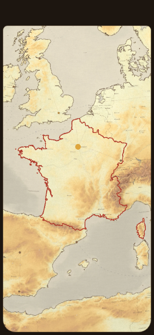
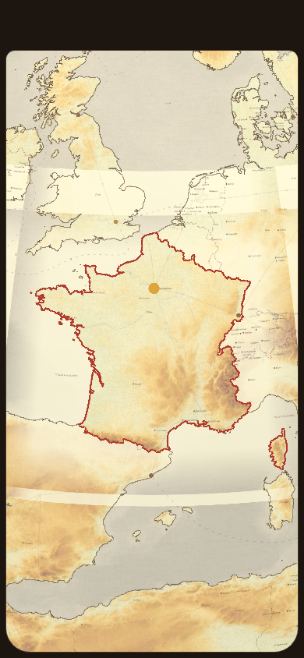
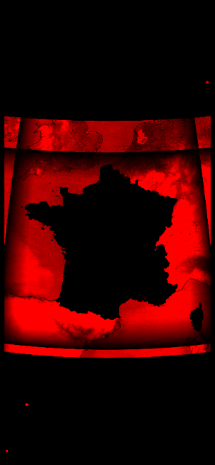
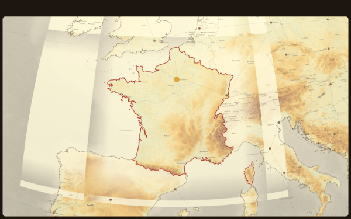

# Karttauudistus, erä 1c — tasoituskerros (kohdemaa alkuperäisenä)

*(Opus-työsessio Fablelle 13.9.2026. Haara
`claude/karttauudistus-era1c-tasoitus`, pohja origin/main v1844. Ei
versionostoa, ei dist/:iä, ei laattoja repossa — vain viisi kuvaa.
Jokainen luku on MITATTU; arviot on merkitty sanalla "arvio".)*

## 0. Lyhyesti

**Omistajan PÄÄTÖS 4 on toteutettu ja mitattu.** Erän 1b värikerros on
käännetty TASOITUSKERROKSEKSI samalla putkella: laatan alfa on
kohdemaan sisällä **0**, ja kaikki muu saa kerma-peiton, joka häivyttää
naapurien reliefin lähes kokonaan. Punainen raja ja uloszoomauksen esto
ovat ennallaan.

**KOHDEMAA ON PIKSELILLEEN ALKUPERÄINEN, JA SE ON MITATTU KAHDESTI.**
Savukkeen V2 vertaa kokonaista alaa Ranskan sisältä (Berry–Sologne)
tavu tavulta ja löytää **nolla eroa** — ei toleranssia, ei haarukkaa.
Koko saapumisnäkymän **erokartta** sanoo saman kuvana: Ranskan muoto
piirtyy MUSTANA aukkona punaiselle pohjalle, Korsika mukaan lukien.
Kuva on `docs/raportit/kuvat/karttauudistus-1c-erokartta.png`, ja se on
tämän erän tärkein yksittäinen todiste.

**Savuke `savuke-tasoitus-pallo` on 11/11 vihreä**, ja sen molemmat
vastakokeet ovat punaisia oikeista väitteistä (luku 4).

**KOLME LÖYDÖSTÄ, JOTKA KANNATTAA LUKEA** (luku 7):

1. **Tasoitusajo ei tarvitse korkeusaineistoa lainkaan.** Laatta on
   kerma-peite, josta ei jää yhtään maastopikseliä, joten ETOPOa,
   1′-paloja eikä Natural Earthiä ei lueta. Ranskan z4–z8 on **17 s ja
   1,61 Mt** (erän 1b murretulla paletilla 102 s ja 4,63 Mt) — ja
   1′-aineiston kysymys, jonka tehtävänanto esitti, EI KOSKE tätä
   kerrosta ollenkaan.
2. **`laatat.json`iin ei ole mitään kirjoitettavaa.** Pallon sarjan
   luettelossa ei ole väritasokenttää eikä tarvitse olla. "Molempien
   luetteloiden päivittäminen" tarkoittaa käytännössä sitä, että
   `pyramidi.json`in on SÄILYTETTÄVÄ pohjan versio, jonka laatat.json jo
   nimeää — ja työnkulku tarkistaa sen pelin omalla funktiolla kahdesti.
   Luku 7.2.
3. **Erän 1b savukkeen mittauspisteet olivat 65 pikseliä pielessä.**
   Globe.gl:n `getScreenCoords` antaa kankaan koordinaatit,
   kuvakaappaus ruudun; kangas alkaa mitattuna kohdasta (8,19 · 64,78).
   Se ei kaada erän 1b johtopäätöksiä (pisteet pysyivät oikeissa
   maissa), mutta sen leikkausprofiilien latitudit ovat noin 0,6°
   pielessä maakameralla. Korjattu tässä erässä. Luku 7.3.

---

## 1. Mitä tehtiin

| Tiedosto | Muutos |
| --- | --- |
| `tools/fokuskartta/piirto.js` | Uusi vakio **`KERMA = '#faf4d6'`** (250,244,214) perusteluineen ja uusi paletti **`VARIPALETIT.tasoitus`** = `{ tasoitus: true, peitto: 0.85, vari: KERMA }`. Paletissa EI ole asteikkoa eikä syvyyttä: se ei piirrä maastoa. |
| `tools/fokuskartta/maailmapiirto.js` | Uusi vienti **`piirraTasoitustaso`**: mitoittaa kankaan lohkon mitoista ja jättää sen läpinäkyväksi. `polttaVariLeikkuri` sai `tasoitus`-haaran: `destination-in` ohitetaan ja kankaalle jää pelkkä kerma-peite, jossa on reikä kohdemaan kohdalla. Tyhjä rengaslista on tasoituksessa VASTAKOE (kerma ilman reikää) eikä paluu. `varipaletti()` heittää virheen, jos tasoituspaletti päätyisi maastomoottorille. |
| `tools/generoi-laattapyramidi.mjs` | Uudet valitsimet **`--paletti tasoitus`**, **`--peitto`**, **`--kerma`**. Uusi lippu `TASOITUSTASO` ja yksi yhteinen `ILMAN_AINEISTOA`, joka korvaa viiteen kohtaan kirjoitetun ehdon `!NOSTOTASO && !VIIVATASO && !RANTATASO`. Leikkurin puskuri on tasoituksessa **0** (maan polygoni, ei aluevesirengasta). Luetteloon uudet kentät `tasoitus`, `peitto`, `kerma`, `leikkurinPuskuri`. |
| `tools/tarkista-varitason-portti.mjs` | **UUSI.** Lukee pelin oman `lepokerroksenKerrokset`-funktion ja kertoo, näkyisikö kerros näillä kahdella luettelolla. Poistumiskoodi kertoo sen työnkululle. |
| `.github/workflows/generoi-varitaso.yml` | **UUSI.** Yhden maan väri-/tasoituskerroksen ajo ja vienti ämpäriin (luku 5). |
| `tools/savukkeet/savuke-tasoitus-pallo.mjs` | **UUSI.** Erän 1b savukkeen käänteiskuva (luku 4). Uudet mittarit: kokonaisen alan tavuvertailu, 9 × 9 keskihajonta, erokartta, `--ruutu`, `--ilman-kerrosta`. Kankaan siirtymä korjattu (luku 7.3). |
| `tests/tasoitustaso.test.mjs` | **UUSI.** Kuusi vartiota: kerma on paperia vaaleampi joka kanavalla, tasoituspaletissa ei ole asteikkoa, paletti maastomoottorille on äänekäs virhe, `piirraTasoitustaso` mitoittaa ja tyhjentää kankaan, luettelo kirjaa peiton/kerman/nollapuskurin, ja murrettu paletti pitää yhä aluevesipuskurinsa. |
| `tools/savukkeet/README.md` | Uusi savuke luetteloon ja taulukkoon. |

**EI koskettu** (rinnakkaiset erät 3, 4, 6, 8): `js/pollo.js`,
`js/livia-*.js`, `js/lehti.js`, `js/fokusmitat.js`, `js/fokusnosto.js`,
`js/game.js`, `js/ui.js`, `js/rules.js`, `js/pallolauta/siirto.js`.
Versionumeroa ei nostettu, `dist/`-kansiota ei committoitu, laattoja ei
ole repossa eikä ämpäriin viety mitään.

## 2. Kolme ratkaisua, jotka kannattaa katsoa

**2.1 Tasoituslaatta ei ole maastorenderöinti.** Tehtävänanto sanoi
"käännä erän 1b värikerros tasoituskerrokseksi samalla putkella", ja
niin tein — mutta putken sisällä maastopassi jää väliin. Perustelu on
mitattavissa: kohdemaan kohdalla alfa on 0 ja muualla peiton alla on
tasainen kerma, joten renderöinnistä ei jäisi laattaan yhtään pikseliä.
Sen ajaminen olisi 85 sekuntia ja 52 megatavua aineistoa laatastoa
kohti, joka heitetään pois. Seuraukset luvussa 7.1.

**2.2 Leikkuri on maan polygoni ilman aluevesipuskuria.** Tehtävänanto
antoi valita, ja päätös 4 valitsee puolestamme: *"Aluevesien sininen ei
kuulu alkuperäiseen."* Ilman sinistä 12 mpk:n kaistaleella ei ole
tehtävää, joten se tasoitetaan muun meren mukana ja leikkurin puskuri on
0. **Laataston LAATIKKO pitää puskurinsa** (`max(laatikko × 1,15,
laatikko + aluevesi)`): se on työn rajaus eikä rajan muoto, ja
pikkuvaltiolla kerroin 1,15 olisi puskuria pienempi (erä 1b, luku 2.1).

**2.3 Kerma on 250,244,214 eikä erän 1b ehdottama 246,237,198.** Luku on
laskettu omistajan ehdosta "naapurit selvästi vaaleammat kuin Ranska".
Peitolla 0,85 naapurin seepiasta jää läpi 15 %, eli tulos on
0,15·A + 0,85·kerma. Ranskan alanko on mitattu rgb(241,232,184).
Kermalla (246,237,198) tyypillinen naapuripikseli (220,205,165) päätyy
arvoon (242,232,193) — samaan kirkkauteen kuin Ranska, eli **ero
katoaisi**. Kermalla (250,244,214) sama pikseli on (246,238,207), joka
on Ranskan alangosta selvästi vaaleampi, mutta jättää rantaviivan ja
rajojen musteesta 15 % kontrastia eli hennon mutta luettavan viivan.
Vaihto on yksi valitsin (`--kerma`) ja laattojen uusi ajo.

## 3. Laatat: määrä, koko, polut, aineisto

Ajettu kontin scratchpadiin, **ei repoon**. Komento:

```
node tools/generoi-laattapyramidi.mjs <kohde> --tasot 4-8 \
     --vari FRA --paletti tasoitus --peitto 0.85 --variversio <versio>
```

| ajo | tasot | laattoja | tavuja | aika |
| --- | --- | ---: | ---: | ---: |
| **peitto 0,85** | z4–z8 | **329** | **1,61 Mt** | **17,9 s** |
| peitto 0,95 | z4–z8 | 329 | 1,61 Mt | 16,0 s |
| vastakoe `--ilman-rajausta` | z4–z8 | 329 | 1,34 Mt | 15,6 s |

Tasoittain (peitto 0,85): z4 2 laattaa 0,02 Mt · z5 6 laattaa 0,05 Mt ·
z6 20 laattaa 0,15 Mt · z7 63 laattaa 0,37 Mt · **z8 238 laattaa
1,02 Mt**. Pienin laatta 1,0 kt, suurin 42,4 kt.

Polku ämpärissä `julisteet/pyramidi/<variversio>/vari/z<taso>/<sarake>/<rivi>.webp`
— sama kuin erässä 1b, koska peli lukee saman `varitasot`-taulun.

**VERRATTUNA ERÄÄN 1b: 65 % VÄHEMMÄN TAVUJA JA 83 % VÄHEMMÄN AIKAA.**
Erän 1b murrettu paletti samalla alalla oli 4,63 Mt ja 102 s. Ero tulee
kahdesta asiasta: laatassa ei ole maastoa (tasainen kerma pakkautuu
webp:ssä lähes olemattomaan) eikä ajossa korkeusruudukkoa.

**AINEISTOA EI KÄYTETTY, EIKÄ 1′-KYSYMYSTÄ SIIS OLE.** Tehtävänanto
pyysi ajamaan 1′-aineistolla R2:n paloista ja kirjaamaan, jos se ei
onnistu kontista. Tasoituslaatta ei lue korkeusaineistoa lainkaan (luku
2.1), joten ajo on aineistoriippumaton: `--kaariminuutit`-valitsinta ei
anneta eikä `--data`-kansiota tarvita. Tämä koskee VAIN tasoitusta;
`--paletti murrettu` ja `--paletti taysvari` tarvitsevat kaiken sen mitä
ennenkin, ja työnkulku hakee ne niille ehdollisesti.

## 4. Savuke ja sen kaksi vastakoetta

`tools/savukkeet/savuke-tasoitus-pallo.mjs` avaa PALLON, siirtää
nappulan Pariisiin, ajaa `saavu()`n, odottaa levon ja mittaa kaksi
vaihetta samalla koodipolulla: **A** ilman `varitasot`-taulua (peli
sellaisena kuin se oli ennen tätä erää, eli valmis-kriteerin
vertailuajo) ja **B** sen kanssa. Pohja, ranta-, viiva- ja nostotaso
tulevat tuotannon ämpäristä; vain `vari/z…` tarjoillaan pilottikansiosta.

### 4.1 VIHREÄ AJO (peitto 0,85 · kerma #faf4d6 · häive 70 yks)

```
PLAYWRIGHT_BROWSERS_PATH=/opt/pw-browsers NODE_USE_ENV_PROXY=1 \
  node tools/savukkeet/savuke-tasoitus-pallo.mjs --laatat <kansio>
```

| piste | A (ilman tasoitusta) | B (tasoitettuna) | ΔL | Δσ |
| --- | --- | --- | ---: | ---: |
| Keski-Ranska (2,0 E 47,3 N) | rgb(246,237,191) σ 3,5 | **rgb(246,237,191) σ 3,5** | **0,0** | **0,00** |
| Belgia, Ardennit (5,30 E 50,05 N) | rgb(252,228,163) σ 5,4 | rgb(255,247,212) σ 0,8 | **+23,7** | **−4,61** |
| Lioninlahti 6 mpk (4,5 E 43,02 N) | rgb(215,208,187) σ 1,8 | rgb(245,239,211) σ 0,3 | +28,3 | −1,46 |
| Lioninlahti 31 mpk (4,5 E 42,6 N) | rgb(205,199,180) σ 2,0 | rgb(243,238,210) σ 0,4 | +35,7 | −1,67 |

σ = 9 × 9 ruudun keskihajonta eli **reliefikontrasti**. Ardenneilla se
putoaa 5,4 → 0,8 eli **15 %:iin** — täsmälleen (1 − peitto). Se on
omistajan *"Poistetaan muista maista korkeus erot"* lukuna, ja se on eri
väite kuin vaaleneminen: pelkkä kirkkauden nousu ei todista, että
korkeuserot katosivat.

Mittarit: taso z5 saapumisnäkymässä, `tasoitettuja` 6 · `variMaa` FRA ·
`syy` tyhjä. **11/11 väitettä läpi.**

**LEIKKAUSPROFIILI RANSKAN POHJOISRAJAN YLI (4,6 E, sävy 0,1° välein)**
on toinen tapa nähdä sama asia — ja se osoittaa leikkurin osuvan rajalle
mittaustarkkuuden rajoissa:

| lat | A (ilman) | B (tasoitettuna) | |
| --- | --- | --- | --- |
| 50,20 | 250,235,181 | **255,248,214** | Belgia, täysi kerma |
| 50,10 | 253,239,183 | **255,249,215** | Belgia |
| 50,00 | 244,221,157 | **252,245,206** | Belgia |
| **49,90** | **249,230,164** | **249,230,164** | **Ranska — identtinen** |
| 49,80 | 243,232,184 | 243,232,184 | Ranska — identtinen |
| 49,70…49,40 | (sama) | (sama) | Ranska — identtiset |

Ranskan ja Belgian raja on 4,6 E:n kohdalla noin 49,95 N. Profiili
näyttää muutoksen alkavan juuri siitä.

**EROKARTTA: KOKO SAAPUMISNÄKYMÄ KERRALLA.** Savuke laskee A:n ja B:n
kuvakaappausten erotuksen pikseli pikseliltä ja piirtää sen kuvaksi
(musta = ei muutosta, punainen = muutos). Vihreässä ajossa **34,2 %
näkymän pikseleistä muuttui ja loput eivät**, ja muuttumaton osa on
Ranskan muotoinen. Pahin kanavaero 138 (avomeri, jossa peitto on täysi).

### 4.2 PUNAINEN AJO 1 — vastakoe `--ilman-rajausta`

Laatat ajettiin generaattorin samalla lipulla ILMAN leikkurin renkaita;
pelissä ei muutettu mitään. **Tämä vastakoe piti rakentaa uudestaan, ja
se on löydös itsessään:** erässä 1b `--ilman-rajausta` jätti leikkurin
nulliksi, jolloin laatta oli läpinäkymätön värillinen suorakaide.
Tasoituksessa sama temppu tuottaisi TYHJÄN laatan (maastoa ei
piirretä) — kohdemaa olisi yhä alkuperäinen ja V2 menisi vihreänä läpi.
**Vastakoe, joka ei voi kaataa väitettä, ei ole vastakoe.** Tasoituksen
vastakoe on siksi KERMA ILMAN REIKÄÄ: renkaita ei ole, joten peite
valuu myös kohdemaan päälle.

| piste | B (ilman leikkuria) | odotus | |
| --- | --- | --- | --- |
| **Keski-Ranska** | **rgb(253,247,214) σ 0,6** | rgb(246,237,191) σ 3,5 = A | **FAIL, kuten pitää** |
| Belgia, Ardennit | rgb(255,247,212) σ 0,8 | kermaa | läpi |
| Lioninlahti 6 mpk | rgb(245,239,211) | kermaa | läpi |
| Lioninlahti 31 mpk | rgb(243,238,210) | kermaa | läpi |

```
FAIL  V2 Ranskan sisältä A ja B ovat pikselilleen identtiset — 74 x 93 = 6882 pikseliä
      (27528 tavua): eroavia tavuja 20618 (74,90 %), pahin ero 69
```

**10/11 väitettä läpi.** Kohdemaa saa kerman heti kun leikkuri
poistetaan, ja Keski-Ranskan σ putoaa 3,5 → 0,6 kuten naapureillakin.
Poltettu alfa on siis se ja ainoa asia, joka pitää Ranskan
alkuperäisenä, ja V2 mittaa sitä eikä kahden kuvakaappauksen samuutta.

### 4.3 PUNAINEN AJO 2 — vastakoe `--rikki-versio`

Pyramidin luettelon versio muutetaan (`<versio>-rikki`) eikä pallon
sarjaa; mitään muuta ei kosketa.

```
  A: tila "purettu" · taso null · laattoja 0 · syy "pallon sarja ja pyramidi eri versiota"
  B: sama
FAIL  V0 tasoituskerros on pallolla ja se on Ranskan — varillisia 0, variMaa null
FAIL  V1 versioportti ei sammuttanut laattakerrosta (syy tyhjä)
FAIL  V3 · V4 · V5 · V6   (kaikki mittaukset ovat A = B, koska karttaa ei ole)
```

**5/11 väitettä läpi** (läpi menevät V2, joka on triviaalisti tosi kun
mitään ei piirretä, sekä erän 2 kaksi zoomiväitettä, jotka eivät riipu
laatoista). Tämä on ainoa koe siitä, että V1 mittaa versioporttia — ja
se on sama portti, jonka työnkulku tarkistaa ennen ja jälkeen ajon
(luku 5). Ilman tätä tasoituskerros voisi olla "päällä" kartalla, joka
on pelkkää sumeaa Mercator-sarjaa (omistajan havainto v1650).

## 5. Työnkulku: mitä Fable painaa

**`.github/workflows/generoi-varitaso.yml`** (uusi). Ranskan ajo
käynnistetään näillä syötteillä:

| syöte | arvo Ranskan ajossa | mitä se tekee |
| --- | --- | --- |
| `maa` | **`FRA`** | kohdemaa ISO A3 -koodina |
| `paletti` | **`tasoitus`** | omistajan PÄÄTÖS 4 (kohdemaa alkuperäisenä) |
| `peitto` | **`0.85`** | kerman peittävyys; `0.95` on toinen vaihtoehtokuva |
| `kerma` | *(tyhjä)* | paletin oletus `#faf4d6` |
| `variversio` | **`2026-09-13-tasoitus`** *(tai muu uusi)* | polku `julisteet/pyramidi/<variversio>/vari/z…`; SAMA versio kaikille maille, koska yksi versio on yksi julkaisu |
| `tasot` | **`4-8`** | z8 on pakko: uloszoomauksen esto rajaa vain ULOS |
| `vesi` · `feidaus` · `feidausreuna` · `korkeus` | *(tyhjiä / oletus)* | vain murretulle ja täysvärille |
| `kuiva` | **`false`** | `true` tulostaa vain laattamäärät ja polut |
| `vie` | **`true`** | `false` = harjoitus, laatat jäävät ajokoneelle |

**SUOSITUS: AJA ENSIN KUIVANA.** `kuiva: true` ajaa generaattorin
`--kuiva`-tilassa (pelkkä geometria, ei selainta, ei piirtoa) ja
tulostaa laattamäärät tasoittain sekä ne ämpärin polut, joihin ajo
kirjoittaisi. Se on sekunteja ja kertoo uuden maan hinnan etukäteen.

**MITÄ TYÖNKULKU TEKEE, JÄRJESTYKSESSÄ.** Järjestys on se, missä kartta
voi rikkoutua, joten se on kirjoitettu auki myös työnkulun kommenttiin:

1. Lataa ämpäristä **molemmat** luettelot: `julisteet/pyramidi/pyramidi.json`
   ja `julisteet/pallo/laatat/<kansio>/laatat.json`. Kansion nimi luetaan
   repon omasta vakiosta (`js/pallo.js` `PALLO_LAATTAKANSIO`), ei
   syötteestä — sama lähde kuin pelillä.
2. **Versioportti ENNEN ajoa** (`tools/tarkista-varitason-portti.mjs
   --vain-pohja`). Jos laattakerros on jo sammuksissa, vika ei ole tässä
   ajossa eikä sitä saa peittää uudella luettelolla.
3. Kopioi ämpärin `pyramidi.json` ajokansioon **pohjaksi**. Tämä on se
   askel, joka pitää pohjan version, tasot ja muiden maiden väritasot
   paikallaan: generaattorin oma "LUETTELO TÄYDENTYY" -polku yhdistää
   `varitasot`-tauluun vain tämän maan kirjauksen.
4. Aineisto VAIN jos paletti ei ole tasoitus (Natural Earth ja
   1′-korkeuspalat).
5. Generoi laatat (tai `--kuiva` ja pysähdy).
6. **Versioportti UUDELLA luettelolla**, ennen kuin yhtään tavua on
   ämpärissä: `kerrokset.vari` on oltava tosi tälle maalle.
7. Vie laatat (`aws s3 sync`, `immutable`-välimuisti, sama kaava kuin
   pohjalla ja nosto-/viivatasolla).
8. Vie luettelo VIIMEISENÄ ja vain jos laatat menivät läpi. Luettelo on
   se, joka tekee kerroksesta julkisen.

Salaisuudet ovat ne, jotka työnkuluissa jo ovat: `R2_ACCESS_KEY_ID`,
`R2_SECRET_ACCESS_KEY`, `R2_BUCKET`, `R2_ACCOUNT_ID`. Uusia ei lisätty.

**EN AJANUT TYÖNKULKUA ENKÄ VIENYT MITÄÄN ÄMPÄRIIN** — tehtävänannon
mukaan Fable käynnistää sen.

## 6. Kuvat — mitä NÄIN

Viisi kuvaa `docs/raportit/kuvat/`:issa, kukin alle 400 kt. Neljä
ensimmäistä ovat SAAPUMISNÄKYMÄSTÄ eli siitä näkymästä, johon peli
saapuu.

- **`karttauudistus-1c-ilman-kerrosta.png`** (puhelin 390 × 844) —
  vertailu, sama kamera. Ranska, Espanja, Saksa, Italia ja Britannia
  ovat kaikki samaa lämmintä seepiareliefiä; Ranskan erottaa vain
  punainen kehä. Juuri tästä näkee, mitä tasoitus muuttaa ja mitä ei.
- **`karttauudistus-1c-peitto085.png` (OLETUS)** — Ranska on
  TÄSMÄLLEEN sama kuin vertailukuvassa: alangot vaaleaa, Massif
  Central ja Alpit ruskeaa, Pyreneet ja Vogeesit paikoillaan. Naapurit
  ovat kermaa: Espanjan ylänkö, Saksan keskivuoret ja Britannian
  kukkulat ovat kadonneet, mutta rantaviivat ja maiden rajat lukevat
  yhä hennosti. Punainen kehä lukee nyt selvästi vahvempana kuin
  vertailukuvassa, koska sen ympäriltä on poistettu kilpaileva
  yksityiskohta. Laataston reuna häipyy vinjettinä (häive 70 yks), eikä
  vaakasuoraa rajaa näy.
- **`karttauudistus-1c-peitto095.png`** — sama näkymä peitolla 0,95.
  Ero 0,85:een on pieni mutta nähtävissä: naapureiden rantaviivat ja
  rajat ohenevat entisestään ja Espanjan sekä Saksan viimeisetkin
  sävyerot litistyvät. Kartta on rauhallisempi ja samalla tyhjempi.
  **Suositukseni on 0,85**, koska rantaviiva on maantiedettä eikä
  koristetta ja pelaajan on nähtävä, missä Ranskan naapurit ovat; mutta
  valinta on omistajan ja se on yksi ajon syöte.
- **`karttauudistus-1c-tyopoyta-peitto085.png`** (työpöytä 1440 × 900) —
  sama peitto leveällä ruudulla. Erän 1b löydös 7.1 näkyy tässä toisin
  päin: puhelimella ylimääräinen ala on PYSTYsuunnassa, työpöydällä
  LEVEYSsuunnassa, ja häive hoitaa molemmat. Kuvassa laataston reuna
  jää ruudun laidoille pehmeänä eikä viivana.
- **`karttauudistus-1c-erokartta.png`** — A:n ja B:n erotus pikseli
  pikseliltä (musta = ei muutosta, punainen = muutos). **Ranska
  piirtyy mustana siluettina, Korsika mukaan lukien.** Tämä on
  päätöksen 4 todiste kuvana: ei yhtään muuttunutta pikseliä kohdemaan
  sisällä, ei yhtään muuttumatonta laataston sisällä sen ulkopuolella.
  Kuvasta näkee myös laataston laatikon ja sen häipyvän reunan.







**MITÄ EN NÄHNYT:** en nähnyt sinistä (sitä ei tule), en vaakasuoraa
rajaa Välimerellä (häive hoitaa sen) enkä eroa Ranskan sisällä (sitä ei
saa tulla). En myöskään nähnyt merentakaisia osia: Guayana ja Réunion
ovat laataston ulkopuolella, joten niissä kartta on tavallista seepiaa
(erän 1b avoin 7.6, ennallaan).

## 7. Löydökset ja avoimet asiat

**7.1 TASOITUSAJO EI LUE KORKEUSAINEISTOA — JA SE MUUTTAA MONISTUKSEN
HINNAN.** Erän 1b luku 7.3 arvioi koko Euroopan väritasoksi 80–150 Mt ja
maata kohti 3–6 Mt. Tasoituksella Ranska on **1,61 Mt** eli 35 % erän 1b
luvusta, ja ajo on 17 s eikä 102 s. Uusi arvio maata kohti on siis
**1–2,5 Mt** ja koko Euroopalle **arvio 30–55 Mt**. Lisäksi ajo ei
tarvitse 1′-korkeuspaloja R2:sta eikä Natural Earthiä, joten työnkulun
valmistelujobi jää kokonaan pois ja monistus on yksi minuutti maata
kohti.

**Tämä on hyvä uutinen, mutta siinä on yksi ehto:** tasoituslaatta ei
ole "tarkempi kartta kohdemaasta" vaan "huonompi kartta kaikista
muista". Jos omistaja joskus haluaa kohdemaan renderöitävän uudelleen
tarkemmalla aineistolla (Raamatun alkuperäinen tilaus: *"renderoidaan
se vain mahdollisimman tarkaksi uudessa versiossa"*), se on ERI ERÄ ja
se tarvitsee 1′-aineiston — tasoitus ei sitä tee eikä yritä.

**7.2 `laatat.json`:IIN EI OLE MITÄÄN KIRJOITETTAVAA, JA SE ON
MITATTU.** Tehtävänanto pyysi päivittämään molemmat luettelot samassa
ajossa. Luin, mitä pallon sarjan luettelossa on
(`tools/tee-pallolaatat.mjs`): `versio`, `saanto`, `tasot`, `viivat`,
`nostot`, `ranta`. Väritasokenttää ei ole eikä tarvitse olla — väri ei
ole poltettu Mercator-sarjaan vaan piirretään elävänä pallon
laattakerrokseen, ja portti (`js/pallolaatat.js lepokerroksenKerrokset`)
lukee sen `pyramidi.varitasot[ISO]`-taulusta.

Vaatimuksen SISÄLTÖ on silti oikea, ja se on tämä: **`pyramidi.json`in
on säilytettävä se pohjan versio, jonka `laatat.json` jo nimeää.** Uusi
luettelo, joka vaihtaisi pohjan version, sammuttaisi KOKO
laattakerroksen — ei vain värit. Työnkulku tekee sen kolmella askeleella
(luku 5, kohdat 1–3 ja 6) ja tarkistaa tuloksen **pelin omalla
funktiolla** kahdesti, ennen ja jälkeen. Pallon sarjan uudelleenpoltto
olisi tunteja työtä, joka ei muuttaisi yhtään tavua, joten työnkulku ei
kirjoita `laatat.json`ia — se lukee sen ja pysähtyy, jos portti ei aukea.

**7.3 ERÄN 1b SAVUKKEEN MITTAUSPISTEET OLIVAT 65 PIKSELIÄ PIELESSÄ.**
Globe.gl:n `getScreenCoords` palauttaa pisteen KANKAAN
koordinaatistossa; `Page.captureScreenshot` antaa kuvan RUUDUN
koordinaatistossa. Kangas alkaa mitattuna kohdasta **(8,19 · 64,78)**,
joten jokainen mittaus luki pikseliä, joka oli 65 pikseliä liian
ylhäällä — maakameralla noin **0,6° pohjoiseen**.

Löysin sen tämän erän leikkausprofiilista: profiili väitti kerman
alkavan Ranskan sisältä 49,4 N:stä, vaikka raja on 49,95 N, laatan alfa
on sen eteläpuolella mitattuna 0 ja erokartta näyttää Ranskan
täsmälleen mustana. Korjaus on kolme riviä (kankaan `getBoundingClientRect`
mukaan jokaiseen muunnokseen, myös `elementFromPoint`iin).

**Erän 1b johtopäätökset eivät kaadu:** siirtymä ei vie Keski-Ranskan
pistettä ulos Ranskasta eikä Lioninlahden pisteitä maalle (merikamera on
niin lähellä, että 65 px on 0,07°). Mutta erän 1b raportin
rannikkoprofiilin latitudit ovat maakameralla noin 0,6° pielessä, ja
sen luvun 7.2 havainto *"Belgian mittauspiste on häiveen sisällä"* piti
paikkansa vielä enemmän kuin siinä arvioitiin. **Erän 1b savuketta EI
korjattu tässä erässä** (se vartioi murrettua palettia, joka on pois
käytöstä); jos siihen palataan, korjaus on kopioitavissa.

**7.4 MITTAUSPISTE SIIRRETTIIN ARDENNEILLE.** Erän 1b Namur (4,6 E
50,6 N) on häiveen sisällä: laatan alfa siellä on **161/255 = 0,63 ×
nimellisestä**, ja peiton mittaaminen siitä on mahdotonta. Uusi piste
(5,30 E 50,05 N) on alfalla **217/255 = täsmälleen nimellinen 0,85**.
Alfa 217 on samalla todiste kahdesta asiasta yhtä aikaa: piste on
kohdemaan leikkurin ulkopuolella JA häiveen sisäpuolella.

**7.5 PEITTO 0,85 VAI 0,95 — OMISTAJAN VALINTA.** Kumpikin on ajettu ja
kuvattu (luku 6). Suositukseni on **0,85**: se jättää naapureiden
rantaviivat ja rajat hennosti näkyviin, ja rantaviiva on maantiedettä
eikä koristetta. 0,95 on rauhallisempi mutta myös tyhjempi. Vaihto on
yksi työnkulun syöte ja uusi ajo (17 s), ei koodimuutos.

**7.6 MITÄ EI VIELÄ OLE TODENNETTU.** (1) Laitetodennus oikealla
puhelimella ja iPadilla on yhä tekemättä — kontissa ei ole GPU:ta, ja
kehysajat (p50 noin 1,0 s) mittaavat ohjelmistorenderöintiä eivät
laitetta. Tämä erä ei liikuta `LAATTAKATTO_TAVUT`ia (96 Mt) eikä lisää
laattoja (V6), joten riski on sama kuin erässä 1b. (2) Kahden maan
yhtäaikaista `varitasot`-taulua ei ole yhä mitattu (erän 1b avoin 7.4);
työnkulun askel 3 on se, joka sen ratkaisee, ja se on nyt olemassa mutta
ajamatta. (3) Merentakaiset osat (Guayana, Réunion) jäävät laataston
ulkopuolelle. (4) Offline: laatat tulevat ämpäristä, joten verkottomassa
pelissä kartta on tasoittamaton kunnes laatat on kerran ladattu, eikä
yhden tiedoston Pages-versio lataa niitä lainkaan.

**7.7 YKSI HAVAINTO, JOTA EN KORJANNUT.** Saapumisnäkymässä näkyy
vaakasuora kaistale ylhäällä ja alhaalla, jossa kartta on karkeampi:
siellä pallon laattakerros ei ole ladannut laattoja (`LAATTAKATTO_NAKYVA`
48) ja alla näkyy Mercator-sarja. Kaistale on kummassakin kuvassa,
myös vertailukuvassa ilman tasoitusta — se on siis pallon
laattakerroksen entinen käytös eikä tämän erän tuote. Kirjaan sen tähän,
koska tasoitettu kartta tekee siitä hieman näkyvämmän: kaistaleen
sisällä oleva ala on kermaa ja sen ulkopuolella seepiaa. (Kustannuskuri
1: havainto kirjataan, ei korjata.)

## 8. Mitä toisen maan ajo vaatii

**Peli ei tarvitse koodimuutosta, ja työnkulku on nyt olemassa.** Yksi
ajo maata kohti samoilla syötteillä kuin luvussa 5, vain `maa` vaihtuu.
Kaksi ehtoa pysyy erästä 1b:

1. **Sama `variversio` kaikille maille**, koska osoite on
   `<variversio>/vari/z…` ja yksi versio on yksi julkaisu.
2. **Molemmat luettelot samassa julkaisussa** — työnkulun askeleet 1–3 ja
   6 (luku 5) hoitavat tämän, ja portti pysäyttää ajon jos ne eivät
   täsmää. Todistus vastakokeessa (luku 4.3).

Kolmas ehto erästä 1b (sama kohdekansio, jotta `varitasot` täydentyy)
on nyt työnkulun vastuulla: se lataa ämpärin luettelon ajokansioon
pohjaksi joka ajossa.

Mitattu FRA:sta johdettu arvio tasoitukselle (0,019 tavua/px, 20
laattaa/s):

| maa | laatikko × 1,15 ∪ puskuri | laattoja z4–z8 (arvio) | tavuja (arvio) | aika (arvio) |
| --- | --- | ---: | ---: | ---: |
| FRA | 563 × 467 | **329 (mitattu)** | **1,61 Mt (mitattu)** | **18 s (mitattu)** |
| GRC | 345 × 319 | ~170 | ~0,8 Mt | ~10 s |
| ESP | 538 × 374 | ~250 | ~1,2 Mt | ~14 s |
| ITA | 472 × 547 | ~290 | ~1,4 Mt | ~16 s |
| DEU | 367 × 411 | ~200 | ~1,0 Mt | ~11 s |

RUS, USA, CAN, GRL ja CHN (ja työpöydällä CHL, BRA, ARG, AUS) eivät saa
uloszoomauksen estoa eivätkä tarvitse z8:aa, koska niiden saapumisnäkymä
osuu kattoon 2000 — niille riittää z4–z6 tai ei tasoitusta ensimmäisessä
aallossa (erän 1b suositus pätee edelleen).

## 9. Portit

| portti | tulos |
| --- | --- |
| `npm test` | **3314 testiä, 3301 pass, 0 fail** (13 skipped; +6 uutta `tests/tasoitustaso.test.mjs`:stä) |
| `node tools/tarkista-kaksoisavaimet.mjs` | ei kaksoisavaimia |
| `node tools/tarkista-niputus.mjs` | 388 moduulia, 4172 julistusta, ei törmäyksiä |
| `PLAYWRIGHT_BROWSERS_PATH=/opt/pw-browsers node tools/tarkista-savukkeet.mjs` | savukkeet kunnossa: 1526 ui-viittausta, 399 metodia, 532 kenttää |
| `node tools/build-standalone.mjs` | dist/matkakirja.html 31 765 kt (EI committiin) |
| `grep -rn '^<<<<<<<' js css tests tools` | tyhjä |
| `savuke-tasoitus-pallo` | **11/11** |
| `savuke-tasoitus-pallo --ilman-rajausta` | **10/11 (vastakoe punainen, V2 kaatuu)** |
| `savuke-tasoitus-pallo --rikki-versio` | **5/11 (vastakoe punainen, V1 kaatuu)** |

## 10. Kolme kysymystä omistajalle

1. **Peitto 0,85 vai 0,95?** Kuvat luvussa 6, suositus 0,85 (luku 7.5).
   Vaihto on yksi työnkulun syöte ja 17 sekunnin ajo.
2. **Kerma 250,244,214 — sopivan vaalea?** Luku 2.3 kertoo, miksi se on
   juuri tämä eikä erän 1b ehdottama 246,237,198 (joka olisi tehnyt
   naapureista Ranskan kanssa samankirkkaisia). Sävy on yksi valitsin
   (`--kerma`).
3. **Ajetaanko Ranska ämpäriin nyt?** Työnkulun syötteet ovat luvussa 5.
   Suositus: ensin `kuiva: true` (sekunteja, kertoo mitä veisi), sitten
   oikea ajo.
